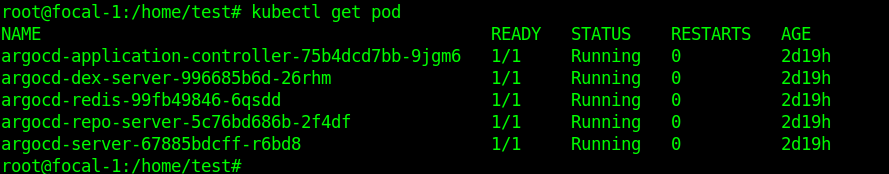
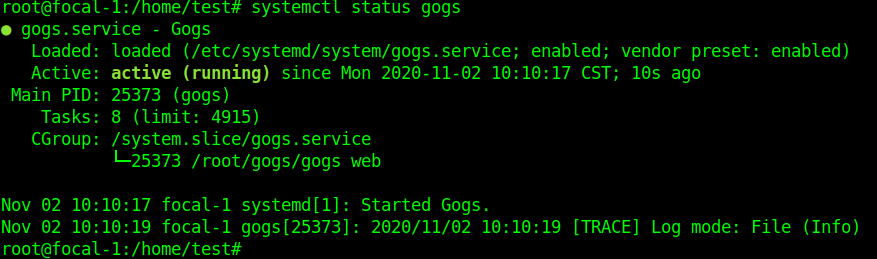
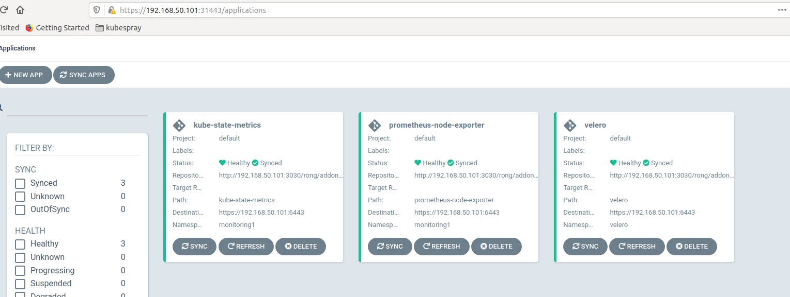
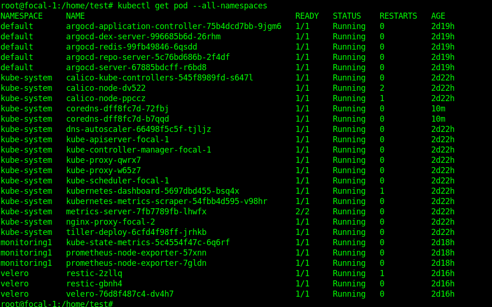

### gitops

`GitOps `是一种快速、安全的方法，可供开发或运维人员维护和更新运行在 Kubernetes 或其他声明式编排框架中的复杂应用。

CI/CD 流水线

目前大多数 CI/CD 工具都基于推模式建交付流水线。代码被合并到主分支后会触发 CI 系统进行构建和一系列的测试，并将新生成的镜像推送至镜像仓库，最后再通过 kubectl set image、helm upgrade、ksonnet apply 等方式将新版本直接应用到系统。

虽然这样的方式自动化程度很高，但对它进行审视后会发现如下问题：

1. 回滚操作复杂 - 如果通过 CI 任务完成一次部署后，系统出现异常，你将如何知道应该回滚到哪一个版本？你可能需要仔细查看构建日志才能找到答案。
2. 难以快速重建集群 - 在集群完全崩溃的情况下进行重建，如何确定需要部署的每个应用的版本？你可能需要重新跑一遍 CI 任务。

GitOps 基于拉模式构建交付流水线。此时，开发人员发布一个新功能的流程如下：

1. 通过 pull request 向主分支提交包含新功能的代码。
2. 代码审核通过后将被合并至主分支。
3. 合并行为将触发 CI 系统进行构建和一系列的测试，并将新生成的镜像推送至镜像仓库。
4. GitOps 检测到有新的镜像，会提取最新的镜像标记，然后同步到 Git 配置仓库的清单中。
5. GitOps 检测到集群状态过期，会从配置仓库中拉取更新后的清单，并将包含新功能的镜像部署到集群里。

通过为不同的集群创建各自的子目录或分支，可以轻松地将该模式拓展到多集群环境。

1. 由于每一次变更都对应着一条 git commit，回滚操作只需要简单的把目标状态恢复到前一个状态。
2. 由于在 Git 的配置仓库中保留了集群的目标状态，如果集群完全崩溃，可以基于仓库中的清单快速重建集群。

### argo-cd 部署

拷贝部署包`argocd-deploy.tar.gz`到`kubernetes`集群的第一个`master`节点上，执行以下命令安装`argocd`。

```
root@rong:~$ tar -zxvf argocd-deploy.tar.gz && cd argocd-deploy && ./install_argo.sh
```

以下命令显示，表示安装成功



运行以下脚本添加`kubernetes`集群到`argocd`中

```
root@rong:~/argocd-deploy$ ./add_cluster.sh
```

脚本配置集群名称为`cluster.local`，如果集群命名为其他字符，请修改`add_cluster.sh`中的`cluster_name=`变量值后，在次运行该脚本。

输出以下显示，表示添加成功

```
root@focal-1:/home/test/argocd-deploy# ./add_cluster.sh 
+ cluster_name=ss
+ k8srouter=192.168.50.101
+ namespace=default
+ pid=1991
++ kubectl get pods -n default -l app.kubernetes.io/name=argocd-server -o name
++ cut -d/ -f 2
+ kubectl port-forward svc/argocd-server -n default 8080:443
+ password=argocd-server-67885bdcff-r6bd8
+ argocd login localhost:8080 --username admin --password argocd-server-67885bdcff-r6bd8 --insecure
Forwarding from 127.0.0.1:8080 -> 8080
Forwarding from [::1]:8080 -> 8080
Handling connection for 8080
Handling connection for 8080
E1102 10:18:47.555869    1991 portforward.go:372] error copying from remote stream to local connection: readfrom tcp4 127.0.0.1:8080->127.0.0.1:33816: write tcp4 127.0.0.1:8080->127.0.0.1:33816: write: broken pipe
Handling connection for 8080
Handling connection for 8080
Handling connection for 8080
'admin' logged in successfully
Context 'localhost:8080' updated
+ argocd cluster add kubernetes-admin@ss
INFO[0000] ServiceAccount "argocd-manager" already exists in namespace "kube-system" 
INFO[0000] ClusterRole "argocd-manager-role" updated    
INFO[0000] ClusterRoleBinding "argocd-manager-role-binding" updated 
Handling connection for 8080
+ set +x
1991 is running

```

### gogs 二进制部署

拷贝部署包`gogs.tar.gz`和文件`gogs.service`到`kubernetes`集群的第一个`master`节点，执行以下命令安装与启动`gogs`。

```
root@rong:~$ tar -zxvf gogs.tar.gz -C /root/ && cp -r gogs.service /etc/systemd/system/ && systemctl daemon-reload && systemctl enable gogs && systemctl start gogs && systemctl status gogs
```

以下命令显示，表示安装成功



### argo-cd联合gogs实现gitops

拷贝`argo-cd`应用`yaml`文件`kube-state-metrics-app.yaml  prometheus-node-exporter-app.yaml  velero-app.yaml`到`kubernetes`集群的第一个`master`节点，执行以下命令部署应用。

```
kubectl apply -f kube-state-metrics-app.yaml -f prometheus-node-exporter-app.yaml -f velero-app.yaml
```

以文件`velero-app.yaml`内容为例进行说明

```
apiVersion: argoproj.io/v1alpha1
kind: Application
metadata:
  name: velero
  namespace: default
spec:
  destination:
    namespace: velero
    server: https://192.168.50.101:6443
  project: default
  source:
    path: velero
    repoURL: http://192.168.50.101:3030/rong/addons.git
  syncPolicy:
    automated:
      prune: true
      selfHeal: true
    syncOptions:
    - CreateNamespace=true
```

`Applicatone`为`argocd`的`crd`定义，`source`配置`git`的仓库`repoURL`和项目中路径`path`，`destination`配置`kubernetes`的`server`为`apiserver url`，名字空间`namespace`为应用需要部署的目的名字空间。

`syncPolicy`使用默认配置即可。

访问`argocd web`页面以下显示应用运行正常



在`kubernetes`检查目标应用`pod`运行状态也是正常。


