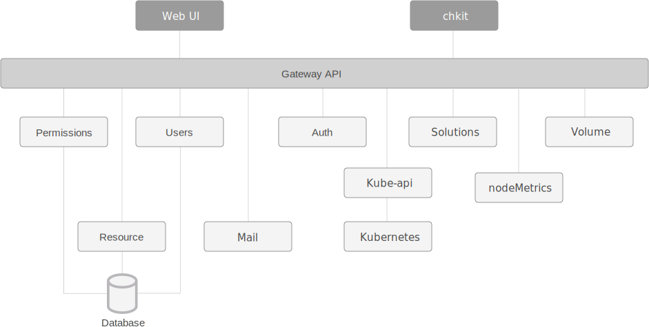

###Fabric8
Fabric8提供了一个完全集成的开源微服务平台，可在任何的Kubernetes和OpenShift环境中开箱即用。为基于Kubernetes和Jenkins的微服务提供持续发布。
Fabric8微服务平台提供的服务有：
* 开发者控制台，这是一个富Web应用程序，它提供了一个单一的页面来创建、编辑、编译、部署和测试微服务。
* 持续集成和持续交付，帮助团队以更快更可靠的方式交付软件，可以使用以下开源软件：
  * Jenkins：CI／CD pipeline
  * Nexus： 组件库
  * Gogs：git代码库
  * SonarQube：代码质量维护平台
  * Jenkins Workflow Library：在不同的项目中复用Jenkins Workflow scripts
  * Fabric8.yml：为每个项目、存储库、聊天室、工作流脚本和问题跟踪器提供一个配置文件
  
* ChatOps：通过使用hubot来开发和管理，能够让你的团队拥抱DevOps，通过聊天和系统通知的方式来approval of release promotion
* Chaos Monkey：通过干掉pods来测试系统健壮性和可靠性
* 管理
  * 日志 统一集群日志和可视化查看状态
  * metris 可查看历史metrics和可视化

###spinnaker
Spinnaker 是 Netflix 的开源项目，是一个持续交付平台，它定位于将产品快速且持续的部署到多种云平台上。Spinnaker 通过将发布和各个云平台解耦，来将部署流程流水线化，从而降低平台迁移或多云品台部署应用的复杂度，它本身内部支持 Google、AWS EC2、Microsoft Azure、Kubernetes和 OpenStack 等云平台，并且它可以无缝集成其他持续集成（CI）流程，如 git、Jenkins、Travis CI、Docker registry、cron 调度器等。简而言之，Spinnaker 是致力于提供在多种平台上实现开箱即用的集群管理和部署功能的平台。

Spinnaker 主要包含两大块内容，集群管理和部署管理。

集群管理主要用于管理云上的资源，它分为以下几个块：
* Server Group：服务组，是资源管理单位，识别可部署组件和基础配置设置，它并且关联了一个负载均衡器和安全组，当部署完毕后，服务组就相当于一组运行中的软件实例集合，如（VM 实例，Kubernetes pods）。
Cluster：集群，由用户定义的，对服务组的逻辑分组。
Applications：应用，是对集群的逻辑分组。
* Load Balancer：负载均衡，用于将外部网络流量重定向到服务组中的机器实例，还可以指定一系列规则，用来对服务组中的机器实例做健康监测。
* Security Group：安全组，定义了网络访问权限，由IP、端口和通信协议组成的防火墙规则。

部署管理功能用于创建一个持续交付流程，它可分为管道和阶段两大部分。
* 管道（pipeline）
部署管理的核心是管道，在Spinnaker的定义中，管道由一系列的阶段（stages）组成。管道可以人工触发，也可以配置为自动触发，比如由 Jenkins Job 完成时、Docker Images 上传到仓库时，CRON 定时器、其他管道中的某一阶段。同时，管道可以配置参数和通知，可以在管道一些阶段上执行时发送邮件消息。Spinnaker 已经内置了一些阶段，如执行自定义脚本、触发 Jenkins 任务等。

* 阶段(stages)
阶段在 Spinnaker 中，可以作为管道的一个自动构建模块的功能组成。我们可以随意在管道中定义各个阶段执行顺序。Spinnaker 提供了很多阶段供我们选择使用，比如执行发布（Deploy）、执行自定义脚本 (script)、触发 Jenkins 任务 (jenkins)等，功能很强大。

* 部署策略(Deployment Strategies)
Spinnaker 支持精细的部署策略，比如 红/黑（蓝/绿）部署，多阶段环境部署，滚动红/黑策略，canary 发布等。用户可以为每个环境使用不同部署策略，比如，测试环境可以使用红/黑策略，生产环境使用滚动红/黑策略，它封装好了必须的步骤，用户不需要复杂操作，就可以实现企业级上线。

Spinnaker 架构所依赖的各个组件。

* Deck：面向用户 UI 界面组件，提供直观简介的操作界面，可视化操作发布部署流程。
* API： 面向调用 API 组件，我们可以不使用提供的 UI，直接调用 API 操作，由它后台帮我们执行发布等任务。
* Gate：是 API 的网关组件，可以理解为代理，所有请求由其代理转发。
* Rosco：是构建 beta 镜像的组件，需要配置 Packer 组件使用。
* Orca：是核心流程引擎组件，用来管理流程。
* Igor：是用来集成其他 CI 系统组件，如 Jenkins 等一个组件。
* Echo：是通知系统组件，发送邮件等信息。
* Front50：是存储管理组件，需要配置 Redis、Cassandra 等组件使用。
* Cloud driver 是它用来适配不同的云平台的组件，比如 Kubernetes，Google、AWS EC2、Microsoft Azure 等。
* Fiat 是鉴权的组件，配置权限管理，支持 OAuth、SAML、LDAP、GitHub teams、Azure groups、 Google Groups 等。

以上组件除了核心组件外，一些组价可选择配置是否启动，各个组件独立服务运行，有各自的服务端口，且各个组件都有自己的独立的项目 GitHub 地址。

###containerum
Container是一个管理kubernetes集群的开源平台组件，它提供工具用于实现简单CI/CD流程控制，角色权限管理，版本滚动升级等功能。containerum运行在kubernetes中，提供命令行工具和web ui界面供用户使用。并且提供应用市场，提供一键部署应用到kubernetes集群功能。

Containerum 组件组成如下:

* api-gateway 提供到 Containerum 组件的路由
* user-manager  管理Containerum 用户，用户组，证书，黑名单等的服务组件
* resource 管理 Kubernetes 的namespace 对象: deployments, ingresses, 等.
* permissions 管理团队开发的用户权限
* kube-api  提供Containerum 和 K8s的api
* auth 管理用户授权和token管理
* mail 邮件通知服务器
* ui Containerum的web ui组件
* solutions 应用构建前配置组件
* volume-manager 存储卷管理组件
* nodeMetrics  向Prometheus服务 提供监控node的资源使用率
* chkit 命令行CLI 组件

以及2个数据库:
* MongoDB
* PostgreSQL

Containerum 架构图如下:

###gitlab-ce
GitLab 是一个用于仓库管理系统的开源项目。即使用git作为代码管理工具，并在此基础上提供了gitlab-ci持续集成和持续部署功能，可以通过runner与kubernetes集成提供持续部署项目到kubernetes运行环境。
gitlab有社区版（Community Edition，CE）和企业版（Enterprise Edition，EE）可以使用。EE 和 CE 都至少需要名为 gitlab-shell 和 Gitaly 的附加组件。这些组件分别可从 gitlab-shell 和 gitaly 代码库获得。

GitLab 组件
* repository：代码库，可以是硬盘或 NFS 文件系统
* Nginx：Web 入口
* 数据库：包含以下信息：
  *  repository 中的数据（元数据，issue，合并请求 merge request 等）
  *  可以登录 Web 的用户（权限）
* Redis：缓存，负责分发任务
* sidekiq：后台任务，主要负责发送电子邮件。任务需要来自 Redis
* Unicorn：Gitlab 自身的 Web 服务器，包含了 Gitlab 主进程，负责处理快速/一般任务，与 Redis 一起工作。工作内容包括： 
  * 通过检查存储在 Redis 中的用户会话来检查权限
  * 为 Sidekiq 制作任务
  * 从仓库（warehouse）取东西或在那里移动东西
* gitlab-shell：用于 SSH 交互，而不是 HTTP。gitlab-shell 通过 Redis 与 Sidekiq 进行通信，并直接或通过 TCP 间接访问 Unicorn
* gitaly：后台服务，专门负责访问磁盘以高效处理 git 操作，并缓存耗时操作。所有的 git 操作都通过 Gitaly 处理
* gitlab-workhorse：反向代理服务器，可以处理与 Rails 无关的请求（磁盘上的 CSS、JS 文件等），处理 Git Push/Pull 请求，处理到 Rails 的连接（修改由 Rails 发送的响应或发送给 Rails 的请求，管理 Rails 的长期 WebSocket 连接等）。
* mail_room：处理邮件请求。回复 GitLab 发出的邮件时，GitLab 会调用此服务
Sidekiq、Unicorn 和 GitLab-shell 是 GitLab 中处理任务的 3 个程序。

GitLab 应用程序是上述所有组件的集合。

###jenkins
jenkins是基于Java开发的一种持续集成（CI）工具，用于监控持续重复的工作，它可以集成各种插件完成持续编译、部署、测试，并将Job运行结果通过邮件发送给相关人员或者展示相关数据报告。

jenkins的优点
提供更为友好的用户界面，不论是新建一个build，还是日常使用，你需要做的大部分时候仅仅是在用户界面上选择和点击而已；
内置的功能强大，基本可以完成常用的开发构建任务；
有完善的文档，使用起来非常简单方便，大大降低了学习成本；
有丰富的插件，并且可根据自己的业务需求进行定制开发；
安装部署简单，独立部署或放到Tomcat中即可完成部署；
可完成的工作很多，借助丰富的插件静态检查、动态检查、编译、部署、测试等等

spinnaker和fabric8的ci/cd功能使用了jenkins组件,containerum可以配置使用jenkins实现ci/cd功能。

###devops工具对比

功能列表| gitlab组合kubernetes| jenkins组合kubernetes| spinnaker| fabric8
-------|--------------------|---------------------|-----------|--------
源代码管理工具| 只支持git   |  git和svn都支持  | git和svn都支持 | 内置git管理代码
镜像仓库| gitlab自带镜像仓库 | 自建镜像仓库 | 自建镜像仓库 | 自建镜像仓库
部署环境| kubernetes或非容器环境 | kubernetes环境或非容器环境 | kubernetes环境 | kubernetes环境
配置方式| 脚本语言配置 | 脚本语言配置 | webui配置 | 项目模板配置
组件复杂度| 较简单 | 简单 | 复杂 | 复杂
系统性能|
流程反馈|
