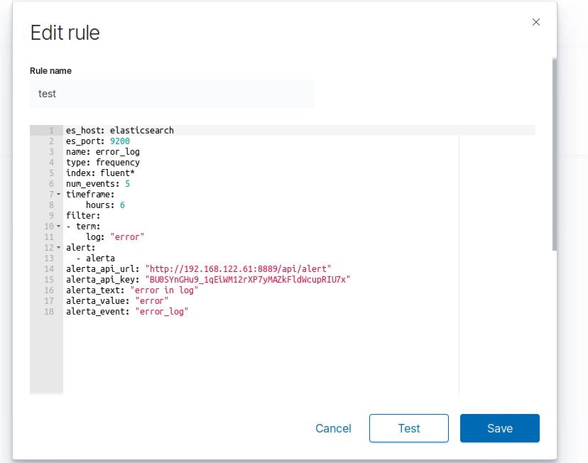
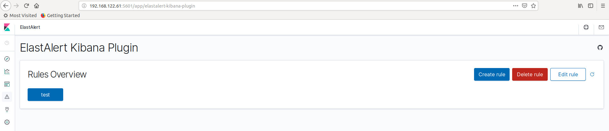
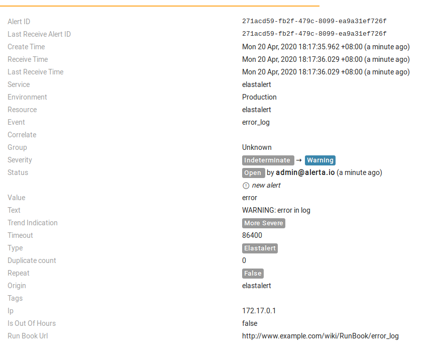
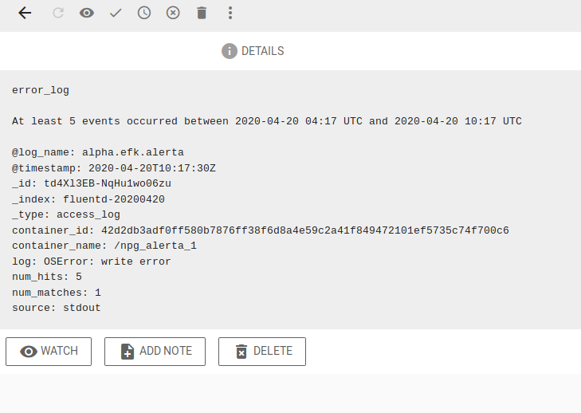

## 组成

1、**efk**: 日志收集框架

2、**estalert**: 是基于 Elasticsearch 的报警工具

3、**elastalert-kibana-plugin** : kibana中elastalert插件，可以实现在kibana界面上编辑elastalert的告警规则配置。

4、**alerta**: 告警集中收集平台，elastalert告警规则可以配置alerta为接收平台。之前npgstack中alerta作为监控指标信息告警接收平台，日志信息告警配置为同一个alerta作为告警接收平台，实现一个界面管理和观察多种维度的告警信息。

## 部署

上一篇文章使用docker-compose来部署efk日志收集框架，这样通过改造kibana容器镜像，把elastalert-kibana-plugin插件安装上。在yml文件增加服务elastalert。

改造kibana容器镜像，Dockerfile文件内容如下：

```
FROM kibana/kibana-oss:7.5.0
COPY ./elastalert-kibana-plugin-1.1.0-7.5.0.zip /tmp/
RUN ["kibana-plugin", "install", "file:///tmp/elastalert-kibana-plugin-1.1.0-7.5.0.zip"]
```

执行命令构建镜像

```
docker build -f Dockerfile -t kibana/kibana-oss:7.5.0-ea .
```

docker-compose.yml增加服务elastalert。

```
---
version: '2'
services:
  elastalert:
    image: bitsensor/elastalert:3.0.0-beta.1
    ports:
      - 3030:3030
      - 3333:3333
    volumes:
      - ./elastalert/config/elastalert.yaml:/opt/elastalert/config.yaml
      - ./elastalert/config/elastalert-test.yaml:/opt/elastalert/config-test.yaml
      - ./elastalert/config/config.json:/opt/elastalert-server/config/config.json
      - ./elastalert/rules:/opt/elastalert/rules
      - ./elastalert/rule_templates:/opt/elastalert/rule_templates
    network_mode: "bridge"
    links:
    - "elasticsearch"

  elasticsearch:
    image: elasticsearch/elasticsearch-oss:7.6.2
    environment:
      - 'node.name=HEYJUDE'
      - 'discovery.type=single-node'
      - 'bootstrap.memory_lock=true'
      - 'ES_JAVA_OPTS=-Xms256m -Xmx256m'
    ports:
      - 9200:9200
      - 9300:9300
    volumes:
      - ./elasticsearch:/usr/share/elasticsearch/data
    network_mode: "bridge"
  
  kibana:
    image: kibana/kibana-oss:7.5.0-ea
    ports:
      - 5601:5601
    volumes:
      - ./kibana/config/kibana.yml:/usr/share/kibana/config/kibana.yml
    network_mode: "bridge"
    links:
    - "elasticsearch"
    - "elastalert"
  
  fluentd:
    image: fluent/fluentd:v1.4.2-2.0-es
    ports:
      - 24224:24224
      - 24224:24224/udp
    volumes:
      - ./fluentd/etc:/fluentd/etc
    network_mode: "bridge"
    links:
    - "elasticsearch"
  
networks:
  default:
    external:
      name: bridge

```

kibana服务增加配置项如下：

```
# cat kibana/config/kibana.yml 
#
# ** THIS IS AN AUTO-GENERATED FILE **
#

# Default Kibana configuration for docker target
server.name: kibana
server.host: "0"
elasticsearch.hosts: [ "http://elasticsearch:9200" ]
elastalert-kibana-plugin.serverHost: elastalert
elastalert-kibana-plugin.serverPort: 3030

```

alerta使用的是npgstack中的服务alerta。

## elastalert测试告警规则

配置测试告警规则如下：

```
es_host: elasticsearch
es_port: 9200
name: test
type: frequency
index: fluent*
num_events: 5
timeframe:
    hours: 6
filter:
- term:
    log: "error"
alert:
  - alerta
alerta_api_url: "http://192.168.122.61:8889/api/alert"
alerta_api_key: "BU0SYnGHu9_1qEiWM12rXP7yMAZkFldWcupRIU7x"
alerta_text: "error in log"
alerta_value: "error"
alerta_event: "error_log"

```

告警规则表明，如果6小时内es中索引为`fluent*`的log字段出现error信息达到5次，则触发一个告警到alerta中。

告警类型：`frequency`，

alerta显示界面配置：alerta_text，alerta_value，alerta_event。

其他的配置项容易理解。





在alerta界面看到的告警信息。





