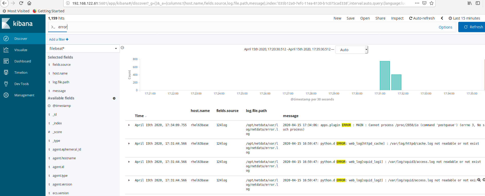

## efk部署

文件结构如下：

```ls
docker-compose.yml  elasticsearch  elasticsearch.tar  fluentd  fluentd-es.tar  fluentd.tar  kibana.tar
```

其中tar文件是镜像文件包，elasticsearch和fluentd是外挂目录。

docker-compose.yml文件内容如下

```
---
version: '2'
services:
  elasticsearch:
    image: elasticsearch/elasticsearch-oss:6.7.0
    environment:
      - 'node.name=HEYJUDE'
      - 'discovery.type=single-node'
      - 'bootstrap.memory_lock=true'
      - 'ES_JAVA_OPTS=-Xms256m -Xmx256m'
    ports:
      - 9200:9200
      - 9300:9300
    volumes:
      - ./elasticsearch:/usr/share/elasticsearch/data
    network_mode: "bridge"
    logging:
      driver: fluentd
      options:
        fluentd-address: 192.168.122.1:24224
        fluentd-async-connect: 'true'
        fluentd-retry-wait: '1s'
        fluentd-max-retries: '30'
        tag: alpha.efk.elasticsearch
  
  kibana:
    image: kibana/kibana-oss:6.7.0
    ports:
      - 5601:5601
    network_mode: "bridge"
    links:
     - "elasticsearch"
    logging:
      driver: fluentd
      options:
        fluentd-address: 192.168.122.1:24224
        fluentd-async-connect: 'true'
        fluentd-retry-wait: '1s'
        fluentd-max-retries: '30'
        tag: alpha.efk.kibana
  
  fluentd:
    image: fluent/fluentd:v1.4.2-2.0-es
    ports:
      - 24224:24224
      - 24224:24224/udp
    volumes:
      - ./fluentd/etc:/fluentd/etc
    network_mode: "bridge"
    links:
     - "elasticsearch"
    logging:
      driver: "json-file"
      options:
        max-size: "1G"
        max-file: "2"
  
networks:
  default:
    external:
      name: bridge
```

其中`192.168.122.1`是宿主机的ip。

`fluentd`镜像`fluent/fluentd:v1.4.2-2.0`默认是没有安装`fluent-plugin-elasticsearch`插件。因此构建镜像`fluent/fluentd:v1.4.2-2.0-es`。

Dockerfile文件内容如下：

```
FROM fluent/fluentd:v1.4.2-2.0
USER root
RUN ["gem", "install", "fluent-plugin-elasticsearch", "--no-rdoc", "--no-ri", "--version", "1.9.7"]
```

构建命令

```
docker build -f Dockerfile -t fluent/fluentd:v1.4.2-2.0-es .
```


fluentd的conf文件内容如下：

```
<system>
  log_level warn
</system>
<source>
  @type forward
  port 24224
  bind 0.0.0.0
</source>
<match *.**>
  @type copy
  <store>
    @type elasticsearch
    host elasticsearch
    port 9200
    logstash_format true
    logstash_prefix fluentd
    logstash_dateformat %Y%m%d
    include_tag_key true
    type_name access_log
    tag_key @log_name
    flush_interval 5s
  </store>
  <store>
    @type stdout
  </store>
</match>
```

配置监听端口为24224，输出到elasticsearch端点为`elasticsearch:9200`。

## 其他容器输出日志到fluentd

例如netdata，在docker-compose.yml文件加入如下`logging`配置内容即可,`192.168.122.61`为远程安装了`fluentd`的节点。

```
netdata:
    restart: always
    hostname: 192.168.122.61
    image: titpetric/netdata
    cap_add:
      - SYS_PTRACE
    security_opt:
      - apparmor:unconfined
    environment:
      - NETDATA_API_KEY_ENABLE_19f64b45-7aa3-40dc-b31d-b4e95946e3d7=1
    ports:
      - 19999:19999
    volumes:
      - /proc:/host/proc:ro
      - /sys:/host/sys:ro
      - /var/run/docker.sock:/var/run/docker.sock:ro
      - ./health_alarm_notify.conf:/etc/netdata/health_alarm_notify.conf:ro
      - ./dashboard.js:/usr/share/netdata/web/dashboard.js:ro
    network_mode: "bridge"
    logging:
      driver: fluentd
      options:
        fluentd-address: 192.168.122.61:24224
        fluentd-async-connect: 'true'
        fluentd-retry-wait: '1s'
        fluentd-max-retries: '30'
        tag: alpha.efk.netdata
```

效果图：


## fluentd收集指定文件目录日志

修改`fluentd`配置文件，加入以下内容收集文件目录`/var/log/containers/*.log`下日志文件内容。fluentd安装依赖ruby环境。

```
<source>
@id fluentd-containers.log
@type tail
path /var/log/containers/*.log
pos_file /var/log/fluentd-containers.log.pos
time_format %Y-%m-%dT%H:%M:%S.%NZ
tag raw.kubernetes.*
format json
read_from_head true
</source>
```

收集指定日志文件内容`/var/log/httpd-access.log`。

```
<source>
  @type tail
  path /var/log/httpd-access.log
  pos_file /var/log/td-agent/httpd-access.log.pos
  tag apache.access
  <parse>
    @type apache2
  </parse>
</source>
```

## filebeat发送日志到远程elasticsearch上

相对于`fluentd`，`filebeat`二进制安装依赖少，易配置部署。下载命令

```
wget https://artifacts.elastic.co/downloads/beats/filebeat/filebeat-oss-7.6.2-linux-x86_64.tar.gz 
```

解压包，进入目录，可以看到配置文件`filebeat.yml`。

`filebeat`配置文件如下：

```
# 输入部分
filebeat.inputs:

# 收集 nginx 日志
#- type: log
#  enabled: true
#  paths:
#    - /home/nginxlogs/webpos.huiyika.com.log
#  json.keys_under_root: true
#  json.add_error_key: true
#  fields:
#    source: 'webpos-nginx-access'
- type: log

  # Change to true to enable this input configuration.
  enabled: true

  # Paths that should be crawled and fetched. Glob based paths.
  paths:
    - /opt/netdata/var/log/netdata/*.log
    - /var/log/node_exporter.log
    #- c:\programdata\elasticsearch\logs\*
  fields:
    source: '124log'

# 收集 docker 日志
#- type: docker
#  enabled: true
#  containers.ids:
#    - '6469383a2884015181d52c0b2ea7cd772a883dd4af79dd1ef9715e6eba78015e'
#  fields:
#    source: 'docker-consul'


# 输出部分
output.elasticsearch:
  # Array of hosts to connect to.
  hosts: ["192.168.122.61:9200"]
#  indices:
#    - index: "%{[fields.source]}-%{+yyyy.MM.dd}"
#      when.contains:
#        fields.source: "webpos-nginx-access"
#    - index: "%{[fields.source]}-%{+yyyy.MM.dd}"
#      when.contains:
#        fields.source: "docker-consul"
```

`192.168.122.61`为远程运行`elasticsearch`的节点，以下命令运行`filebeat`。

```
./filebeat -e -c filebeat.yml
```

效果图如下


