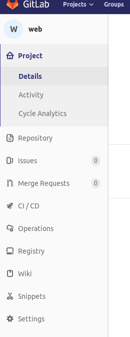
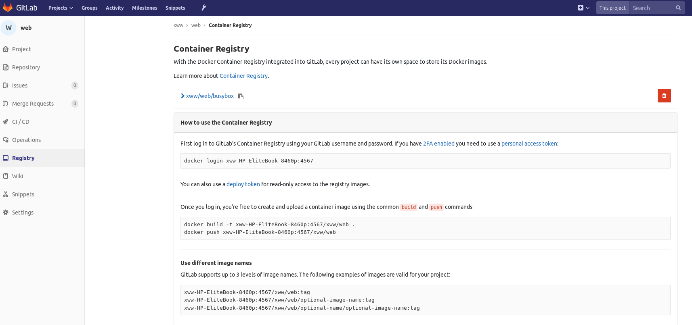

###gitlab启用自带的docker registry
gitlab安装后默认不开启自带的docker registry。
需要修改```/etc/gitlab/gitlab.rb```文件，修改以下配置
```
...
registry_external_url 'http://xww-HP-EliteBook-8460p:4567'
...
```
这里配置不带ssl证书认证的docker registry。修改后执行以下命令重启
```
sudo gitlab-ctl stop
sudo gitlab-ctl reconfigure
sudo gitlab-ctl start
```
在gitlab的页面上可以看到如下配置
在某个项目中的左侧有```Registry```面板。


进去```Registry```面板，可以看到使用项目内registry的帮助信息


可以看到使用命令
```
docker login xww-HP-EliteBook-8460p:4567
```
登录内置的registry
用户名和密码与gitlab的登录用户名密码一致，这也是gitlab用户权限控制的设计。
上传和下载镜像是通用的docker命令
```
docker tag busybox:latest xww-HP-EliteBook-8460p:4567/xww/web/busybox:v1
docker push xww-HP-EliteBook-8460p:4567/xww/web/busybox:v1
```
gitlab的docker registry可以和gitlab runner配合，在```.gitlab-ci.yaml```使用（在文件中使用docker命令操作内置registry镜像），前提需要gitlab-runner配置docker login。

在gitlab项目的registry页面上可以查看和删除上传后的docker 镜像。

亮点：
1、内置的registry与gitlab用户一致，能控制reginstry镜像使用范围在gitlab project内。