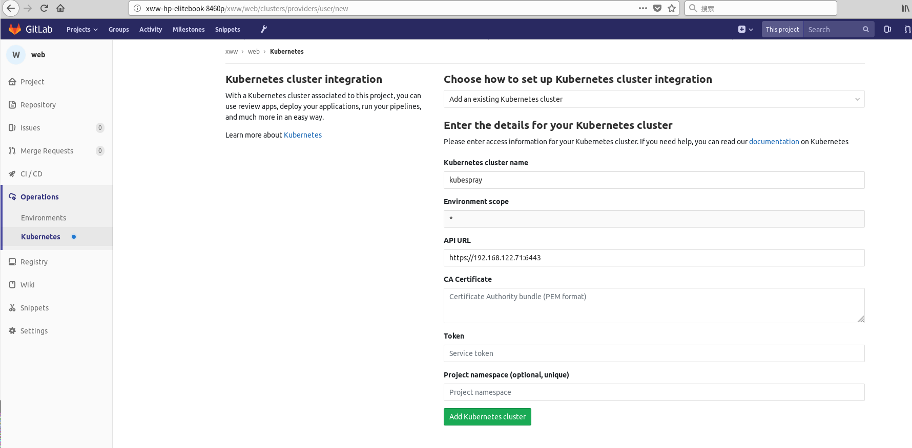

###gitlab中添加已存在的kubernetes
进入gitlab的某个项目中，在Oerations->Kubernetes下选择```add exist kuberntes...```便进入如下配置kubernetes参数界面



kubernetes的参数配置如下

1，name：任意名字
2, API URL： 通过以下命令获取
```
[root@kubesprayofflinenode ~]# cat ~/.kube/config | grep server:
    server: https://192.168.122.71:6443
```
3, CA Certificate：通过以下命令获取
```
[root@kubesprayofflinenode ~]# cat ~/.kube/config | grep certificate-authority-data | awk -F : '{print $2}' | awk '{sub("^ *","");sub(" *$","");print}' | base64 -d
-----BEGIN CERTIFICATE-----
MIIC+TCCAeGgAwIBAgIJAIJ2rYZ9KfobMA0GCSqGSIb3DQEBCwUAMBIxEDAOBgNV
BAMMB2t1YmUtY2EwIBcNMTgwOTEzMDIyNjA3WhgPMjExODA4MjAwMjI2MDdaMBIx
EDAOBgNVBAMMB2t1YmUtY2EwggEiMA0GCSqGSIb3DQEBAQUAA4IBDwAwggEKAoIB
AQDvJjxXCKONufXuyVEO/SOUQROKzZuh3tjFa8U9N/4XPzpyr8XiaqCP1anPkZ4H
ih9OHB2Xmw3kz1KbtstCmC0g6NuhilHiuilWpr8992xukh+yoEodw8bXgxy2tdtP
qyzGGdNS0Fc1MeZX4SOV1ZRY5xakp7VX4q9f7k/NE4jeLP/BdHMtZyt5PVOz1sMw
NsSz0jbq/3josvz4BWCnk8qUMAzTAt2PiRbEQ2WtZzDpBo6tU1yfgmZbVaymppwY
dl5/a2M3Nks9irkaq0Ee1nf+9IU9yIDXf1EssR7rTVP92lMvd6/Gl90dMKPAVIH+
3AgtaUFBmizoAqJ2Phr+tyK7AgMBAAGjUDBOMB0GA1UdDgQWBBR00+QroVTk/6xi
HuaTQa+ZQueh9zAfBgNVHSMEGDAWgBR00+QroVTk/6xiHuaTQa+ZQueh9zAMBgNV
HRMEBTADAQH/MA0GCSqGSIb3DQEBCwUAA4IBAQDge8xV5I9t5Na/0jg42jpIdOJy
1wR246uyxEytiZ6F+29bj3wC5I53c20+zcNqIFHipbTbzqlweylIadA4Vx1YlqLU
/9fulOTyVBeOcncbVVQ+j4u20zJq0nUgyzV9eNEaDJOs4rD70bjfo86hbOQKfIqp
GyFVBO0vLUpcxzkXF8Ks8SyboyhIOyyW0X6rZ0V69wkcjIpgJ4Qei/GxV/LBCWiB
3fmQvVW/1/c9SmNDE1ywax8VAW7Q6XWisxckmK5aBkeeimedBCZarFk8qGrxiksU
mE6eTkS/Q5Q0tTcW8ZQY/c2SXJ+LTGC2sRRlZrWlDNozJbr6P8VHcgc0IdE9
-----END CERTIFICATE-----
```

4, Token： 在kubernetes中创建一个serviceaccount给gitlab使用，该serviceaccount的token即是。
使用token.yaml文件如下
```
apiVersion: v1
kind: Namespace
metadata:
  name: gitlab-managed-apps
---
apiVersion: v1
kind: ServiceAccount
metadata:
  name: gitlab-sa
  namespace: gitlab-managed-apps 
---
kind: Role
apiVersion: rbac.authorization.k8s.io/v1beta1
metadata:
  name: gitlab-role
  namespace: gitlab-managed-apps
rules:
- apiGroups:
  - ""
  - extensions
  resources:
  - '*'
  verbs:
  - '*'
---
kind: RoleBinding
apiVersion: rbac.authorization.k8s.io/v1beta1
metadata:
  name: gitlab-rb
  namespace: gitlab-managed-apps
subjects:
  - kind: ServiceAccount
    name: gitlab-sa
    namespace: gitlab-managed-apps
roleRef:
  kind: Role
  name: gitlab-role
  apiGroup: rbac.authorization.k8s.io
---
kind: ClusterRoleBinding
apiVersion: rbac.authorization.k8s.io/v1beta1
metadata:
  name: gitlab-cluster
  namespace: gitlab-managed-apps
subjects:
  - kind: ServiceAccount
    name: default
    namespace: gitlab-managed-apps
roleRef:
  kind: ClusterRole
  name: cluster-admin
  apiGroup: rbac.authorization.k8s.io
---
apiVersion: v1
kind: Secret
metadata:
  name: gitlab-secret
  namespace: gitlab-managed-apps
  annotations: 
    kubernetes.io/service-account.name: gitlab-sa
type: kubernetes.io/service-account-token
```
执行以下命令获取
```
kubectl apply -f token.yaml
kubectl describe secrets/gitlab-secret -n gitlab-managed-apps | grep token:
```

5 ,Project Namespace: 按照4的配置，namespace为gitlab-managed-apps

6,在11.0.3上，Helm Tiller的安装名字空间在文件中固定
```
/opt/gitlab/embedded/service/gitlab-rails/lib/gitlab/kubernetes/helm.rb

cat ./service/gitlab-rails/lib/gitlab/kubernetes/helm.rb
module Gitlab
  module Kubernetes
    module Helm
      HELM_VERSION = '2.7.0'.freeze
#      NAMESPACE = 'gitlab-managed-apps'.freeze
      NAMESPACE = 'gitlab-apps'.freeze
    end
  end
end
```

###启用kubernetes内嵌的gitlab-runner