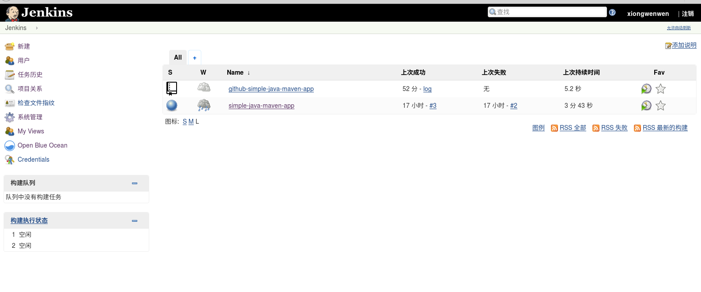
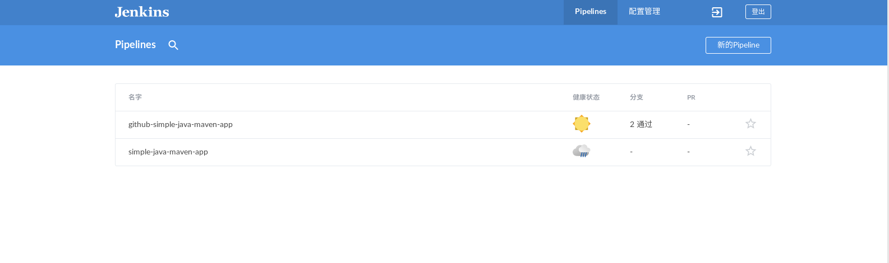

####jenkins blueocean使用
docker方式安装jenkins
```
docker pull jenkinsci/blueocean
```
```
docker volume create jenkins-data
```
创建jenkins-data卷，持久化存储jenkins的数据
```
docker run -d -it --name jenkins --restart always -u root -p 8281:8080 -v jenkins-data:/var/jenkins_home -v /var/run/docker.sock:/var/run/docker.sock -v /media/xww/sda1/myproject/jenkins:/home jenkinsci/blueocean
```

container内/home目录，映射到host目录/root/jenkins，可以将拉取的git项目存放在/media/xww/sda1/myproject/jenkins/*下，在容器的目录就变为/home/*

容器运行后，访问http://localhost:8281
参考网址
https://jenkins.io/doc/tutorials/using-jenkins-to-build-a-java-maven-project/
https://jenkins.io/blog/2017/04/12/welcome-to-blue-ocean-dashboard/
下面是参考上面两篇文章，jenkins与github项目ci一览
jenkins主页面

blueocean页面

simple-java-maven-app 项目pipeline


jenkins构建pipeline生成的Jenkinsfile
