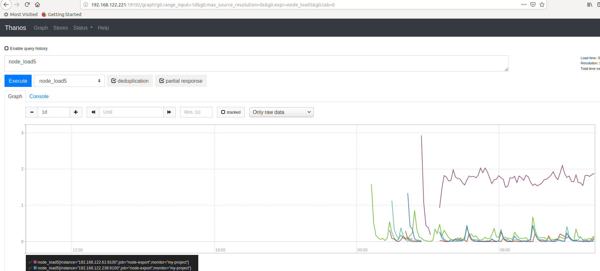
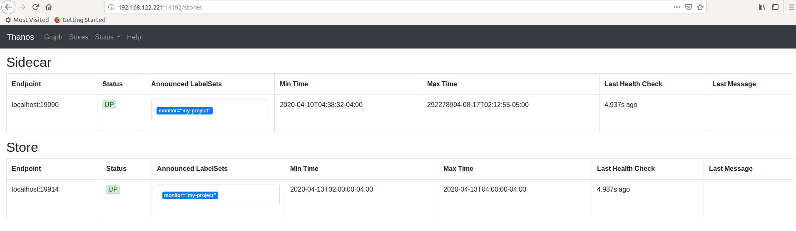

参考文档：https://www.kubernetes.org.cn/7217.html

## prometheus高可用方案

`prometheus`官方的高可用有几种方案：

1. HA：即两套 `prometheus` 采集完全一样的数据，外边挂负载均衡
2. HA + 远程存储：除了基础的多副本`prometheus`，还通过`Remote write` 写入到远程存储，解决存储持久化问题
3. 联邦集群：即`federation`，按照功能进行分区，不同的 `shard`分点采集不同的数据，由`Global`节点来统一存放，解决监控数据规模的问题。

使用官方建议的多副本 + 联邦仍然会遇到一些问题，本质原因是`prometheus`的本地存储没有数据同步能力，要在保证可用性的前提下再保持数据一致性是比较困难的，基本的多副本 `proxy` 满足不了要求，比如：

- `prometheus`集群的后端有 A 和 B 两个实例，A 和 B 之间没有数据同步。A 宕机一段时间，丢失了一部分数据，如果负载均衡正常轮询，请求打到A 上时，数据就会异常。
- 如果 A 和 B 的启动时间不同，时钟不同，那么采集同样的数据时间戳也不同，就多副本的数据不相同
- 就算用了远程存储，A 和 B 不能推送到同一个` tsdb`，如果每人推送自己的 `tsdb`，数据查询走哪边就是问题
- 官方建议数据做`Shard`分点，然后通过`federation`来实现高可用，但是边缘节点和`Global`节点依然是单点，需要自行决定是否每一层都要使用双节点重复采集进行保活。也就是仍然会有单机瓶颈。
- 另外部分敏感报警尽量不要通过`global`节点触发，毕竟从`Shard`节点到`Global`节点传输链路的稳定性会影响数据到达的效率，进而导致报警实效降低。

目前大多数的 `prometheus` 的集群方案是在存储、查询两个角度上保证数据的一致:

- 存储角度：如果使用` remote write` 远程存储， A 和 B后面可以都加一个` adapter`，`adapter`做选主逻辑，只有一份数据能推送到` tsdb`，这样可以保证一个异常，另一个也能推送成功，数据不丢，同时远程存储只有一份，是共享数据。方案可以参考[这篇文章](https://blog.timescale.com/blog/prometheus-ha-postgresql-8de68d19b6f5)
- 存储角度：仍然使用 `remote write` 远程存储，但是 A 和 B 分别写入 `tsdb1 `和`tsdb2` 两个时序数据库，利用`sync`的方式在 `tsdb1` 和`2` 之前做数据同步，保证数据是全量的。
- 查询角度：上边的方案需要自己实现，有侵入性且有一定风险，因此大多数开源方案是在查询层面做文章，比如`thanos` 或者`victoriametrics`，仍然是两份数据，但是查询时做数据去重和`join`。只是 `thanos`是通过 `sidecar` 把数据放在对象存储，`victoriametrics`是把数据`remote write` 到自己的 `server` 实例，但查询层` thanos-query` 和`victor`的 `promxy`的逻辑基本一致，都是为全局视图服务

实际需求：

随着集群规模越来越大，监控数据的种类和数量也越来越多：如`master/node` 机器监控、进程监控、4 大核心组件的性能监控，`pod` 资源监控、`kube-stats-metrics`、`k8s events`监控、插件监控等等。除了解决上面的高可用问题，还希望基于 `prometheus` 构建全局视图，主要需求有：

- 长期存储：1 个月左右的数据存储，每天可能新增几十G，希望存储的维护成本足够小，有容灾和迁移。考虑过使用 influxdb，但influxdb没有现成的集群方案，且需要人力维护。最好是存放在云上的 tsdb 或者对象存储、文件存储上。
- 无限拓展：我们有300+集群，几千节点，上万个服务，单机prometheus无法满足，且为了隔离性，最好按功能做 shard，如 master 组件性能监控与 pod 资源等业务监控分开、主机监控与日志监控也分开。或者按租户、业务类型分开（实时业务、离线业务）。
- 全局视图：按类型分开之后，虽然数据分散了，但监控视图需要整合在一起，一个 grafana 里 n个面板就可以看到所有地域+集群+pod 的监控数据，操作更方便，不用多个 grafana 切来切去，或者 grafana中多个 datasource 切来切去。
- 无侵入性：不要对已有的 prometheus 做过多的修改，因为 prometheus 是开源项目，版本也在快速迭代，我们最早使用过 1.x，可1.x 和 2.x的版本升级也就不到一年时间，2.x 的存储结构查询速度等都有了明显提升，1.x 已经没人使用了。因此我们需要跟着社区走，及时迭代新版本。因此不能对 prometheus 本身代码做修改，最好做封装，对最上层用户透明。

在调研了大量的开源方案(cortex/thanos/victoria/..)和商业产品之后，我们选择了 thanos，准确的说，thanos只是监控套件，与 原生prometheus 结合，满足了长期存储+ 无限拓展 + 全局视图 + 无侵入性的需求。

## 简单配置部署

Thanos是一组组件，在[官网](https://thanos.io/)上可以看到包括：

- Bucket
- Check
- Compactor
- Query
- Rule
- Sidecar
- Store

除了官方提到的这些，其实还有：

- receive
- downsample

看起来组件很多，但其实部署时二进制只有一个，非常方便。只是搭配不同的参数实现不同的功能，如 query 组件就是 ./thanos query，sidecar 组件就是./thanos sidecar，组件all in one，代码只有一份，体积很小。


示例使用Thanos Sidecar，Store，Query三个组件。

### 第 1 步：确认已有的 prometheus

docker-compose运行的prometheus配置

```
prometheus:
    image: prom/prometheus
    volumes:
      - ./prometheus/:/etc/prometheus/
      - /usr/local/npg/prometheus_data:/prometheus
    command:
      - '--config.file=/etc/prometheus/prometheus.yml'
      - '--storage.tsdb.path=/prometheus'
      - '--storage.tsdb.retention=35d'
      - '--storage.tsdb.max-block-duration=2h'
      - '--storage.tsdb.min-block-duration=2h'
      - '--storage.tsdb.wal-compression'
      - '--storage.tsdb.retention.time=2h'
      - '--web.console.libraries=/usr/share/prometheus/console_libraries'
      - '--web.console.templates=/usr/share/prometheus/consoles'
      - '--web.enable-admin-api'
      - '--web.enable-lifecycle'
    links:
     - "alertmanager"
    ports:
      - 9090:9090
    restart: always
    network_mode: "bridge"

```

web.enable-lifecycle一定要开，用于热加载reload你的配置，retention保留 2 小时，prometheus 默认 2 小时会生成一个 block，thanos 会把这个 block 上传到对象存储。

对 prometheus 的要求：

- 2.2.1版本以上
- 声明你的external_labels
- 启用–web.enable-admin-api
- 启用–web.enable-lifecycle

### 第 2 步：部署 sidecar 组件

Sidecar 组件作为 Prometheus server 的 sidecar ，与 Prometheus server 部署于同一个 pod或主机 中。 他有两个作用：

1. 它使用Prometheus的remote read API，实现了Thanos的Store API。这使后面要介绍的Query 组件可以将Prometheus服务器视为时间序列数据的另一个来源，而无需直接与Prometheus API交互（这就是 sidecar 的拦截作用）
2. 可选配置：在Prometheus每2小时生成一次TSDB块时，Sidecar将TSDB块上载到对象存储桶中。这使得Prometheus服务器可以以较低的保留时间运行，同时使历史数据持久且可通过对象存储查询。

当然，这不意味着Prometheus可以是完全无状态的，因为如果它崩溃并重新启动，您将丢失2个小时的指标，不过如果你的 prometheus 也是多副本，可以减少这2h 数据的风险。

sidecar配置：

```
thanos sidecar --tsdb.path /usr/local/npg/prometheus_data --prometheus.url http://localhost:9090 --objstore.config-file /root/config.yaml --http-address  0.0.0.0:19191 --grpc-address  0.0.0.0:19090
```

存储配置文件为/root/config.yaml，可以是共享对象存储或者本地文件系统，这里演示方便使用的是本地文件系统，文件内容如下：

```
[root@localhost ~]# cat config.yaml 
type: FILESYSTEM
config:
  directory: "/data"

```

### 第 3 步：部署 query 组件

sidecar 部署完成，可以安装 query 组件

Query组件（也称为“查询”）实现了Prometheus 的HTTP v1 API，可以像 prometheus 的 graph一样，通过PromQL查询Thanos集群中的数据。

简而言之，sidecar暴露了StoreAPI，Query从多个StoreAPI中收集数据，查询并返回结果。Query是完全无状态的，可以水平扩展。

query配置

```
thanos query     --http-address 0.0.0.0:19192  --store   localhost:19090  --store localhost:19914
```

store 参数代表的就是刚刚启动的 sidecar 组件。

### 第 4 步：部署 store gateway 组件

在第 3 步里，./thanos query有一条–store是 xxx:19914，这个 19914 就是接下来要说的store gateway组件。

在第 2 步的 sidecar 配置中，如果你配置了对象存储objstore.config-file，你的数据就会定时上传到bucket 中，本地只留 2 小时，那么要想查询 2 小时前的数据怎么办呢？数据不被 prometheus 控制了，应该如何从 bucket 中拿回来，并提供一模一样的查询呢？

Store gateway 组件：Store gateway 主要与对象存储交互，从对象存储获取已经持久化的数据。与sidecar一样，Store gateway也实现了store api，query 组可以从 store gateway 查询历史数据。

配置

```
thanos store --data-dir=/store --objstore.config-file=/root/config.yaml --http-address=0.0.0.0:19904 --grpc-address=0.0.0.0:19914 --index-cache-size=250MB --sync-block-duration=5m --min-time=-2w --max-time=-1hg

```

因为Store gateway需要从网络上拉取大量历史数据加载到内存，因此会大量消耗 cpu 和内存，这个组件也是 thanos 面世时被质疑过的组件，不过当前的性能还算可以，遇到的一些问题后面会提到。

Store gateway也可以无限拓展，拉取同一份 bucket 数据。

下图是查找近1d的数据。可以超过2小时，证明sotre组件生效。



store显示在query的web 页面上



