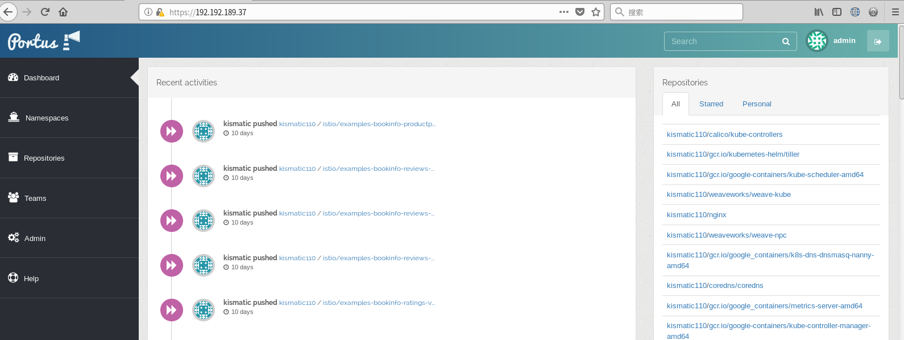
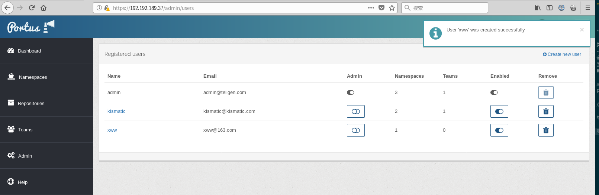
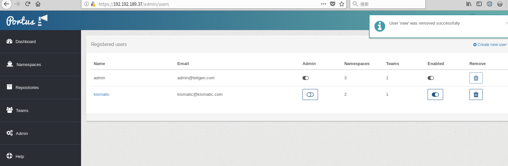
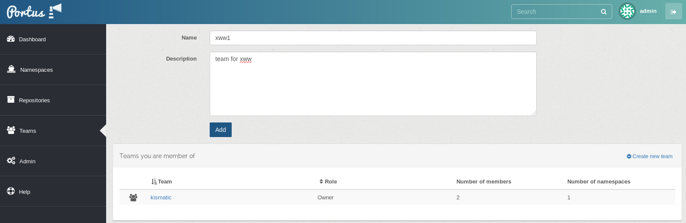
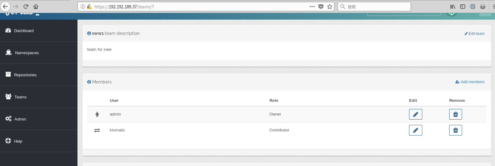
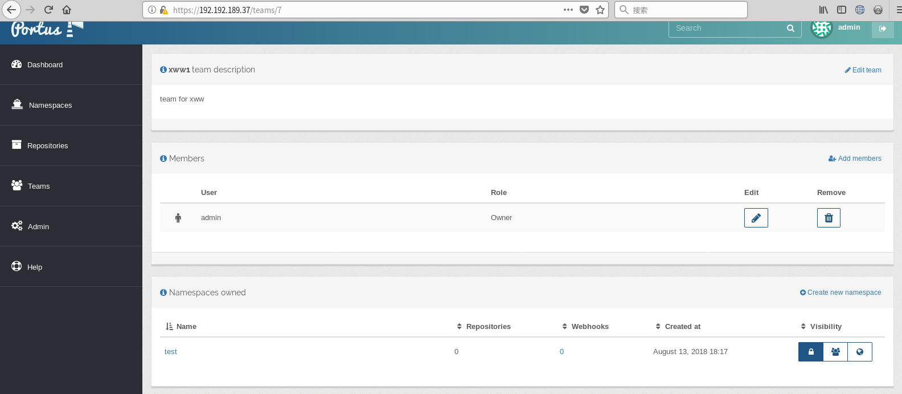

###portus概念术语
* User（用户）:portus上面可以创建多个用户，管理员用户可以把其他用户提升为管理员用户。用户拥有自己的名字空间。
* Team（团队）:团队由用户组成，拥有团队名字空间。
* Team Roles（团队角色）:团队中用户可被赋予的角色，有Viewer、Contributor、Owner。
  Viewer：只拥有pull镜像的权限.
  Contributor：拥有pull和push镜像的权限.
  Owner：拥有pull和push镜像的权限,可以管理其他成员，为其变更权限，增删团队用户。
* Namespaces（名字空间）:每个namespace是个镜像仓库。名字空间的类型有以下

类型|描述|权限
----|---|---
全局名字空间|属于整个portus|只有admin可以push，每个人都可以pull
团队名字空间|属于team团队|通过team内用户的team role决定
用户名字空间|每个用户拥有自身名字空间|只有该用户和管理员可以push/pull

###用户
####创建新用户
只有admin用户可以创建用户，admin用户登录后的界面如下

点击左侧的Admin按钮，然后点击右边上方Users，进入用户列表显示

单击Create new user进入创建新用户信息面板

填好信息后，点击Create创建用户，创建用户成功后，会显示包含了新用户的用户列表。

####删除用户
只有admin用户可以创建用户，admin用户登录后，点击左侧的Admin按钮，然后点击右边上方Users，进入用户列表显示

在最后两列，配置指定用户的Enabled,Remove。如果只想暂时停用某用户，点击Enabled禁用掉，如果想永久删除则点击Remove按钮。

###普通用户提升为管理员
只有管理员用户才能提升普通用户为管理员
管理员用户登录后，点击左侧的Admin按钮，然后点击右边上方Users，进入用户列表，有一列Admin，通过激活它便可以把对于行用户提升为管理员用户。通过禁用它便可以把对于行用户降级为普通用户。
###团队
####查看Team
用户登录后，点击左侧的Teams，便可以看到自己所属的Team。

####创建Team
用户在点击左侧的Teams后，点击右上方的Create new team，填好信息后，点击Add按钮创建新的team。

创建成功后，在Team列表中显示

####Team成员变更
只有Team的Owner角色用户才能增添和删除用户
在team的详情面板中，点击Add members便可以添加用户，点击Members列表下的用户对于行的Remove按钮可以删除用户


###名字空间
全局名字空间，整个portus只有一个，无法新建。用户名字空间随着用户创建后默认创建起来。只有Team名字空间可以由Team的Owner角色用户创建

####创建Team名字空间
在team的详情面板中，点击Create new namespace可以创建新的team名字空间

####Team名字空间镜像推拉策略变更
在team的详情面板中，名字空间的Visibility可以配置为三种。

将鼠标悬浮于策略图标上，会看到关于该策略的提示。
###镜像推送与下载
下面以一个例子演示portus镜像上传与下载的操作步骤
首先portus镜像上传与下载都需要预先在操作的机器上配置证书和docker命令行登录portus
演示环境：
###### portus用户名/密码等
https://192.192.189.144
baolh/123456aB
团队名字空间: telecom
######配置证书与docker命令行登录
以centos 7.3为例，需要运行以下配置， 
1\. 手动添加`portus.teligen.com`至`/etc/hosts`   

```
# vim /etc/hosts
......
192.192.189.144 portus.teligen.com
```

2\. 拷贝portus.crt至系统目录后，docker login：    

```
# cp portus.crt /etc/pki/ca-trust/source/anchors/
# update-ca-trust 
# docker login portus.teligen.com:5000
Username: baolh
Password: 
Login Succeeded
```
#####上传镜像
tag / push 镜像至镜像仓库:    

```
# docker tag sonatype/nexus:3 portus.teligen.com:5000/telecom/sonatype/nexus:3
# docker push portus.teligen.com:5000/telecom/sonatype/nexus:3
The push refers to a repository [portus.teligen.com:5000/telecom/sonatype/nexus]
cd8a60667200: Pushed 
59289d78b8c4: Pushed 
32e104ecc8b6: Pushed 
b35d14f4a6a9: Pushed 
fa4ac6535770: Pushed 
b362758f4793: Pushed 
3: digest: sha256:3cdaf4b23857b7b4a30aac562df55e241f50e5e1d3e13052f8b1d9a1b0dd3733 size: 1579
```

刷新`https://192.192.189.144`的dashboard，可以看到nexus镜像已经上传成功:    


#####下载镜像
从仓库pull镜像
```
docker pull portus.teligen.com:5000/telecom/sonatype/nexus:3
```
如果docker命令行所登录的用户没有该镜像的pull权限，会报错。解决办法是以具有权限的用户docker命令行登录
```
# docker login portus.teligen.com:5000
Username: baolh
Password: 
Login Succeeded
```
再次pull镜像。
```
docker pull portus.teligen.com:5000/telecom/sonatype/nexus:3
```