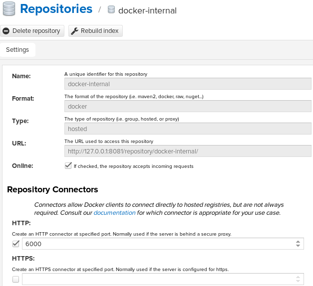
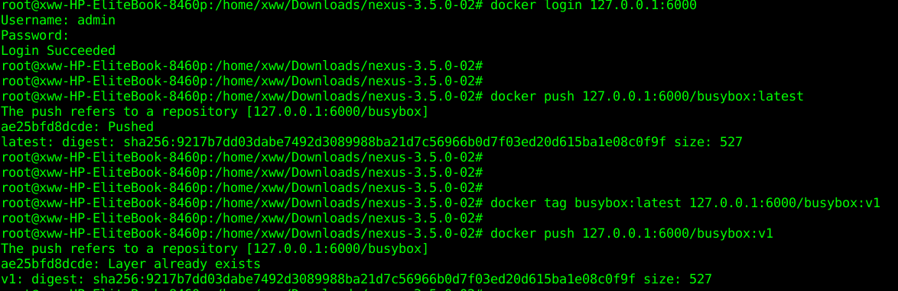
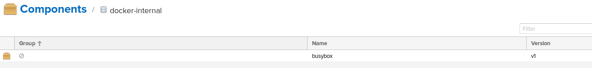

nexus 最初用于搭建 maven 私服，提供企业级 maven jar 包管理等功能；2.x 后续支持了 npm、rpm 等包管理；最新版本 3.x 开始支持 Docker 仓库。下面使用nexus配置管理docker registry。
nexus支持三种类型的docker registry
内置的docker registry
外部docker registry的代理proxy
docker registry组群group（其实是前两者类型的组合）
###创建内置的docker registry
在设置```Repositories```选项卡中中选择```Create repository```
选择类型为```docker(host)```


配置名称为```docker-internal```,配置http端口为6000.


创建完成的Repositories的信息如下


登录nexus创建的内置的docker registry，并push一个镜像。


nexus页面查看的镜像信息,可以在上面删除镜像。



总结：
  nexus创建的内置docker registry跟单独的docker registry类似，增加了页面
  可以方便搜索，查看image信息，可以配置http，https两种认证方式。
  并且用户信息与nexus自身的用户信息统一管理，可以在页面上删除docker 镜像。
  一句话总结，可以方便增删查。
###创建外部docker registry的代理proxy
暂时未配置成功
不能上传下载镜像，也没有与源镜像仓库同步镜像。
###创建docker registry组群group
创建后，能看到加入的内置的docker registry中的docker 镜像。