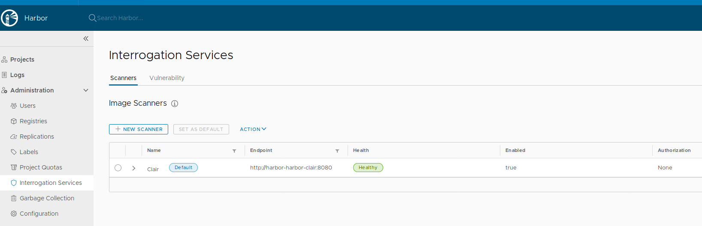
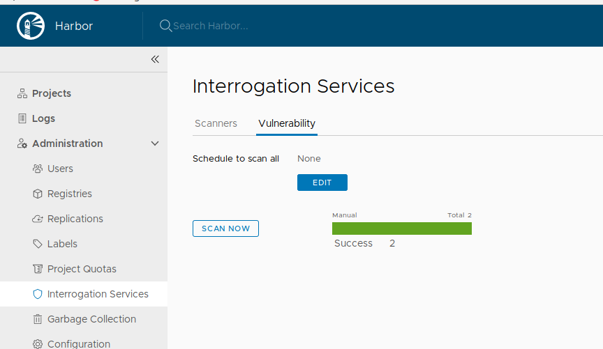
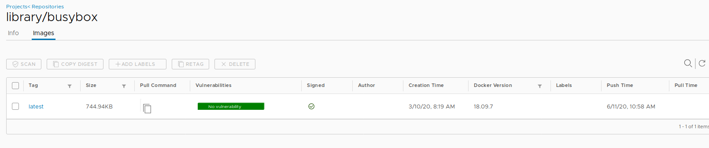
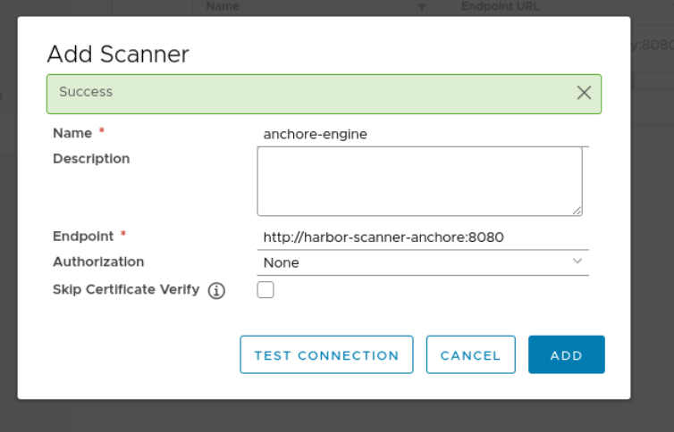
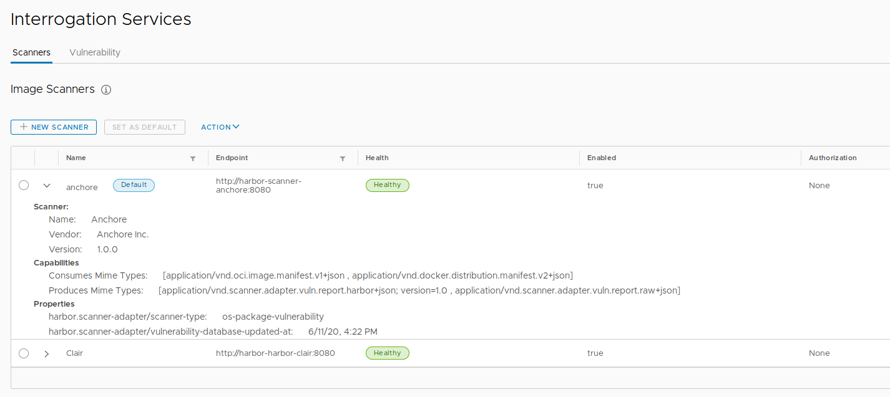
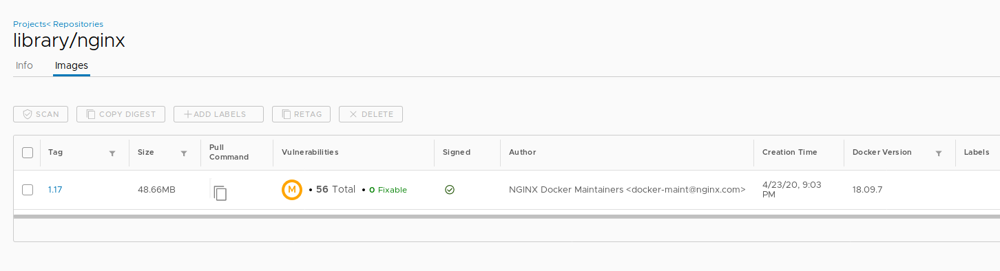
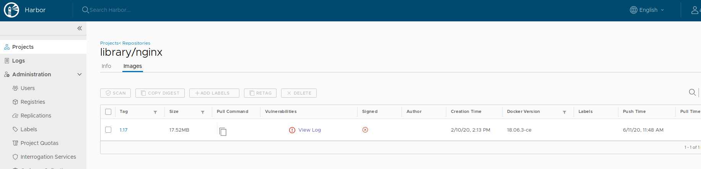

### harbor镜像安全扫描与可信上传

#### 安全扫描

trivy

harbor默认采用clair作为镜像扫描器，可以增添多个镜像扫描器。



镜像扫描



扫描后的镜像`busybox`



扫描后的镜像`nginx`

harbor添加镜像扫描器anchore

1、使用docker-compose部署anchore，anchore会从漏洞库取数据存入postgres数据库，因此，首次部署需要联网。安装anchore-cli或者登入anchore-api容器执行以下查看抓取数据进度

```
xww@xww-NUC8i5BEH:/media/xww/sda1/dockersecurity/anchore$ anchore-cli system feeds list
Feed                   Group                  LastSync                          RecordCount        
github                 github:composer        pending                           None       ...                     
nvdv2                  nvdv2:cves             pending                           None               
vulnerabilities        alpine:3.10            2020-06-11T08:11:25.691831        1725       ...              
vulnerabilities        debian:7               pending                           15000              
...
```

２、部署`harbor-adapter-anchore`到kubernetes集群中

创建anchore-creds的secret保存anchore用户名与密码

```
kubectl create secret generic anchore-creds --from-literal=username=admin --from-literal=password=foobar
```

harbor-adapter-anchore的yaml文件中，注意配置anchore endpoint，username，password。

```
...
    spec:
      containers:
        - name: adapter
          image: anchore/harbor-scanner-adapter:1.0.0
          imagePullPolicy: IfNotPresent
          env:
            - name: SCANNER_ADAPTER_LISTEN_ADDR
              value: ":8080"
            - name: ANCHORE_ENDPOINT
              value: "http://192.168.50.2:8228"
            - name: ANCHORE_USERNAME
              valueFrom:
                secretKeyRef:
                  name: anchore-creds
                  key: username
            - name: ANCHORE_PASSWORD
              valueFrom:
                secretKeyRef:
                  name: anchore-creds
                  key: password
...
```

anchore用户名密码默认为admin/foobar 可通过命令创建新的用户名与密码

```
anchore-cli account add harbor
anchore-cli account user add --account harbor harbor harboruserpass123
```

3、在harbor上配置新增scan，endpoint配置为harbor-adapter-anchore的service名称与端口



设置anchore为默认镜像扫描器，然后扫描镜像





nginx镜像在harbor自带clair镜像扫描器扫描没有问题，但是在anchore镜像扫描器发现漏洞。因为clair处于离线安装没有完整拉取其漏洞库。所以镜像漏洞库的维护与更新非常重要。

查看clair容器日志，发现其一直没有完全获取其漏洞库，保持以2分钟的幂次方等待尝试拉取数据。

```
root@focal-1:/home/test# kubectl logs harbor-harbor-clair-6cffc7d8c6-sjklz  -c clair
ls: /harbor_cust_cert: No such file or directory
{"Event":"running database migrations","Level":"info","Location":"pgsql.go:216","Time":"2020-06-11 02:39:01.677047"}
...
{"Event":"Not all updaters succeeded, sleep duration: 2m0s","Level":"warning","Location":"updater.go:136","Time":"2020-06-11 02:39:28.248869"}
...
{"Event":"Not all updaters succeeded, sleep duration: 4m0s","Level":"warning","Location":"updater.go:136","Time":"2020-06-11 02:41:29.639687"}
...
{"Event":"Not all updaters succeeded, sleep duration: 8m0s","Level":"warning","Location":"updater.go:136","Time":"2020-06-11 02:45:35.098772"}
...
{"Event":"Not all updaters succeeded, sleep duration: 16m0s","Level":"warning","Location":"updater.go:136","Time":"2020-06-11 02:53:36.323417"}
...
{"Event":"Not all updaters succeeded, sleep duration: 32m0s","Level":"warning","Location":"updater.go:136","Time":"2020-06-11 03:09:37.911076"}
...
{"Event":"Not all updaters succeeded, sleep duration: 1h4m0s","Level":"warning","Location":"updater.go:136","Time":"2020-06-11 03:41:38.427084"}
...
{"Event":"Not all updaters succeeded, sleep duration: 2h8m0s","Level":"warning","Location":"updater.go:136","Time":"2020-06-11 04:45:39.729896"}
...
```

#### 可信上传

harbor默认采用notary作为可信镜像签名与验证工具（前提是harbor必须配置HTTPS）

示例，采用harbor helm chart 部署了v1.10版本镜像仓库，配置中采用nodeport暴露服务，并且配置自动生成tls证书。修改的配置如下

```
expose:
  type: nodePort
  tls:
     enabled: true
     secretName: ""
     commonName: "portus.teligen.com"
  nodePort:
    # The name of NodePort service
    name: harbor
    ports:
      http:
        # The service port Harbor listens on when serving with HTTP
        port: 80
        # The node port Harbor listens on when serving with HTTP
        nodePort: 30002
      https:
        # The service port Harbor listens on when serving with HTTPS
        port: 443
        # The node port Harbor listens on when serving with HTTPS
        nodePort: 30003
      # Only needed when notary.enabled is set to true
      notary:
        # The service port Notary listens on
        port: 4443
        # The node port Notary listens on
        nodePort: 30004
externalURL: https://portus.teligen.com:30003
```

harbor运行后，从组件core的pod目录`/etc/core/ca/..data/`下存有自动生成tls证书。需要把它们拷到docker宿主机上，并且放置在目录1) `/etc/docker/certs.d/portus.teligen.com:30003/`和2)`/usr/local/share/ca-certificates/`，运行命令`update-ca-certificates`导入可信证书。

可信镜像测试

１、配置环境变量`export DOCKER_CONTENT_TRUST=1`和`export DOCKER_CONTENT_TRUST_SERVER=https://portus.teligen.com:30004`开启可信配置。

２、执行以下命令上传镜像，上传完镜像内容，并且会上传镜像元数据，并且加密保存镜像元数据。

```
root@focal-1:/home/test/data# docker push portus.teligen.com:30003/library/nginx:1.17
The push refers to repository [portus.teligen.com:30003/library/nginx]
b3003aac411c: Layer already exists 
216cf33c0a28: Layer already exists 
c2adabaecedb: Layer already exists 
1.17: digest: sha256:cccef6d6bdea671c394956e24b0d0c44cd82dbe83f543a47fdc790fadea48422 size: 948
Signing and pushing trust metadata
You are about to create a new root signing key passphrase. This passphrase
will be used to protect the most sensitive key in your signing system. Please
choose a long, complex passphrase and be careful to keep the password and the
key file itself secure and backed up. It is highly recommended that you use a
password manager to generate the passphrase and keep it safe. There will be no
way to recover this key. You can find the key in your config directory.
Enter passphrase for new root key with ID c8610da: 
Passphrase is too short. Please use a password manager to generate and store a good random passphrase.
Enter passphrase for new root key with ID c8610da: 
Repeat passphrase for new root key with ID c8610da: 
Enter passphrase for new repository key with ID 0e177b1: 
Repeat passphrase for new repository key with ID 0e177b1: 
Finished initializing "portus.teligen.com:30003/library/nginx"
Successfully signed portus.teligen.com:30003/library/nginx:1.17
root@focal-1:/home/test/data# 
```

3、检查可信镜像

```
root@focal-1:/home/test/data# docker trust inspect portus.teligen.com:30003/library/nginx:1.17
[
    {
        "Name": "portus.teligen.com:30003/library/nginx:1.17",
        "SignedTags": [
            {
                "SignedTag": "1.17",
                "Digest": "cccef6d6bdea671c394956e24b0d0c44cd82dbe83f543a47fdc790fadea48422",
                "Signers": [
                    "Repo Admin"
                ]
            }
        ],
        "Signers": [],
        "AdministrativeKeys": [
            {
                "Name": "Root",
                "Keys": [
                    {
                        "ID": "69afff7f00b55c1c5cc5d8a0530e770f8673b54f720b28223fbf04fd03bf84af"
                    }
                ]
            },
            {
                "Name": "Repository",
                "Keys": [
                    {
                        "ID": "0e177b10c4097374d5145086010b4e8b574b9767cbf8152a74601148d250cff9"
                    }
                ]
            }
        ]
    }
]
root@focal-1:/home/test/data#
```

4、取消可信配置`unset DOCKER_CONTENT_TRUST`,上传一个新镜像

```
root@focal-2:/home/test# docker push portus.teligen.com:30003/library/busybox:latest
The push refers to repository [portus.teligen.com:30003/library/busybox]
a6d503001157: Pushed 
latest: digest: sha256:afe605d272837ce1732f390966166c2afff5391208ddd57de10942748694049d size: 527
root@focal-2:/home/test#
```

５、打开可信配置，拉取新镜像，会发现notary没有该镜像的可信信息，拒绝下载。

```
root@focal-1:/home/test# docker pull portus.teligen.com:30003/library/busybox:latest
Error: remote trust data does not exist for portus.teligen.com:30003/library/busybox: portus.teligen.com:30004 does not have trust data for portus.teligen.com:30003/library/busybox
root@focal-1:/home/test#
```

测试结果表明，使用notary可信可以只下载内容可信的镜像

６、测试篡改镜像内容，上传覆盖原始镜像

```
root@focal-2:/home/test# docker images | grep nginx
nginx                                      1.17                             602e111c06b6        6 weeks ago         127MB
portus.teligen.com:30003/library/nginx     1.17                             602e111c06b6        6 weeks ago         127MB
goharbor/nginx-photon                      v1.10.1                          01276d086ad6        4 months ago        44MB
root@focal-2:/home/test# 
root@focal-2:/home/test# docker tag goharbor/nginx-photon:v1.10.1 portus.teligen.com:30003/library/nginx:1.17
root@focal-2:/home/test# docker push portus.teligen.com:30003/library/nginx:1.17
The push refers to repository [portus.teligen.com:30003/library/nginx]
48cda078e98d: Pushed 
47a4bb1cfbc7: Pushed 
1.17: digest: sha256:8f900484be88c2f72699996ade92cbcbd84366f386396af0ac093430e6c2f7f2 size: 740
Signing and pushing trust metadata
ERRO[0010] couldn't add target to targets: could not find necessary signing keys, at least one of these keys must be available: 0e177b10c4097374d5145086010b4e8b574b9767cbf8152a74601148d250cff9 
failed to sign portus.teligen.com:30003/library/nginx:1.17: could not find necessary signing keys, at least one of these keys must be available: 0e177b10c4097374d5145086010b4e8b574b9767cbf8152a74601148d250cff9
root@focal-2:/home/test# docker images | grep nginx
nginx                                      1.17                             602e111c06b6        6 weeks ago         127MB
portus.teligen.com:30003/library/nginx     <none>                           602e111c06b6        6 weeks ago         127MB
goharbor/nginx-photon                      v1.10.1                          01276d086ad6        4 months ago        44MB
portus.teligen.com:30003/library/nginx     1.17                             01276d086ad6        4 months ago        44MB
root@focal-2:/home/test# docker rmi portus.teligen.com:30003/library/nginx:1.17
Untagged: portus.teligen.com:30003/library/nginx:1.17
Untagged: portus.teligen.com:30003/library/nginx@sha256:8f900484be88c2f72699996ade92cbcbd84366f386396af0ac093430e6c2f7f2
root@focal-2:/home/test# docker pull portus.teligen.com:30003/library/nginx:1.17
Pull (1 of 1): portus.teligen.com:30003/library/nginx:1.17@sha256:cccef6d6bdea671c394956e24b0d0c44cd82dbe83f543a47fdc790fadea48422
sha256:cccef6d6bdea671c394956e24b0d0c44cd82dbe83f543a47fdc790fadea48422: Pulling from library/nginx
Digest: sha256:cccef6d6bdea671c394956e24b0d0c44cd82dbe83f543a47fdc790fadea48422
Status: Image is up to date for portus.teligen.com:30003/library/nginx@sha256:cccef6d6bdea671c394956e24b0d0c44cd82dbe83f543a47fdc790fadea48422
Tagging portus.teligen.com:30003/library/nginx@sha256:cccef6d6bdea671c394956e24b0d0c44cd82dbe83f543a47fdc790fadea48422 as portus.teligen.com:30003/library/nginx:1.17
portus.teligen.com:30003/library/nginx:1.17
root@focal-2:/home/test# 
root@focal-2:/home/test# docker images | grep nginx
nginx                                      1.17                             602e111c06b6        6 weeks ago         127MB
portus.teligen.com:30003/library/nginx     1.17                             602e111c06b6        6 weeks ago         127MB
goharbor/nginx-photon                      v1.10.1                          01276d086ad6        4 months ago        44MB
root@focal-2:/home/test# 
```

并且，在镜像仓库中可以看到镜像内容的异常，需要上传正确的镜像内容。



测试结果表明，使用notary可信可以防止下载被篡改的镜像。
