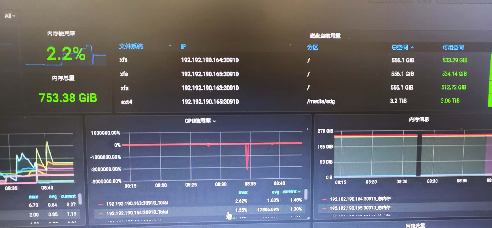
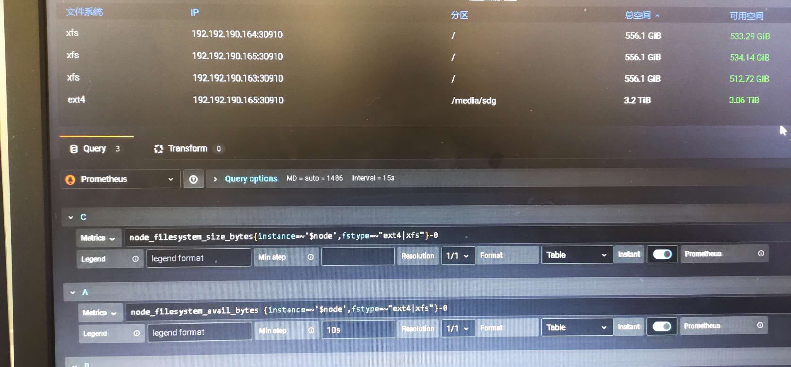

### 修改`prometheus-node-exporter`的配置参数

默认部署`prometheus-node-exporter`时，未开启主机根文件系统到容器内部的映射。`prometheus-node-exporter`安装后部署脚本存放在`/etc/kubernetes/spec/prometheus-node-exporter`目录。`prometheus-node-exporter`以`helm`形式安装。

修改`prometheus-node-exporter`的配置，把物理主机根文件系统映射到容器内部。编辑文件`/etc/kubernetes/spec/prometheus-node-exporter/values.yaml`修改以下配置


```
...
extraArgs:
  - --path.rootfs=/host
extraHostVolumeMounts:
  - name: root
    hostPath: /
    mountPath: /host
    readOnly: true
    mountPropagation: HostToContainer
...
```

参数`extraHostVolumeMounts`把物理主机的根分区只读挂载到容器内部的`/host`文件夹，参数`extraArgs`指定容器程序监控的根分区为`/host`。

### 重新部署`prometheus-node-exporter`

组件`prometheus-node-exporter`是个收集监控指标的程序，`prometheus`从`prometheus-node-exporter`抓取数据，因此组件`prometheus-node-exporter`重启不会对监控历史数据产生影响，历史监控数据都存储在`prometheus`。运行以下命令重启`prometheus-node-exporter`。

```
helm del --purge prometheus-node-exporter
helm install --name prometheus-node-exporter /etc/kubernetes/spec/prometheus-node-exporter --namespace monitoring1
```

重启成功后，可以看到挂载点`/media/sdg`的分区容量。



注：1、`grafana`配置面板只查看文件分区类型为`ext4|xfs`的分区，分区类型使用`mount`命令可以查看，如果想看其他文件类型的分区，例如`nfs`，可以在面板配置，修改`ext4|xfs`为`ext4|xfs|nfs`。



2、在`prometheus-node-exporter`部署后，主机新挂载的分区如果不被识别，重启组件`prometheus-node-exporter`。重启方法为删除组件的`pod`自动生成新的`pod`。

