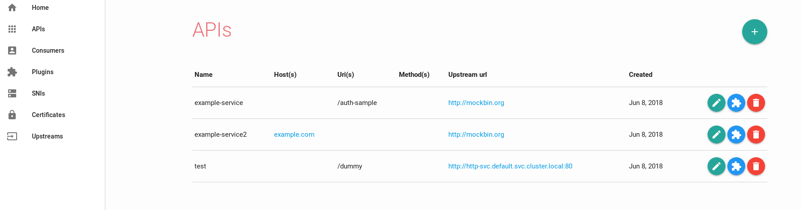
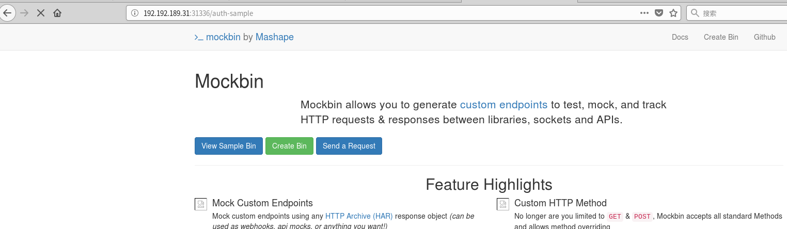
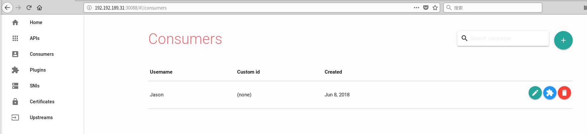
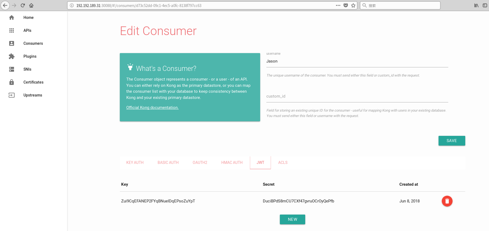
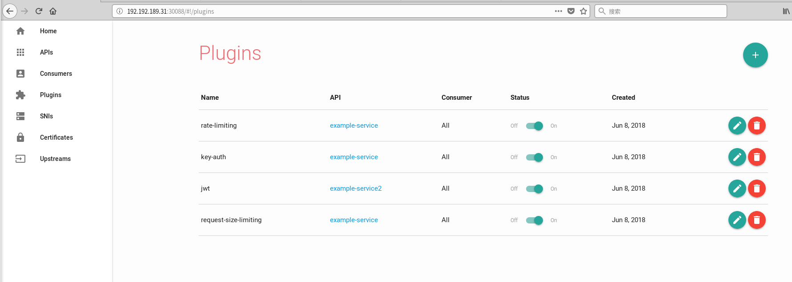
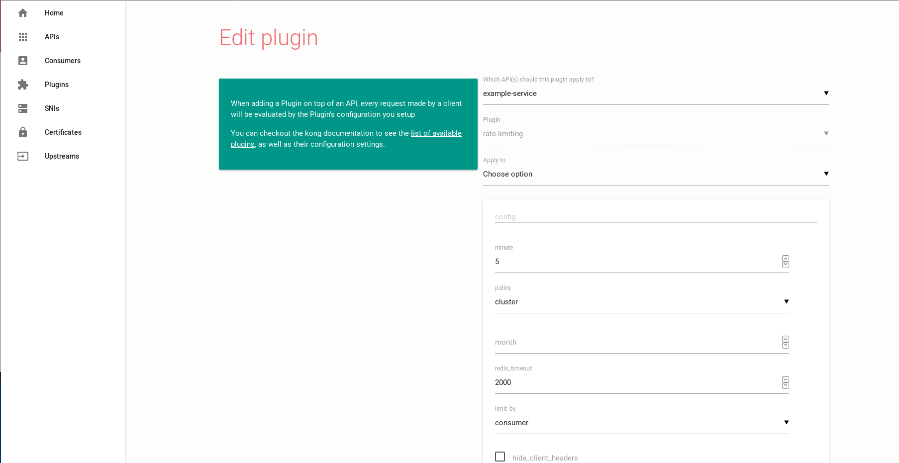

###k8s部署kong-dashboard
实验环境：已经部署了kong的kubernetes环境。
首先找出kong管理端口的服务名
```
[root@rhel74 kong-dashboard]# kubectl get svc
NAME              TYPE        CLUSTER-IP       EXTERNAL-IP   PORT(S)                              AGE
cassandra         ClusterIP   None             <none>        9042/TCP                             1d
http-svc          ClusterIP   172.20.182.62    <none>        80/TCP                               1d
kong-admin        NodePort    172.20.121.84    <none>        8001:32423/TCP                       4h

```
kong管理端口的服务名为kong-admin
创建kong-dashboard.yaml文件如下
```
apiVersion: v1
kind: Service
metadata:
  name: kong-dashboard
spec:
  type: NodePort
  ports:
  - name: kong-dashboard
    port: 8080
    targetPort: 8080
    protocol: TCP
  selector:
    app: kong-dashboard


---

apiVersion: extensions/v1beta1
kind: Deployment
metadata:
  name: kong-dashboard
spec:
  template:
    metadata:
      labels:
        name: kong-dashboard
        app: kong-dashboard
    spec:
      containers:
      - name: kong-dashboard
        image: pgbi/kong-dashboard:v3.3.0
        args: ["start","--kong-url","http://kong-admin:8001"]
        ports:
        - name: kong-dashboard
          containerPort: 8000
          protocol: TCP
```
在pod的args中配置了kong管理端口的服务。
使用命令启动kong-dashboard。
```
kubectl create -f kong-dashboard.yaml
```
###kong-dashboard试用
在kong上配置服务路由转发,如下图所示



配置外部服务```http://mockbin.org```通过路径```/auth-sample```转发
配置外部服务```http://mockbin.org```通过http头部```Host: example.com```转发
配置内部服务```http://http-svc.default.svc.cluster.local:80```通过路径```/dummy```转发
访问```http://192.192.189.31:31336/dummy```

访问```http://192.192.189.31:31336/auth-sample```

访问```http://192.192.189.31:31336/```,增加http头部```Host: example.com```。


在kong-dashboard上创建consumer为```Jason```。

配置用户```Jason```的```key-auth```插件```plugin```。

配置用户```Jason```的```jwt```的插件```plugin```。


以下创建的api服务配置认证```key-auth```和```jwt```的插件```plugin```。


对配置了key-auth认证的example-service使用http头部apikey认证访问


对配置了key-auth认证的example-service2使用http头部Authorization认证访问


配置api服务的请求速率和大小限制插件

配置了example-service的请求速率为每分钟内5次

配置了example-service的请求块大小限制为1M
