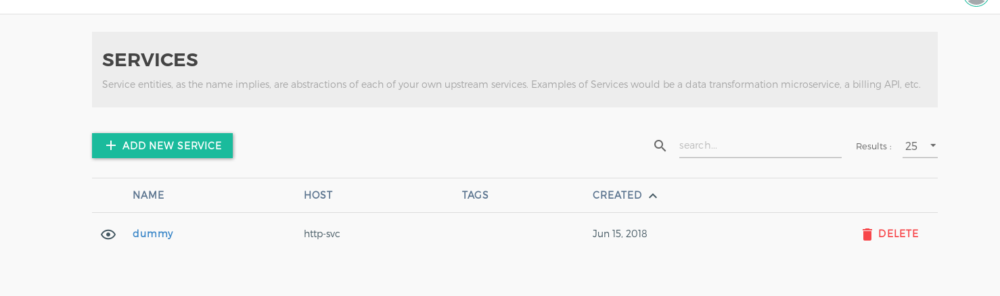

###kong数据库
kong可以使用cassandra数据库或者postgres数据库作为存储，在定位kong的问题时，会经常需要查询数据库中相关的记录，下面分别介绍在kubernetes环境中查询kong数据库的方法。
实验环境：
在kubernetes环境中运行两个kong，一个采用cassandra数据库，一个采用postgres数据库。部署konga来管理2个kong，konga的数据库采用mongodb。所有数据库的底层存储采用k8s-nfs-provisioner模拟的nfs存储，一个测试服务http-svc。
```
[root@rhel74 ~]# kubectl get pod
NAME                               READY     STATUS    RESTARTS   AGE
cassandra-0                        1/1       Running   8          9d
cqlsh-84dfbc7f7c-8rtwb             1/1       Running   1          2h
http-svc-794dc89f5-4w7qc           1/1       Running   5          8d
kong-rc-5d9d5f8958-85cxw           1/1       Running   23         7d
kong-rc-5d9d5f8958-b9c9j           1/1       Running   23         7d
kong-rc-5d9d5f8958-wcfx4           1/1       Running   23         7d
kong-rc-postgres-c4bf5fd4d-4r8gb   1/1       Running   2          1h
kong-rc-postgres-c4bf5fd4d-kgzj8   1/1       Running   2          1h
kong-rc-postgres-c4bf5fd4d-t8nqw   1/1       Running   2          1h
konga-9c4d84c8b-stjk5              1/1       Running   5          7h
mongo-6f558f6c74-wmdb6             1/1       Running   2          7h
nfs-provisioner-77777dc768-fplsr   1/1       Running   8          9d
postgres-zjjxr                     1/1       Running   1          1h
psql-599dc45695-ld8xb              1/1       Running   0          1h
[root@rhel74 ~]# 
[root@rhel74 ~]# kubectl get svc
NAME                      TYPE           CLUSTER-IP       EXTERNAL-IP   PORT(S)                              AGE
cassandra                 ClusterIP      None             <none>        9042/TCP                             9d
http-svc                  ClusterIP      172.20.182.62    <none>        80/TCP                               8d
kong-admin                NodePort       172.20.121.84    <none>        8001:32423/TCP                       7d
kong-admin-postgres       LoadBalancer   172.20.35.116    <pending>     8001:32482/TCP                       1h
kong-admin-ssl            NodePort       172.20.155.24    <none>        8444:30299/TCP                       7d
kong-admin-ssl-postgres   LoadBalancer   172.20.79.246    <pending>     8444:31613/TCP                       1h
kong-proxy                NodePort       172.20.21.16     <none>        8000:31336/TCP                       7d
kong-proxy-postgres       LoadBalancer   172.20.203.9     <pending>     8000:32230/TCP                       1h
kong-proxy-ssl            NodePort       172.20.120.146   <none>        8443:31630/TCP                       7d
kong-proxy-ssl-postgres   LoadBalancer   172.20.65.87     <pending>     8443:32503/TCP                       1h
konga                     NodePort       172.20.13.207    <none>        1337:31259/TCP                       6h
kubernetes                ClusterIP      172.20.0.1       <none>        443/TCP                              11d
mongo                     ClusterIP      172.20.163.176   <none>        27017/TCP                            7h
nfs-provisioner           ClusterIP      172.20.238.224   <none>        2049/TCP,20048/TCP,111/TCP,111/UDP   9d
postgres                  ClusterIP      172.20.4.3       <none>        5432/TCP                             1h
[root@rhel74 ~]# 
[root@rhel74 ~]# kubectl get pvc
NAME                         STATUS    VOLUME                                     CAPACITY   ACCESS MODES   STORAGECLASS   AGE
cassandra-data-cassandra-0   Bound     pvc-6435f07a-695f-11e8-944a-5254005d04e6   1Gi        RWO            example-nfs    9d
mongo-data                   Bound     pvc-218c579a-703f-11e8-892c-5254005d04e6   100Mi      RWO            default-nfs    7h
[root@rhel74 ~]# 
[root@rhel74 ~]# kubectl get pv
NAME                                       CAPACITY   ACCESS MODES   RECLAIM POLICY   STATUS    CLAIM                                STORAGECLASS   REASON    AGE
pvc-218c579a-703f-11e8-892c-5254005d04e6   100Mi      RWO            Delete           Bound     default/mongo-data                   default-nfs              7h
pvc-6435f07a-695f-11e8-944a-5254005d04e6   1Gi        RWO            Delete           Bound     default/cassandra-data-cassandra-0   example-nfs              9d
pvc-9752113e-6aee-11e8-8b84-5254005d04e6   1Gi        RWO            Delete           Bound     kong/datadir-postgres-0              default-nfs              7d
[root@rhel74 ~]# 
[root@rhel74 ~]# kubectl get sc
NAME                    PROVISIONER       AGE
default-nfs (default)   example.com/nfs   8d
example-nfs             example.com/nfs   9d
[root@rhel74 ~]#
```
konga管理两个kong，同一时间只有一个kong处于激活状态。

在konga上为kong创建services和routes，这些数据会在数据库存储中记录，用来测试查询数据库。


####kong cassandra数据库
cassandra数据库采用calsh工具连接数据库进行查询。
编写在kubernetes中部署calsh工具的yaml文件```cqlsh.yaml```。
```
apiVersion: extensions/v1beta1
kind: Deployment
metadata:
  name: cqlsh
spec:
  replicas: 1
  selector:
    matchLabels:
      app: cqlsh
  template:
    metadata:
      labels:
        app: cqlsh
    spec:
      containers:
      - name: cqlsh
        image: mikewright/cqlsh:latest
        command: ["sleep", "infinity"]
        imagePullPolicy: IfNotPresent
```
部署完成后，进入cqlsh的pod容器，执行连接cassandra数据库，并显示集群，键空间，表。
```
root@cqlsh-84dfbc7f7c-8rtwb:/# cqlsh cassandra 9042                    
Connection error: ('Unable to connect to any servers', {'172.16.120.199': ProtocolError("cql_version '3.3.1' is not supported by remote (w/ native protocol). Supported versions: [u'3.4.2']",)})
root@cqlsh-84dfbc7f7c-8rtwb:/# cqlsh cassandra 9042 --cqlversion="3.4.2"
Connected to K8Demo at cassandra:9042.
[cqlsh 5.0.1 | Cassandra 3.9 | CQL spec 3.4.2 | Native protocol v4]
Use HELP for help.
cqlsh> describe cluster;

Cluster: K8Demo
Partitioner: Murmur3Partitioner

cqlsh> 
cqlsh> describe keyspaces;

system_schema  system_auth  system  kong  system_distributed  system_traces

cqlsh> 
cqlsh> use kong;
cqlsh:kong> 
cqlsh:kong> describe tables;

schema_migrations      oauth2_tokens               services                     
ratelimiting_metrics   upstreams                   plugins                      
jwt_secrets            oauth2_authorization_codes  cluster_events               
consumers              keyauth_credentials         hmacauth_credentials         
apis                   oauth2_credentials          response_ratelimiting_metrics
ssl_certificates       routes                      ssl_servers_names            
basicauth_credentials  acls                        targets                      

cqlsh:kong> 
```
查询表的结构，数据。
```
cqlsh:kong> 
cqlsh:kong> describe table services;

CREATE TABLE kong.services (
    partition text,
    id uuid,
    connect_timeout int,
    created_at timestamp,
    host text,
    name text,
    path text,
    port int,
    protocol text,
    read_timeout int,
    retries int,
    updated_at timestamp,
    write_timeout int,
    PRIMARY KEY (partition, id)
) WITH CLUSTERING ORDER BY (id ASC)
    AND bloom_filter_fp_chance = 0.01
    AND caching = {'keys': 'ALL', 'rows_per_partition': 'NONE'}
    AND comment = ''
    AND compaction = {'class': 'org.apache.cassandra.db.compaction.SizeTieredCompactionStrategy', 'max_threshold': '32', 'min_threshold': '4'}
    AND compression = {'chunk_length_in_kb': '64', 'class': 'org.apache.cassandra.io.compress.LZ4Compressor'}
    AND crc_check_chance = 1.0
    AND dclocal_read_repair_chance = 0.1
    AND default_time_to_live = 0
    AND gc_grace_seconds = 864000
    AND max_index_interval = 2048
    AND memtable_flush_period_in_ms = 0
    AND min_index_interval = 128
    AND read_repair_chance = 0.0
    AND speculative_retry = '99PERCENTILE';
CREATE INDEX services_name_idx ON kong.services (name);

cqlsh:kong> 
cqlsh:kong> select * from services;

 partition | id                                   | connect_timeout | created_at                      | host     | name  | path | port | protocol | read_timeout | retries | updated_at                      | write_timeout
-----------+--------------------------------------+-----------------+---------------------------------+----------+-------+------+------+----------+--------------+---------+---------------------------------+---------------
  services | 2fdffd72-8622-4351-b935-fe4f8d9d31bd |           60000 | 2018-06-15 02:11:56.000000+0000 | http-svc | dummy | null |   80 |     http |        60000 |       5 | 2018-06-15 02:11:56.000000+0000 |         60000

(1 rows)
cqlsh:kong> 
cqlsh:kong> expend on;
SyntaxException: <Error from server: code=2000 [Syntax error in CQL query] message="line 1:0 no viable alternative at input 'expend' ([expend]...)">
cqlsh:kong> expand on;
Now Expanded output is enabled
cqlsh:kong> 
cqlsh:kong> select * from services;

@ Row 1
-----------------+--------------------------------------
 partition       | services
 id              | 2fdffd72-8622-4351-b935-fe4f8d9d31bd
 connect_timeout | 60000
 created_at      | 2018-06-15 02:11:56.000000+0000
 host            | http-svc
 name            | dummy
 path            | null
 port            | 80
 protocol        | http
 read_timeout    | 60000
 retries         | 5
 updated_at      | 2018-06-15 02:11:56.000000+0000
 write_timeout   | 60000

(1 rows)
cqlsh:kong>
```

####kong postgres数据库
postgres数据库采用psql工具连接数据库进行查询。
编写在kubernetes中部署psql工具的yaml文件```psql.yaml```。
```
apiVersion: extensions/v1beta1
kind: Deployment
metadata:
  name: psql
spec:
  replicas: 1
  selector:
    matchLabels:
      app: psql
  template:
    metadata:
      labels:
        app: psql
    spec:
      containers:
      - name: psql
        image: governmentpaas/psql:latest
        command: ["sleep", "100000000s"]
        imagePullPolicy: IfNotPresent
```
部署完成后，进入psql的pod容器，执行连接postgres数据库（用户名:kong，密码:kong，数据库名:kong），并显示数据库，表。
```
[root@rhel74 ~]# kubectl exec -it psql-599dc45695-ld8xb /bin/sh
/ # psql -h postgres -p 5432 -U kong kong
Password for user kong: 
psql (10.4, server 9.6.9)
Type "help" for help.

kong=# \l
                                 List of databases
   Name    |  Owner   | Encoding |  Collate   |   Ctype    |   Access privileges   
-----------+----------+----------+------------+------------+-----------------------
 kong      | postgres | UTF8     | en_US.utf8 | en_US.utf8 | 
 postgres  | postgres | UTF8     | en_US.utf8 | en_US.utf8 | 
 template0 | postgres | UTF8     | en_US.utf8 | en_US.utf8 | =c/postgres          +
           |          |          |            |            | postgres=CTc/postgres
 template1 | postgres | UTF8     | en_US.utf8 | en_US.utf8 | =c/postgres          +
           |          |          |            |            | postgres=CTc/postgres
(4 rows)

kong=# \d
                   List of relations
 Schema |             Name              | Type  | Owner 
--------+-------------------------------+-------+-------
 public | acls                          | table | kong
 public | apis                          | table | kong
 public | basicauth_credentials         | table | kong
 public | cluster_events                | table | kong
 public | consumers                     | table | kong
 public | hmacauth_credentials          | table | kong
 public | jwt_secrets                   | table | kong
 public | keyauth_credentials           | table | kong
 public | oauth2_authorization_codes    | table | kong
 public | oauth2_credentials            | table | kong
 public | oauth2_tokens                 | table | kong
 public | plugins                       | table | kong
 public | ratelimiting_metrics          | table | kong
 public | response_ratelimiting_metrics | table | kong
 public | routes                        | table | kong
 public | schema_migrations             | table | kong
 public | services                      | table | kong
 public | ssl_certificates              | table | kong
 public | ssl_servers_names             | table | kong
 public | targets                       | table | kong
 public | ttls                          | table | kong
 public | upstreams                     | table | kong
(22 rows)

kong=#
```
查询表的结构，数据。
```
kong=# select * from services;
                  id                  |       created_at       |       updated_at       |   name   | retries | protocol |   host   | port | path | connect_timeout | write_timeout | read_timeout 
--------------------------------------+------------------------+------------------------+----------+---------+----------+----------+------+------+-----------------+---------------+--------------
 84967f0d-8679-44c6-92f6-1732748e23a8 | 2018-06-15 07:17:11+00 | 2018-06-15 07:17:11+00 | http-svc |       5 | http     | http-svc |   80 |      |           60000 |         60000 |        60000
(1 row)

kong=#
kong=# \x on;
Expanded display is on.
kong=# 
kong=# select * from services;
-[ RECORD 1 ]---+-------------------------------------
id              | 84967f0d-8679-44c6-92f6-1732748e23a8
created_at      | 2018-06-15 07:17:11+00
updated_at      | 2018-06-15 07:17:11+00
name            | http-svc
retries         | 5
protocol        | http
host            | http-svc
port            | 80
path            | 
connect_timeout | 60000
write_timeout   | 60000
read_timeout    | 60000

kong=#
kong=# \d services
                           Table "public.services"
     Column      |           Type           | Collation | Nullable | Default 
-----------------+--------------------------+-----------+----------+---------
 id              | uuid                     |           | not null | 
 created_at      | timestamp with time zone |           |          | 
 updated_at      | timestamp with time zone |           |          | 
 name            | text                     |           |          | 
 retries         | bigint                   |           |          | 
 protocol        | text                     |           |          | 
 host            | text                     |           |          | 
 port            | bigint                   |           |          | 
 path            | text                     |           |          | 
 connect_timeout | bigint                   |           |          | 
 write_timeout   | bigint                   |           |          | 
 read_timeout    | bigint                   |           |          | 
Indexes:
    "services_pkey" PRIMARY KEY, btree (id)
    "services_name_key" UNIQUE CONSTRAINT, btree (name)
Referenced by:
    TABLE "oauth2_authorization_codes" CONSTRAINT "oauth2_authorization_codes_service_id_fkey" FOREIGN KEY (service_id) REFERENCES services(id) ON DELETE CASCADE
    TABLE "oauth2_tokens" CONSTRAINT "oauth2_tokens_service_id_fkey" FOREIGN KEY (service_id) REFERENCES services(id) ON DELETE CASCADE
    TABLE "plugins" CONSTRAINT "plugins_service_id_fkey" FOREIGN KEY (service_id) REFERENCES services(id) ON DELETE CASCADE
    TABLE "routes" CONSTRAINT "routes_service_id_fkey" FOREIGN KEY (service_id) REFERENCES services(id)

kong=#
```

###konga mongodb数据库
mongdodb的pod容器中包含客户端mongo。
进入mongdodb的pod容器，执行连接mongodb数据库，并显示数据库，集合，文档。
```
[root@rhel74 ~]# kubectl exec -it mongo-6f558f6c74-wmdb6 /bin/bash
root@mongo-6f558f6c74-wmdb6:/# 
root@mongo-6f558f6c74-wmdb6:/# mongo
MongoDB shell version v3.6.5
connecting to: mongodb://127.0.0.1:27017
MongoDB server version: 3.6.5
Welcome to the MongoDB shell.
For interactive help, type "help".
For more comprehensive documentation, see
	http://docs.mongodb.org/
Questions? Try the support group
	http://groups.google.com/group/mongodb-user
Server has startup warnings: 
2018-06-15T07:39:37.703+0000 I CONTROL  [initandlisten] 
2018-06-15T07:39:37.703+0000 I CONTROL  [initandlisten] ** WARNING: Access control is not enabled for the database.
2018-06-15T07:39:37.703+0000 I CONTROL  [initandlisten] **          Read and write access to data and configuration is unrestricted.
2018-06-15T07:39:37.703+0000 I CONTROL  [initandlisten] 
2018-06-15T07:39:37.704+0000 I CONTROL  [initandlisten] 
2018-06-15T07:39:37.704+0000 I CONTROL  [initandlisten] ** WARNING: /sys/kernel/mm/transparent_hugepage/enabled is 'always'.
2018-06-15T07:39:37.704+0000 I CONTROL  [initandlisten] **        We suggest setting it to 'never'
2018-06-15T07:39:37.704+0000 I CONTROL  [initandlisten] 
2018-06-15T07:39:37.704+0000 I CONTROL  [initandlisten] ** WARNING: /sys/kernel/mm/transparent_hugepage/defrag is 'always'.
2018-06-15T07:39:37.704+0000 I CONTROL  [initandlisten] **        We suggest setting it to 'never'
2018-06-15T07:39:37.704+0000 I CONTROL  [initandlisten] 
> 
> help
	db.help()                    help on db methods
	db.mycoll.help()             help on collection methods
	sh.help()                    sharding helpers
	rs.help()                    replica set helpers
	help admin                   administrative help
	help connect                 connecting to a db help
	help keys                    key shortcuts
	help misc                    misc things to know
	help mr                      mapreduce

	show dbs                     show database names
	show collections             show collections in current database
	show users                   show users in current database
	show profile                 show most recent system.profile entries with time >= 1ms
	show logs                    show the accessible logger names
	show log [name]              prints out the last segment of log in memory, 'global' is default
	use <db_name>                set current database
	db.foo.find()                list objects in collection foo
	db.foo.find( { a : 1 } )     list objects in foo where a == 1
	it                           result of the last line evaluated; use to further iterate
	DBQuery.shellBatchSize = x   set default number of items to display on shell
	exit                         quit the mongo shell
> show dbs
admin   0.000GB
config  0.000GB
konga   0.000GB
local   0.000GB
> use konga
switched to db konga
> show collections
konga_api_health_checks
konga_email_transports
konga_kong_nodes
konga_kong_services
konga_kong_snapshot_schedules
konga_kong_snapshots
konga_netdata_connections
konga_passports
konga_settings
konga_users
>
```
查询集合的数据。
```
> 
> db.konga_kong_services.find()
{ "_id" : ObjectId("5b23206c475fbb00057d0ce7"), "kong_node_id" : "5b231d66475fbb00057d0ce5", "service_id" : "2fdffd72-8622-4351-b935-fe4f8d9d31bd", "createdAt" : ISODate("2018-06-15T02:11:56.617Z"), "updatedAt" : ISODate("2018-06-15T02:11:56.617Z"), "createdUserId" : null, "updatedUserId" : null }
{ "_id" : ObjectId("5b2367f77520ac00056feccc"), "kong_node_id" : "5b2367aa7520ac00056feccb", "service_id" : "84967f0d-8679-44c6-92f6-1732748e23a8", "createdAt" : ISODate("2018-06-15T07:17:11.910Z"), "updatedAt" : ISODate("2018-06-15T07:17:11.910Z"), "createdUserId" : null, "updatedUserId" : null }
> db.konga_kong_services.find().pretty()
{
	"_id" : ObjectId("5b23206c475fbb00057d0ce7"),
	"kong_node_id" : "5b231d66475fbb00057d0ce5",
	"service_id" : "2fdffd72-8622-4351-b935-fe4f8d9d31bd",
	"createdAt" : ISODate("2018-06-15T02:11:56.617Z"),
	"updatedAt" : ISODate("2018-06-15T02:11:56.617Z"),
	"createdUserId" : null,
	"updatedUserId" : null
}
{
	"_id" : ObjectId("5b2367f77520ac00056feccc"),
	"kong_node_id" : "5b2367aa7520ac00056feccb",
	"service_id" : "84967f0d-8679-44c6-92f6-1732748e23a8",
	"createdAt" : ISODate("2018-06-15T07:17:11.910Z"),
	"updatedAt" : ISODate("2018-06-15T07:17:11.910Z"),
	"createdUserId" : null,
	"updatedUserId" : null
}
>
```
