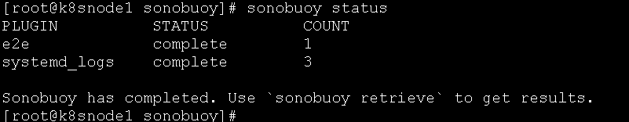
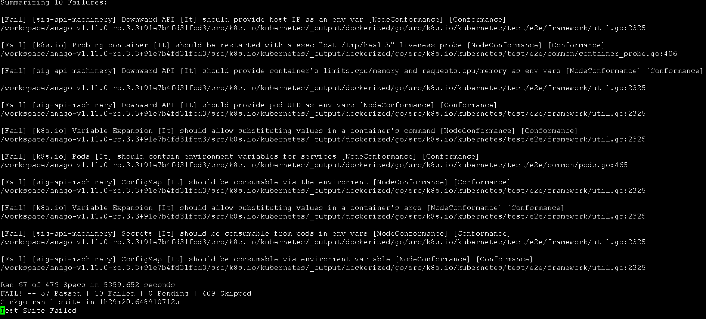

###测试环境
在一台物理服务器（24核256G内存）使用kvm启动四个虚拟机（一个部署节点，三个工作节点）。
部署节点（4核4G内存200G硬盘）：使用6月最新的Centos-7-x86_64-LMD-1708-JP.iso安装，包含镜像仓库服务、chart包仓库服务、yum源服务、nfs存储服务、部署容器云平台脚本。
工作节点（8核16G内存200G硬盘）：使用6月最新版的Centos-7-x86_64-1708-NODE.iso安装，容器云平台的落地节点。
###k8s测试工具
* k8s-testsuite: 由两个Helm图表组合而成，适用于网络带宽测试与单个Kubernetes集群的负载测试。负载测试模拟了带有loadbots的简单网页服务器，这些服务器可在Vegeta基础上以Kubernetes微服务的形式运行。网络测试则是在内部连续对iperf3与netperf-2.7.0运行三次。这两项测试都会生成涵盖全部结果与指标的综合日志信息。
* sonobuoy: Sonobuoy允许用户以易于访问与非破坏性的方式运行一组测试，从而对当前Kubernetes集群状态进行评估。Sonobuoy可生成有关集群性能详细信息的信息性报告，并能够支持Kubernetes1.8及更高版本。SonobuoyScanner是一款基于浏览器的工具。在该工具的帮助下，用户只需点击数下即可完成对Kubernetes集群的测试。当然，其CLI版本能够应对规模更大的测试集群。

###k8s-testsuite使用
github地址： https://github.com/mrahbar/k8s-testsuite

首先下载helm chart文件中所需的docker images。然后执行命令
```
> git clone https://github.com/mrahbar/k8s-testsuite.git
> cd k8s-testsuite
> helm install --namespace load-test ./load-test
> helm install --namespace network-test ./network-test
```
安装使用测试工具。
注意点：
1、load-test采用分别扩展pod实例数进行测试，两个pod（loadbots，webserver）分别由1扩展到100,而pod的默认cpurequest为100m，以此需要保证kubernetes集群环境拥有闲置的20core以上cpu资源运行测试，同样内存也应保证充足，建议32以上。

2、网络测试采用iperf和netperf两个测试工具进行测试，对于tcp，mtu配置从96以64步长直到1460,测试时间有点长。此外测试场景包括pod到另一个node上pod的网络性能，因此，kubernetes测试需要至少两个节点。

3、测试结果通过安装运行helm命令后显示的帮助信息操作查看。
###k8s-testsuite测试结果
1、负载测试结果
负载测试使用了三个服务，webserver服务充当服务端应用，loadbot为一个客户端向服务端发起并发连接测试（默认为1s内10个worker以每秒1000次请求向服务端发送），aggregator服务手机测试信息。测试场景有以下，分别对应loadbots和webserver的容器个数。

场景Szenario	|Loadbots	|Webserver
------------|-----------|----------
Idle	|1	|1
Under load	|1	|10
Equal load	|10	|10
Over load	|100	|10
High load	|100	|100

测试结果如下
在Over load和High load下能以100%成功率完成总共百万并发请求，并且平均延迟在500毫秒左右。

2、网络性能测试结果
网络性能测试中镜像使用iperf3和netperf-2.7.0工具测试网络性能，测试场景以下
* 同节点不同pod（容器）使用pod ip通信
* 同节点不同pod（容器）使用service ip通信
* 不同节点不同pod（容器）使用pod ip通信
* 不同节点不同pod（容器）使用service ip通信
* 同节点同pod（容器）使用service ip通信

测试结果如下


测试场景|测试工具|速率Mbit/s
-------|-------|---
不同节点不同pod（容器）使用pod ip通信 | iperf | tcp 1545 udp 858
不同节点不同pod（容器）使用service ip通信| iperf | tcp 1632 udp 2554
不同节点不同pod（容器）使用pod ip通信 | netperf | 1141
不同节点不同pod（容器）使用service ip通信| netperf | 不支持service ip通信

###sonobuoy使用
github地址：https://github.com/heptio/sonobuoy

sonobuoy是采用go语言编写的，安装时使用go get命令（解决墙问题，可以使用Shadowsocks+cow组合方式，安装和使用可以搜索google）
```
$ go get -u -v github.com/heptio/sonobuoy
```
使用```sonobuoy --help```可以查看使用帮助，下面列出常用的命令
运行sonobuoy（自行提前下载好镜像，除了sonobuoy自身运行的镜像，它还调用了kubernetes endtoendtest的镜像，镜像比较多具体参考 https://github.com/kubernetes/kubernetes/blob/master/test/utils/image/manifest.go#L25:54）
```
sonobuoy run --image-pull-policy IfNotPresent
```
查看测试状态
```
sonobuoy status
```
查看测试日志
```
sonobuoy logs
```
打包获取结果输出
```
sonobuoy retrieve .
mkdir ./results; tar xzf *.tar.gz -C ./results
```
目前还没有图形化工具可以离线分析查看sonobuoy输出结果，只有人工检查输出结果文件。
###sonobuoy测试结果

测试结果显示如下，有10项未通过（这10项要联网环境下载busybox镜像来测试，内网环境不满足条件；在外网环境测试通过）
