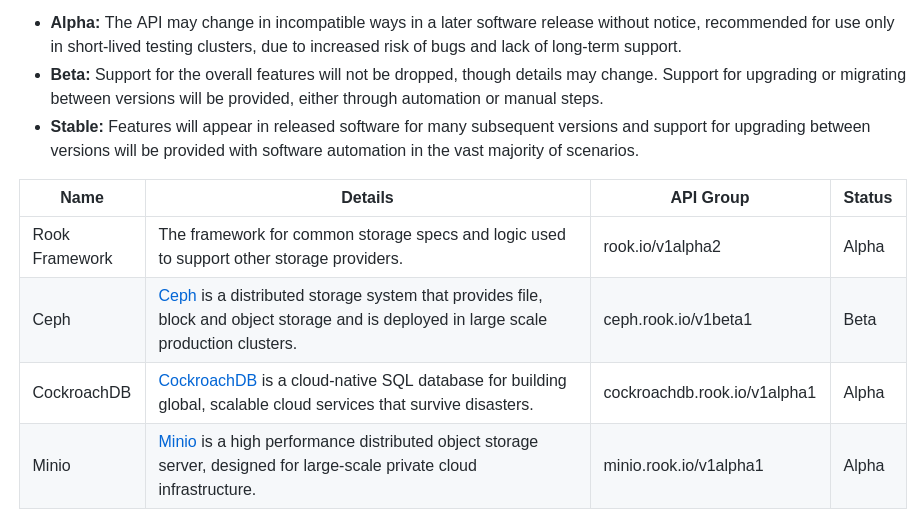

参考网址： https://github.com/rook/rook/blob/master/README.md#project-status
https://rook.github.io/docs/rook/master/

###rook
rook是coreos构建的ceph存储operator，rook还支持其他存储，当前的状态如下，ceph的支持度更好一点。



rook使存储软件（ceph）以kubernetes里的primitives（基本元素）运行，如下图所示。


rook运行在kubernetes集群里，可以自动管理存储组件的配置，监控存储组件。这些存储组件可以为kubernetes 容器应用提供block、filesystem、object存储。rook在每个节点会运行rook agent，rook agent配置Flexvolume plugin。该插件可以提供挂在网络存储设备、挂在volume、格式化文件系统等功能。


###rook provision ceph

参考网址： https://rook.github.io/docs/rook/master/ceph-quickstart.html
https://rook.github.io/docs/rook/master/block.html
https://rook.github.io/docs/rook/master/ceph-dashboard.html
https://rook.github.io/docs/rook/master/monitoring.html

步骤如下：
1. 部署Rook Operator。
2. 创建Rook Cluster。
3. 构建Block、Object、Shared File System给pod使用（本次构建Block）。
4. 配置Ceph Dashboard。（可选）
5. 配置ceph存储prometheus监控（可选）

####部署Rook Operator
可直接使用kubectl创建或者使用helm创建
kubectl创建
```
git clone https://github.com/rook/rook.git
cd cluster/examples/kubernetes/ceph
kubectl create -f operator.yaml

# verify the rook-ceph-operator, rook-ceph-agent, and rook-discover pods are in the `Running` state before proceeding
kubectl -n rook-ceph-system get pod
```
helm创建
```
helm repo add rook-master https://charts.rook.io/master
helm search rook-ceph
helm install --namespace rook-ceph-system rook-master/rook-ceph --version <version>
```
####创建Rook Cluster
kubectl创建
```
cd cluster/examples/kubernetes/ceph
kubectl create -f cluster.yaml
```
在cluster.yaml里有个```dataDirHostPath: /var/lib/rook```配置节点存储数据的目录。
其他配置信息参考 https://rook.github.io/docs/rook/master/ceph-cluster-crd.html
###构建Block给pod使用
kubectl创建
```
cd cluster/examples/kubernetes/ceph
kubectl create -f storageclass.yaml
```
在storageclass.yaml里面有个```size: 3```用于配置ceph中副本数量。
执行后，可以看到创建了一个storageclass。
```
[root@k8snode1 ~]# kubectl get sc
NAME                        PROVISIONER          AGE
rook-ceph-block (default)   ceph.rook.io/block   15h
```
设置该storageclass为default。
```
kubectl patch storageclass rook-ceph-block -p '{"metadata": {"annotations":{"storageclass.kubernetes.io/is-default-class":"true"}}}'
```
###配置Ceph Dashboard
在创建好ceph集群时，已经创建了ceph dashboard服务```rook-ceph-mgr```，此刻，可以创建一个type为NodePort的service来把服务暴露。
```
cd cluster/examples/kubernetes/ceph
kubectl create -f dashboard-external.yaml
```
###配置ceph存储prometheus监控
rook-ceph的prometheus是通过prometheus operator管理的，因为首先要部署prometheus operator。
```
helm install --name prometheus-operator --namespace monitoring stable/prometheus-operator
```
然后，部署ceph的prometheus监控组件
```
cd cluster/examples/kubernetes/monitoring
kubectl create -f service-monitor.yaml
kubectl create -f prometheus.yaml
kubectl create -f prometheus-service.yaml
```
###问题
目前在kismatic安装的kubernetes环境，存在以下问题：
1、有些pod无法使用pvc挂载ceph
2、重启后（pod重新生成）不能挂载原pvc（提示pvc被原pod挂载，即删除pod时没有解邦pvc）
3、清理rook-ceph无法清理干净，ceph-agent的pod已删除，但kubelet一直报错，认为没有删除。