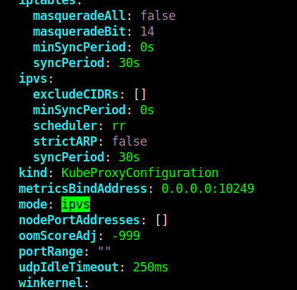
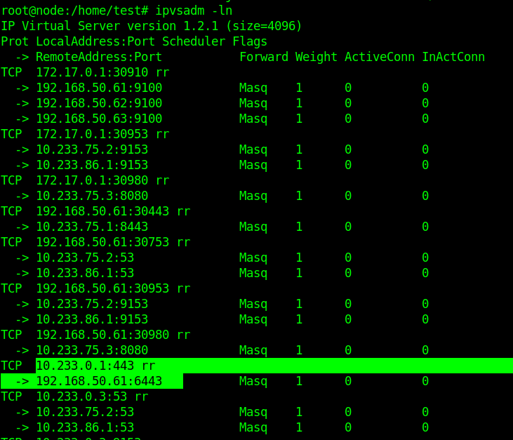

### 安装IPVS包

`ubuntu`系列通过安装`ipvsadm`来安装`ipvs`模块。挂载主机操作系统对应的`iso`，文件，找出`ipvsadm deb`包所在并且安装。

```
# mount /dev/cdrom /mnt
mount: /mnt: WARNING: device write-protected, mounted read-only.
# cd /mnt
# grep -rn "ipvsadm" ./*
./md5sum.txt:1459:4d728e76d37eae729a43cb7f42fa3f54  ./pool/main/i/ipvsadm/ipvsadm_1.28-3ubuntu0.18.04.1_amd64.deb
...
# cp -r ./pool/main/i/ipvsadm/ipvsadm_1.28-3ubuntu0.18.04.1_amd64.deb /home/test/
# cd /home/test/
# apt install ./ipvsadm_1.28-3ubuntu0.18.04.1_amd64.deb 
Reading package lists... Done
 ...
Processing triggers for systemd (237-3ubuntu10.33) ...
root@node:/home/test# 

```

### 更改kube-proxy配置

更改集群`kube-proxy`组件`mode`配置为`ipvs`。

```
# kubectl edit configmap kube-proxy -n kube-system
```



删除`kube-proxy`的`pod`使其重新生成读取新的配置。

```
kubectl delete pod kube-proxy-名字1 kube-proxy-名字2 ... -n kube-system
```

等待`kube-proxy`的`pod`成为`Running`状态后，使用以下命令检测`ipvs`是否生效。

```
ipvsadm -ln
```

生效的话会产生类似以下的规则


