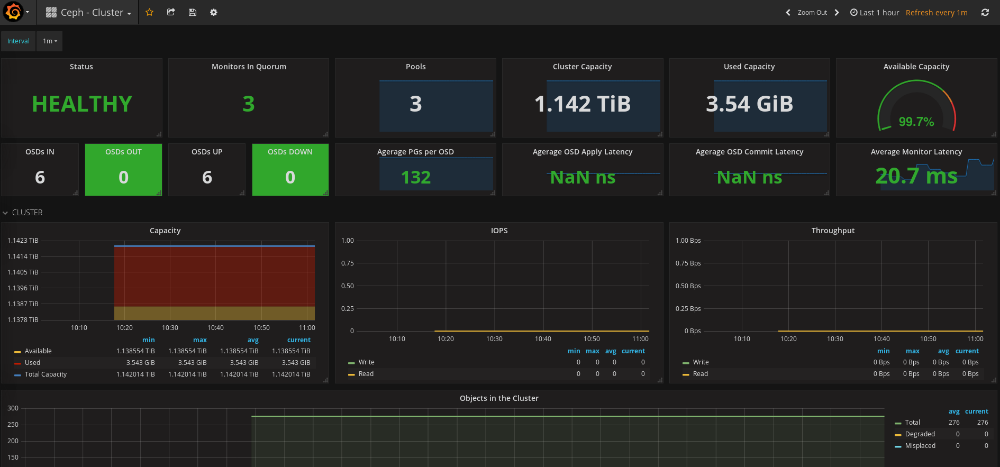
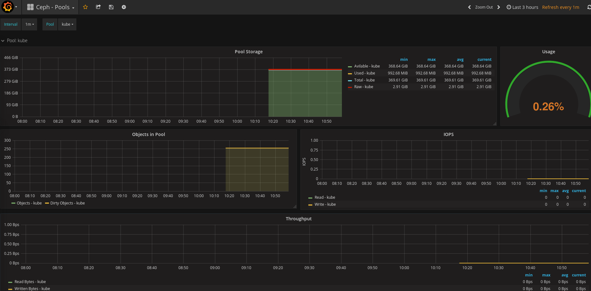

参考网址： https://github.com/digitalocean/ceph_exporter
   https://grafana.com/dashboards/917
   https://grafana.com/dashboards/926
   https://grafana.com/dashboards/923

###使用ceph_exporter监控ceph集群
使用```ceph_exporter```吐出```ceph```集群的监控数据，使用```promethues，garfana```存储和展示```ceph```集群监控性能信息。

搭建该监控套件的```docker-compose.yml```文件内容如下
```
version: '2'

services:
  prometheus:
    image: prom/prometheus:v1.6.1
    volumes:
        - ./prometheus.yml:/etc/prometheus/prometheus.yml
        - prometheus_data:/prometheus
    command:
        - -config.file=/etc/prometheus/prometheus.yml
    ports:
        - '9090:9090'
  ceph-exporter:
    image: digitalocean/ceph_exporter
    volumes:
        - $CEPHCONF:/etc/ceph
    ports:
        - '9128:9128'
  grafana:
    image: grafana/grafana:4.2.0
    environment:
        - GF_SECURITY_ADMIN_PASSWORD=test
    volumes:
        - grafana_data:/var/lib/grafana
    depends_on:
        - prometheus
    ports:
        - "3000:3000"
volumes:
  prometheus_data:
  grafana_data:
```
配置项```$CEPHCONF```替换为```ceph```集群的配置文件所在目录，一般在```ceph monitor```节点的```/etc/ceph```目录。
配置文件```prometheus.yml```文件的内容如下
```
# prometheus.yml

# Place in same directory as docker-compose.yml and replace  with your desired host IP where ceph_exporter is running

global:
    scrape_interval: 5s
    external_labels:
        monitor: my-monitor
scrape_configs:
    - job_name: prometheus
      static_configs:
          - targets: ['localhost:9090']
    - job_name: ceph-exporter
      static_configs:
          - targets: ['192.168.122.21:9128']
```
这里配置```ceph-exporter```的IP端口为```192.168.122.21：9128```,用户配置以实践环境为准。
使用命令```docker-compose up -d ```启动监控套件。登录到```grafana```界面（用户名```admin```，密码在```docker-compose.yml```配置为```test```），配置```datasource```，```dashboard```。
界面```dashboard```文件为```ceph-cluster_rev1.json，ceph-pools_rev1.json，ceph-osd_rev1.json```（从参考网址中下载）。
下面是监控的截图




###使用ceph mgr prometheus插件监控集群
1、启用```Ceph```的```Prometheus```插件：
```
ceph mgr module enable prometheus

ceph mgr module ls
[
    "dashboard",
    "prometheus"
]
```
启用成功后在激活(active)的mgr节点上可以看到：
```
netstat -nltp | grep mgr
tcp        0      0 0.0.0.0:6804            0.0.0.0:*               LISTEN      159556/ceph-mgr
tcp6       0      0 :::7000                 :::*                    LISTEN      159556/ceph-mgr
tcp6       0      0 :::9283                 :::*                    LISTEN      159556/ceph-mgr
```
其中```9283```是```ceph exporter```的监听端口，```curl 127.0.0.1:9283```可以获取到```metrics```。将这个```exporter```作为```Prometheus```的```target```即可。
```
- job_name: ceph-mgr
  static_configs:
      - targets: ['192.168.122.22:9283']
```
监控```dashboard```可以用```https://grafana.com/dashboards/5086```。
注，这两种监控方法不要用同一个prometheus来收集数据，会产生数据收集不完整影响，