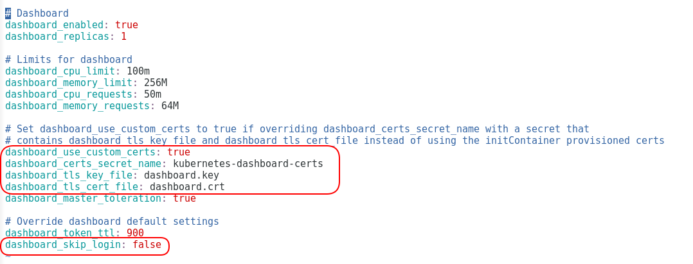
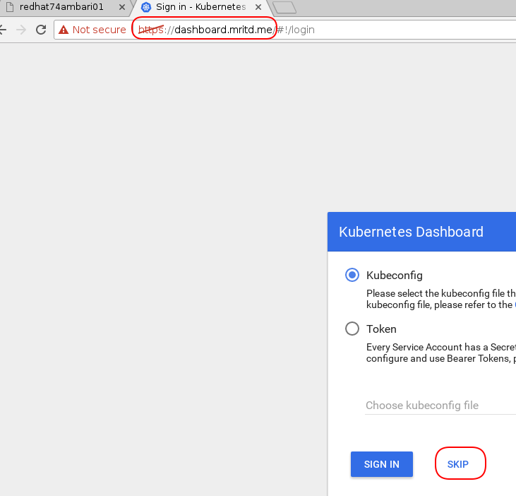

在```kubespray```部署```kube-dashboard```的配置选项有以下：



通过配置可以对```kube-dashboard```做到以下几种改造。

1、登录界面配置显示```skip```选项

如下图所示


这个配置简单，只需更改配置项```dashboard_skip_login```的值为```true```。

2、配置```kube-dashboard```使用自定义```ssl```证书

配置自定义的证书，可以方便构建```kube-dashboard```的```ingress```。
配置自定义证书需要
1）修改配置项```dashboard_use_custom_certs```为```true```。
2）创建自定义```ssl```证书，并且创建对应的名为```kubernetes-dashboard-certs```的```secret```。
```
mkdir $HOME/certs && cd $HOME/certs
openssl genrsa -out dashboard.key 2048
openssl req -new -x509 -key dashboard.key -out dashboard.crt -subj /C=CN/ST=Shanghai/L=Shanghai/O=DevOps/CN=dashboard.mritd.me
kubectl create secret generic kubernetes-dashboard-certs --from-file=$HOME/certs -n kube-system
```
3）创建```kube-dashboard```的```ingress```。（```ingress-conroller```采用```kubespray```自带的```ingress-nginx```组件）


```
kubectl create -f dashbaor-ingress.yaml
```
配置```ingress-controller```所运行的节点```IP```对应到```dashboard.mritd.me```。
便可通过```https：//dashboard.mritd.me```访问```kube-dashboard```的界面。




注： ```ingress-nginx```的```controller```默认占用了以下几个端口
```
80 http
443 https
442 real https port (443 is used for ssl passthrough)
18080 default server
8181 default server
```
在```kubespray```部署```ingress-nginx```时，一般配置网络模式为```hostnetwork```。因此容易造成端口冲突，比如自带的```secureregistry```服务用到了```443```端口（需配置在```kube-deploy```节点不运行```ingress-nginx```的```controller```组件）；```heketi```服务的```18080```端口要切换到```18085```,注意存储```gluster sc```的配置端点应该是```heketi```服务运行节点，不是```kube-deploy```节点。
此外```ingress-nginx```中的```pod hostport```功能与```ipvs kube-proxy```有冲突，因此在```ipvs```模式下，使用```hostnetwork: true```部署```ingress-nginx```。

在```3rdparty```的```efk```中缺少镜像```quay.io/pires/docker-elasticsearch-curator:5.5.4```。