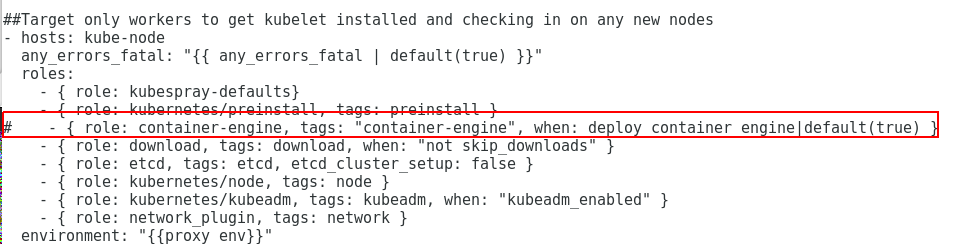
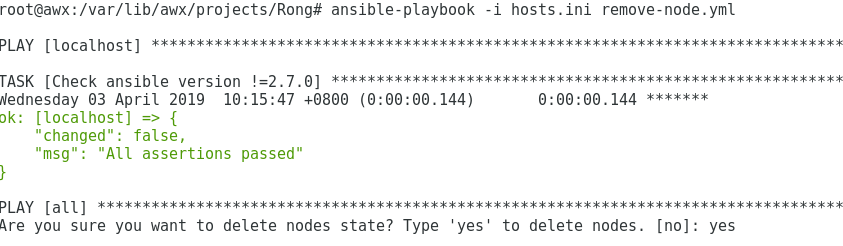

###Rong扩容worker节点
1、修改```host.ini```文件
扩容worker节点时，修改安装部署时的```host.ini```文件（一般位于```inventory/rong/hosts.ini```），增加新增的机器信息。
例如，原```host.ini```文件内容为


新增节点```ubuntukubespray04```,节点IP为```912.168.124.64```。修改后文件如下


注： 扩展节点请严格按照上述例子修改```host.ini```文件，不要在其他```group```（```kube-deloy,kube-master,etcd```等）添加节点信息，否则会导致脚本执行失败。

2、检查并执行脚本```scale.yml```
扩展节点脚本文件```scale.yml```位于安装脚本的一级目录下。
检查```scale.yml```文件以下几点
1）、检查以下段的```hosts```配置是否带有```！kube-deploy```。

2）、检查是否注释了带```container-engine```那一行。

然后执行下面的命令：
```
ansible-playbook -i inventory/rong/hosts.ini scale.yml
```
脚本执行成功后，便可新增集群```worker```节点。

###Rong删除worker节点
检查并执行脚本```remove-node.yml```
扩展节点脚本文件```remove-node.yml```位于安装脚本的一级目录下。
例如，删除节点```nodename，nodename2```

然后执行下面的命令：
```
ansible-playbook -i inventory/rong/hosts.ini remove-node.yml --extra-vars "node=nodename,nodename2"
```
在弹出的提示信息填入```yes```

则继续执行。
脚本执行成功后，便可删除指定的集群```worker```节点。