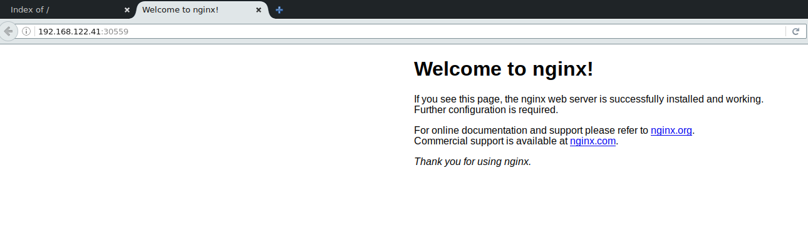
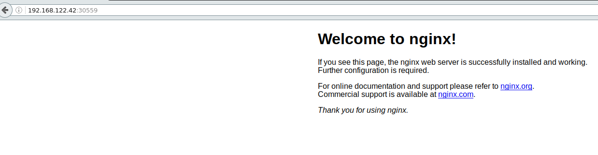
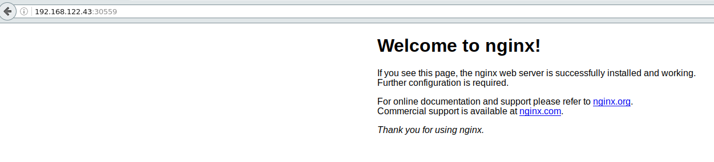
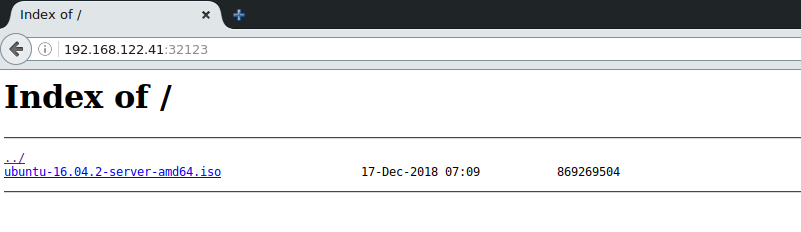
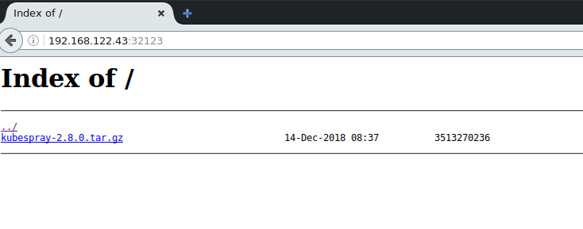
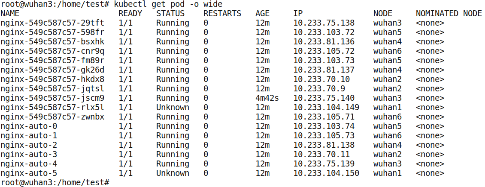
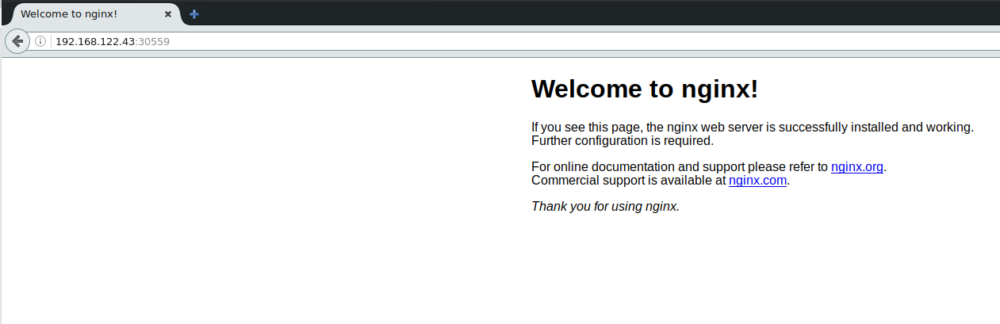
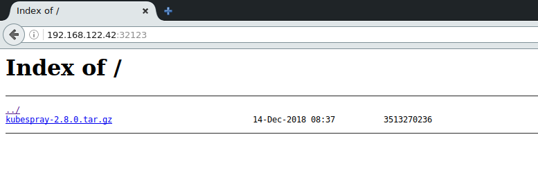
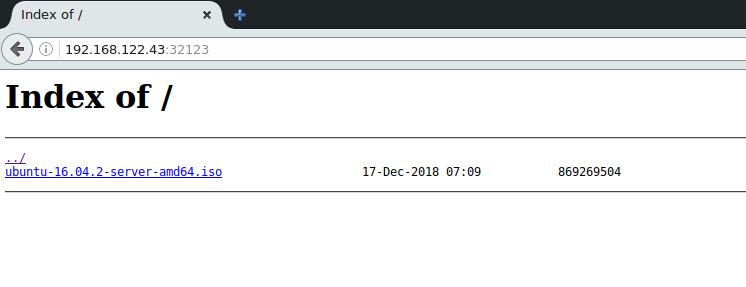

测试示例
1） 无状态应用镜像nginx:1.13业务影响
包含两个文件```nginx-dp.yaml```和```nginx-svc.yaml```。
文件```nginx-dp.yaml```内容如下
```
apiVersion: extensions/v1beta1
kind: Deployment
metadata:
  labels:
    run: nginx
  name: nginx
  namespace: default
spec:
  replicas: 10
  selector:
    matchLabels:
      run: nginx
  template:
    metadata：
      labels:
        run: nginx
    spec:
      containers:
      - image: portus.teligen.com:5000/kubesprayns/nginx:1.13
        imagePullPolicy: IfNotPresent
        name: nginx
```
文件```nginx-svc.yaml```内容如下
```
apiVersion: v1
kind: Service
metadata:
  labels:
    run: nginx
  name: nginx
  namespace: default
spec:
  ports:
  - nodePort: 30559
    port: 80
    protocol: TCP
    targetPort: 80
  selector:
    run: nginx
  type: NodePort
```

2） 挂载共享存储pvc的应用镜像jrelva/nginx-autoindex（有状态应用）业务影响
包含两个文件```nginx-auto-stateful.yaml```和```nginx-auto-svc.yaml```。
文件```nginx-auto-stateful.yaml```内容如下
```
apiVersion: apps/v1beta2
kind: StatefulSet
metadata:
  labels:
    run: nginx-auto
  name: nginx-auto
  namespace: default
spec:
  replicas: 6
  selector:
    matchLabels:
      run: nginx-auto
  serviceName: nginx-auto
  template:
    metadata:
      labels:
        run: nginx-auto
    spec:
      containers:
      - image: portus.teligen.com:5000/kubesprayns/jrelva/nginx-autoindex:latest
        imagePullPolicy: IfNotPresent
        name: nginx-auto
        ports:
          - containerPort: 80
            name: "http-server"
        volumeMounts:
          - mountPath: "/usr/share/nginx/html"
            name: nginx-auto-pvc
  volumeClaimTemplates:
  - metadata:
      name: nginx-auto-pvc
    spec:
      accessModes:
        - ReadWriteOnce
      resources:
        requests:
          storage: 8Gi
      storageClassName: rook-ceph-block
```
文件```nginx-auto-svc.yaml```内容如下
```
apiVersion: v1
kind: Service
metadata:
  labels:
    run: nginx-auto
  name: nginx-auto
  namespace: default
spec:
  ports:
  - port: 80
    protocol: TCP
    targetPort: 80
  selector:
    run: nginx-auto
  type: NodePort
```

测试环境
构建6个节点的kubernetes集群。
节点|角色
---|----
192.168.122.41| master node etcd
192.168.122.42| master node etcd
193.168.122.43| master node etcd
194.168.122.44| node
195.168.122.45| node
196.168.122.16| node
部署```rook```存储。

测试过程
在节点```192.168.122.41```上创建测试示例
```
kubectl create -f nginx-dp.yaml -f nginx-svc.yaml -f nginx-auto-stateful.yaml -f nginx-auto-svc.yaml
```

查看服务
无状态应用访问



3个```master```节点上都能访问服务。
有状态应用访问



3个```master```节点上都能访问服务（注，其中有两个个```pod```实例中存有数据，```service```随机路由到后端```pod```）
测试结果显示，通过三个```master```节点均可以访问服务。
关闭节点```192.168.122.41```,登录节点```192.168.122.42```查看```pod```实例的变化。

登录节点```192.168.122.43```查看```pod```实例的变化。

测试结果显示，无状态应用生成了新的```pod```实例，```192.168.122.41```节点上```pod```实例处于```Unknown```状态。
有状态应用```192.168.122.41```节点上```pod```实例处于```Unknown```状态，没有产生新的```pod```实例。
查看服务
无状态应用访问



有状态应用访问



测试结果显示，通过故障节点```192.168.122.41```无法访问服务。

测试结论
1）若其中一个```master```节点产生故障，无状态应用生成了新的```pod```实例，故障节点上```pod```实例处于```Unknown```状态。
有状态应用故障节点上```pod```实例处于```Unknown```状态，没有产生新的```pod```实例。
2）若其中一个```master```节点产生故障，通过故障节点的```url```无法访问服务，但是，其他```master```节点的```url```仍可以访问服务。