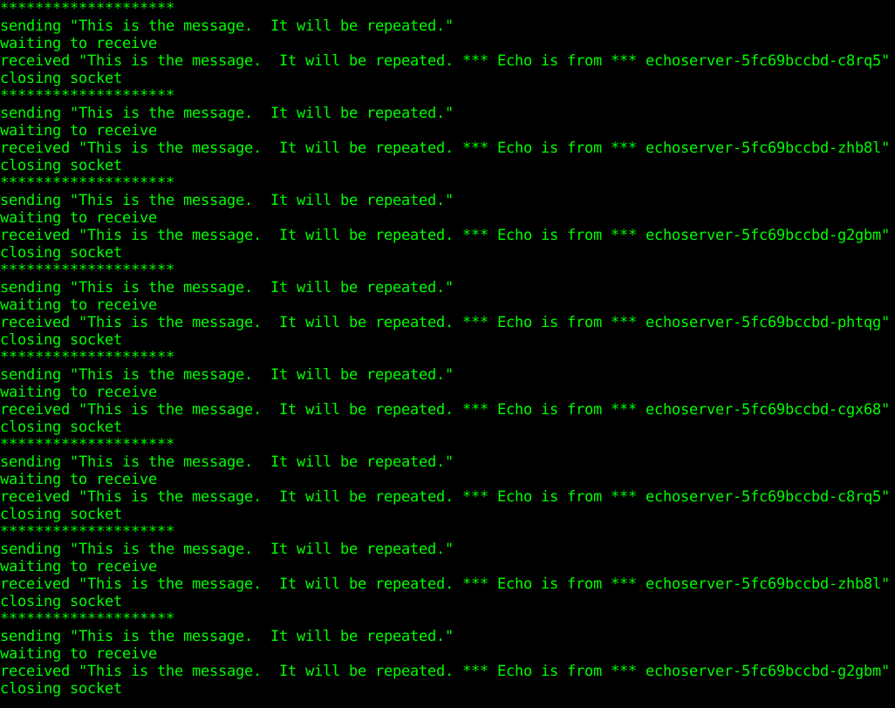
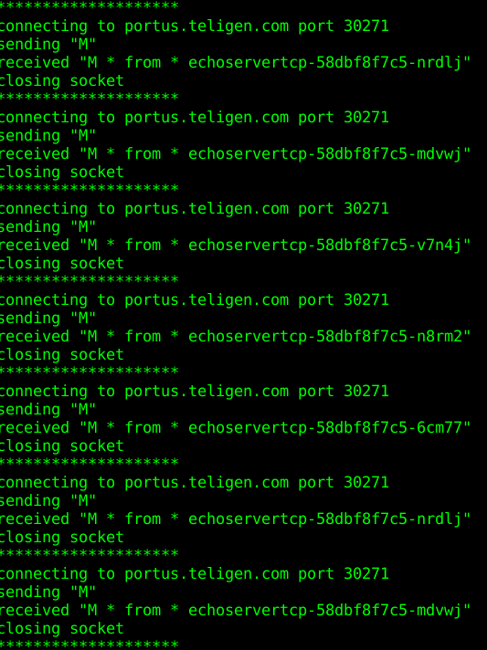
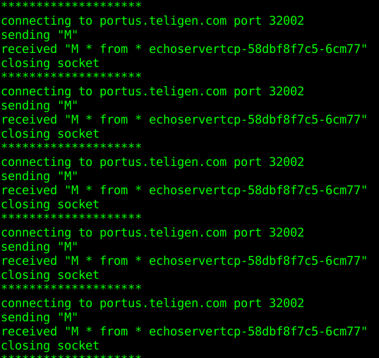

###kubespray中插件nginx-ingresscontroller启用
在```kubespray```文件夹下```inventory/rong/group_vars/k8s-cluster/addons.yml```文件配置了插件的启用与关闭，修改```addons.yml```文件，启用插件```nginx-ingresscontroller```。
```
...
# Nginx ingress controller deployment
ingress_nginx_enabled: true
# ingress_nginx_host_network: false
# ingress_nginx_nodeselector:
#   node-role.kubernetes.io/master: ""
# ingress_nginx_namespace: "ingress-nginx"
# ingress_nginx_insecure_port: 80
# ingress_nginx_secure_port: 443
# ingress_nginx_configmap:
#   map-hash-bucket-size: "128"
#   ssl-protocols: "SSLv2"
# ingress_nginx_configmap_tcp_services:
#   9000: "default/example-go:8080"
# ingress_nginx_configmap_udp_services:
#   53: "kube-system/kube-dns:53"
...
```
###nginx-ingresstroller配置4层负载
在Kuberetes应用中，一般都是通过Ingress来暴露HTTP/HTTPS的服务。但是在实际应用中，还是有不少应用是TCP/UDP长连接的，这个也是可以通过Ingress来暴露。
原理
Ingress Controller在启动时会去watch两个configmap(一个tcp，一个 udp)，里面记录了后面需要反向代理的TCP的服务以及暴露的端口。如果两个configmap里面的key-value发生变换，Ingress controller会去更改Nginx的配置，增加对应的TCP的listen的server以及对应的后端的upstream。
在kubespray部署中，启用nginx-ingresscontroller后
容器实例```ingress-nginx-controller```的配置参数中存在指定tcp/udp配置```configmap```。
```
[root@node2 ~]# kubectl get pod -n ingress-nginx
NAME                               READY   STATUS    RESTARTS   AGE
default-backend-749566fdb6-xkpl7   1/1     Running   1          17h
ingress-nginx-controller-l66sd     1/1     Running   1          17h
[root@node2 ~]#
[root@node2 ~]# kubectl get pod ingress-nginx-controller-l66sd -n ingress-nginx -o yaml
...
  containers:
  - args:
    - /nginx-ingress-controller
    - --default-backend-service=$(POD_NAMESPACE)/default-backend
    - --configmap=$(POD_NAMESPACE)/ingress-nginx
    - --tcp-services-configmap=$(POD_NAMESPACE)/tcp-services
    - --udp-services-configmap=$(POD_NAMESPACE)/udp-services
    - --annotations-prefix=nginx.ingress.kubernetes.io
...
```

存在两个初始的DATA为空的configmap(一个tcp-services，一个 udp-services)如下
```
[root@node2 ~]# kubectl get configmap -n ingress-nginx
NAME                              DATA   AGE
ingress-controller-leader-nginx   0      17h
ingress-nginx                     0      17h
tcp-services                      0      17h
udp-services                      0      17h
[root@node2 ~]#
```
下面通过配置一个UDP例子和一个TCP例子来说明nginx-ingress的4层负载。
####4层UDP负载配置
在kubernetes环境存在kube-dns服务UDP端口53提供集群内部service的DNS解析功能，以此服务为例，通过ingress-nginxcontroller进行4层负载。
1、首先，创建一个nginx应用来验证DNS解析功能
```
[root@node2 ~]# kubectl run nginx --image=nginx:1.7.9 --replicas=3
kubectl run --generator=deployment/apps.v1beta1 is DEPRECATED and will be removed in a future version. Use kubectl create instead.
deployment.apps/nginx created
[root@node2 ~]# kubectl expose deployment nginx --port 80 
service/nginx exposed
[root@node2 ~]# kubectl get svc
NAME         TYPE        CLUSTER-IP    EXTERNAL-IP   PORT(S)   AGE
kubernetes   ClusterIP   10.233.0.1    <none>        443/TCP   22h
nginx        ClusterIP   10.233.1.88   <none>        80/TCP    5s
```
使用kube-dns解析nginx服务service。
```
[root@node2 ~]# kubectl get svc -n kube-system
NAME                   TYPE        CLUSTER-IP     EXTERNAL-IP   PORT(S)         AGE
kube-dns               ClusterIP   10.233.0.3     <none>        53/UDP,53/TCP   18h
kubernetes-dashboard   ClusterIP   10.233.31.59   <none>        443/TCP         21h
[root@node2 ~]# host -t A nginx.default.svc.cluster.local 10.233.0.3
Using domain server:
Name: 10.233.0.3
Address: 10.233.0.3#53
Aliases:

nginx.default.svc.cluster.local has address 10.233.1.88
[root@node2 ~]#
```
2、nginx-ingresscontroller配置4层UDP负载
在名为udp-services的configmap中加入配置
```
[root@node2 ~]# kubectl get configmaps udp-services -n ingress-nginx -o yaml
...
data:
  "53": kube-system/kube-dns:53
...
```
3、测试由ingress-controller容器实例IP解析DNS功能
```
[root@node2 ~]# kubectl get pod -n ingress-nginx -o wide
NAME                               READY   STATUS    RESTARTS   AGE   IP             NODE    NOMINATED NODE
default-backend-749566fdb6-xkpl7   1/1     Running   1          18h   10.233.75.10   node2   <none>
ingress-nginx-controller-l66sd     1/1     Running   1          18h   10.233.75.11   node2   <none>
[root@node2 ~]# 
[root@node2 ~]# host -t A nginx.default.svc.cluster.local 10.233.75.11
Using domain server:
Name: 10.233.75.11
Address: 10.233.75.11#53
Aliases: 

nginx.default.svc.cluster.local has address 10.233.1.88
[root@node2 ~]#
```
进入ingress-controller容器实例观察nginx.conf配置，发现生成了UDP的upstream配置。
```
...
stream {
        log_format log_stream [$time_local] $protocol $status $bytes_sent $bytes_received $session_time;

        access_log /var/log/nginx/access.log log_stream;

        error_log  /var/log/nginx/error.log;

        # TCP services

        # UDP services

        upstream udp-53-kube-system-kube-dns-53 {

                server                  10.233.102.146:53;

                server                  10.233.75.12:53;

        }

        server {

                listen                  53 udp;

                proxy_responses         1;
                proxy_timeout           600s;
                proxy_pass              udp-53-kube-system-kube-dns-53;
        }

}
```
upstream后端两个server是kube-dns的两个pod容器实例IP和端口，nginx-ingresscontroller直达pod容器实例访问，不再经过service IP走iptables规则到pod容器实例访问。
删除kube-dns其中一个pod实例，使其pod实例重建获取新的IP地址。
```
[root@node2 ~]# kubectl delete pod kube-dns-5cd856946f-266lz -n kube-system
pod "kube-dns-5cd856946f-266lz" deleted
[root@node2 ~]# kubectl get pod -n kube-system -o wide
...
kube-dns-5cd856946f-7ktsg                  3/3     Running   0          66s   10.233.75.17     node2   <none>
kube-dns-5cd856946f-xfljb                  3/3     Running   3          18h   10.233.102.146   node1   <none>
...
```
进入nginx-ingresscontroller的pod实例查看nginx.conf配置文件，发现upstream更新为新的IP地址。
```
...
upstream udp-53-kube-system-kube-dns-53 {

                server                  10.233.102.146:53;

                server                  10.233.75.17:53;

        }
...
```
如果不想通过nginx-ingresscontroller的pod容器实例IP访问4层负载，可以通过修改nginx-ingresscontroller的service把53端口向外暴露。从集群外访问DNS服务。
```
[root@node2 ~]# kubectl get svc -n ingress-nginx
NAME              TYPE        CLUSTER-IP      EXTERNAL-IP   PORT(S)                                                  AGE
default-backend   ClusterIP   10.233.9.71     <none>        80/TCP                                                   37h
ingress-nginx     NodePort    10.233.24.252   <none>        80:30838/TCP,443:31693/TCP,53:30047/UDP,6379:32649/TCP   13h
```
在外部机器```/etc/hosts```配置一行```192.168.122.61 portus.teligen.com```，从集群外访问DNS服务。
```
xww@xww-HP-EliteBook-8460p:~$
xww@xww-HP-EliteBook-8460p:~$ dig @portus.teligen.com -p 30047 nginx.default.svc.cluster.local

; <<>> DiG 9.10.3-P4-Ubuntu <<>> @portus.teligen.com -p 30047 nginx.default.svc.cluster.local
; (1 server found)
;; global options: +cmd
;; Got answer:
;; ->>HEADER<<- opcode: QUERY, status: NOERROR, id: 9000
;; flags: qr aa rd ra; QUERY: 1, ANSWER: 1, AUTHORITY: 0, ADDITIONAL: 0

;; QUESTION SECTION:
;nginx.default.svc.cluster.local. IN    A

;; ANSWER SECTION:
nginx.default.svc.cluster.local. 30 IN  A       10.233.1.88

;; Query time: 1 msec
;; SERVER: 192.168.122.61#30047(192.168.122.61)
;; WHEN: Thu Nov 29 10:39:35 CST 2018
;; MSG SIZE  rcvd: 65

xww@xww-HP-EliteBook-8460p:~$
```

####4层TCP负载配置
这里使用kubernetes官网的guestbook例子，一个前端web应用访问后端redis集群，redis集群暴露TCP端口6379,通过把TCP端口6379通过nginx-ingresscontroller代理来说名4层TCP负载。
步骤如下
1、配置nginx-ingresscontroller的名为tcp-services的configmap。
2、运行redis 集群。
3、验证nginx-ingresscontroller的容器实例中nginx.conf配置更改，使用redis cli工具访问nginx-ingresscontroller的容器实例的代理tcp端口验证可以访问到redis集群。

配置nginx-ingresscontroller 4层TCP负载，在名为tcp-services的configmap加入配置
```
[root@node2 guestbook]# kubectl get configmap tcp-services -n ingress-nginx -o yaml
apiVersion: v1
data:
  "6379": default/redis-master:6379
kind: ConfigMap
...
```
运行redis集群
```
kubectl create -f redis-master-deployment.yaml -f redis-master-service.yaml -f redis-slave-deployment.yaml -f redis-slave-service.yaml
```
集群启动运行
```
[root@node2 guestbook]# kubectl get pod -o wide
NAME                            READY   STATUS    RESTARTS   AGE     IP               NODE    NOMINATED NODE
redis-master-5df5c88598-x487p   1/1     Running   0          21m     10.233.102.152   node1   <none>
redis-slave-699876c56d-9krgs    1/1     Running   0          20m     10.233.102.153   node1   <none>
redis-slave-699876c56d-ldqmv    1/1     Running   0          20m     10.233.75.18     node2   <none>
```
进入nginx-ingresscontroller的容器实例中发现nginx.conf配置有了更改，增加了tcp的upstream。
```
www-data@ingress-nginx-controller-l66sd:/etc/nginx$ cat nginx.conf
...
 # TCP services

        upstream tcp-6379-default-redis-master-6379 {

                server                  10.233.102.152:6379;

        }
        server {

                listen                  6379;

                proxy_timeout           600s;
                proxy_pass              tcp-6379-default-redis-master-6379;

        }

        # UDP services

        upstream udp-53-kube-system-kube-dns-53 {

                server                  10.233.102.146:53;

                server                  10.233.75.17:53;

        }

        server {

                listen                  53 udp;

                proxy_responses         1;
                proxy_timeout           600s;
                proxy_pass              udp-53-kube-system-kube-dns-53;
        }
...

```
使用redis cli工具访问nginx-ingresscontroller的容器实例的代理tcp端口验证是否可以访问到redis集群。
查看nginx-ingresscontroller的容器实例的IP。（也可以通过nginx-ingresscontroller的service从外部访问）
```
[root@node2 guestbook]# kubectl get pod -n ingress-nginx -o wide
NAME                               READY   STATUS    RESTARTS   AGE   IP             NODE    NOMINATED NODE
default-backend-749566fdb6-xkpl7   1/1     Running   1          21h   10.233.75.10   node2   <none>
ingress-nginx-controller-l66sd     1/1     Running   1          21h   10.233.75.11   node2   <none>
```
redis集群容器中有cli工具，进入redis容器中执行cli共访问nginx-ingresscontroller的容器实例的代理tcp端口，以验证可以访问到redis集群。
```
[root@node2 guestbook]# kubectl exec -it redis-master-5df5c88598-x487p /bin/bash
[ root@redis-master-5df5c88598-x487p:/data ]$ 
[ root@redis-master-5df5c88598-x487p:/data ]$ redis-cli -h 10.233.75.11 -p 6379 info server
# Server
redis_version:2.8.19
redis_git_sha1:00000000
redis_git_dirty:0
redis_build_id:a74551038794e13f
redis_mode:standalone
os:Linux 3.10.0-862.el7.x86_64 x86_64
arch_bits:64
multiplexing_api:epoll
gcc_version:4.8.2
process_id:1
run_id:5d2182be23ea070ccaf3631586a090f3da5b3505
tcp_port:6379
uptime_in_seconds:758
uptime_in_days:0
hz:10
lru_clock:16672730
config_file:/etc/redis/redis.conf
[ root@redis-master-5df5c88598-x487p:/data ]$
```
结果说明，可以从nginx-ingresscontroller的容器实例的代理tcp端口访问redis集群。
查看TCP6379暴露的外部```nodeport```端口。
```
[root@node2 ~]# kubectl get svc -n ingress-nginx
NAME              TYPE        CLUSTER-IP      EXTERNAL-IP   PORT(S)                                                  AGE
default-backend   ClusterIP   10.233.9.71     <none>        80/TCP                                                   37h
ingress-nginx     NodePort    10.233.24.252   <none>        80:30838/TCP,443:31693/TCP,53:30047/UDP,6379:32649/TCP   13h
```
从集群外部访问。
```
[root@node2 guestbook]# kubectl exec -it redis-master-5df5c88598-x487p /bin/bash
[ root@redis-master-5df5c88598-x487p:/data ]$ 
[ root@redis-master-5df5c88598-x487p:/data ]$ redis-cli -h portus.teligen.com -p 32649 info server
# Server
redis_version:2.8.19
redis_git_sha1:00000000
redis_git_dirty:0
redis_build_id:a74551038794e13f
redis_mode:standalone
os:Linux 3.10.0-862.el7.x86_64 x86_64
arch_bits:64
multiplexing_api:epoll
gcc_version:4.8.2
process_id:1
run_id:5d2182be23ea070ccaf3631586a090f3da5b3505
tcp_port:6379
uptime_in_seconds:758
uptime_in_days:0
hz:10
lru_clock:16672730
config_file:/etc/redis/redis.conf
[ root@redis-master-5df5c88598-x487p:/data ]$
```
###7层负载（基于hostname和单独基于path）
####基于path的7层访问
创建```ingress```文件如下
```
apiVersion: extensions/v1beta1
kind: Ingress
metadata:
  name: test-ingress
  annotations:
    nginx.ingress.kubernetes.io/rewrite-target: /
    nginx.ingress.kubernetes.io/ssl-redirect: "false"
spec:
  rules:
  - http:
      paths:
      - path: /testpath
        backend:
          serviceName: nginx
          servicePort: 80
```
注：必须配置注解```nginx.ingress.kubernetes.io/rewrite-target```和```nginx.ingress.kubernetes.io/ssl-redirect```。
运行结果如下，显示可以基于path访问http应用。
```
[root@node2 ~]# kubectl create -f path-nginx-ingress.yaml 
ingress.extensions/test-ingress created
[root@node2 ~]# 
[root@node2 ~]# kubectl get svc -n ingress-nginx
NAME              TYPE        CLUSTER-IP      EXTERNAL-IP   PORT(S)                                                  AGE
default-backend   ClusterIP   10.233.9.71     <none>        80/TCP                                                   37h
ingress-nginx     NodePort    10.233.24.252   <none>        80:30838/TCP,443:31693/TCP,53:30047/UDP,6379:32649/TCP   13h
[root@node2 ~]# curl http://portus.teligen.com:30838/testpath
<!DOCTYPE html>
<html>
<head>
<title>Welcome to nginx!</title>
<style>
    body {
        width: 35em;
        margin: 0 auto;
        font-family: Tahoma, Verdana, Arial, sans-serif;
    }
</style>
</head>
<body>
<h1>Welcome to nginx!</h1>
<p>If you see this page, the nginx web server is successfully installed and
working. Further configuration is required.</p>

<p>For online documentation and support please refer to
<a href="http://nginx.org/">nginx.org</a>.<br/>
Commercial support is available at
<a href="http://nginx.com/">nginx.com</a>.</p>

<p><em>Thank you for using nginx.</em></p>
</body>
</html>
[root@node2 ~]#
```
####基于hostname的7层访问
创建```ingress```文件如下
```
apiVersion: extensions/v1beta1
kind: Ingress
metadata:
  name: name-virtual-host-ingress
spec:
  rules:
  - host: foo.bar.com
    http:
      paths:
      - backend:
          serviceName: nginx
          servicePort: 80
```
注，可以在外部浏览器所在节点上配置```/etc/hosts```文件加入
```
k8smasterIP foo.bar.com
```
后，通过浏览器访问```http://foo.bar.com```访问。

也可以以下面方式访问。

运行结果如下，显示可以基于hostname访问http应用。
```
[root@node2 ~]# kubectl create -f hostname-nginx-ingress.yaml 
ingress.extensions/name-virtual-host-ingress created
[root@node2 ~]#
[root@node2 ~]# curl http://portus.teligen.com:30838 -H "host:foo.bar.com"
<!DOCTYPE html>
<html>
<head>
<title>Welcome to nginx!</title>
  1 127.0.0.1   localhost
<style>
    body {
        width: 35em;
        margin: 0 auto;
        font-family: Tahoma, Verdana, Arial, sans-serif;
    }
</style>
</head>
<body>
<h1>Welcome to nginx!</h1>
<p>If you see this page, the nginx web server is successfully installed and
working. Further configuration is required.</p>

<p>For online documentation and support please refer to
<a href="http://nginx.org/">nginx.org</a>.<br/>
Commercial support is available at
<a href="http://nginx.com/">nginx.com</a>.</p>

<p><em>Thank you for using nginx.</em></p>
</body>
</html>
[root@node2 ~]#
```
####echoserver示例测试负载均衡类型
目前支持的负载均衡类型有（参考https://github.com/kubernetes/ingress-nginx/blob/master/docs/user-guide/nginx-configuration/configmap.md#load-balance）
* 轮训调度（round_robin）：默认配置。
* 最小负载（least_conn）：需要在ingress-nginx容器的启动参数加上```--enable-dynamic-configuration=false```。
* 基于哈希路由（ip_hash）：需要在ingress-nginx容器的启动参数加上```--enable-dynamic-configuration=false```，也可以考虑用注解（Annotations）```nginx.ingress.kubernetes.io/upstream-hash-by```在```ingress```上指定。
* peak EWMA（ewma）。

注：轮训调度：依次向每个副本分发请求
最小负载：记录每个副本未完成的请求，将流量分发到未完成请求数最少的副本
peak EWMA：记录每个副本请求响应时间，和未完成请求数加权，分发给权值最小的副本

负载均衡类型配置
1、在名为ingress-nginx的configmap可以配置全局的负载均衡类型，配置值可以为```round_robin，least_conn，ip_hash，ewma```。
2、在```ingress```使用注解```nginx.ingress.kubernetes.io/load-balance```配置，配置值可以为```round_robin，least_conn，ip_hash，ewma```。
3、在```ingress```使用注解```nginx.ingress.kubernetes.io/upstream-hash-by```配置基于自定义值的哈希（ip_hash）负载均衡，配置了该注解会覆盖注解```nginx.ingress.kubernetes.io/load-balance```配置。
注：上面的负载均衡配置是针对7层负载，4层负载当前版本只支持默认的轮训调度。
#####使用自己编写的UDP例子来测试4层负载轮训调度。
示例```echoserver```是一个显示自己主机名的UDP套接字应用，文件如下```echoserver-deployment.yaml，echoserver-svc.yaml```。
文件```echoserver-deployment.yaml```内容如下
```
apiVersion: extensions/v1beta1
kind: Deployment
metadata:
  name: echoserver
spec:
  replicas: 5
  template:
    metadata:
      labels:
        app: echoserver
    spec:
      containers:
      - image: portus.teligen.com:5000/kubesprayns/echoserverpy:latest
        imagePullPolicy: Always
        name: echoserver
        ports:
        - containerPort: 31113
```
文件```echoserver-svc.yaml```内容如下
```
apiVersion: v1
kind: Service
metadata:
  name: echoserver
spec:
  ports:
  - port: 31113
    targetPort: 31113
    protocol: UDP
  selector:
    app: echoserver
```
编辑名为```udp-services```的```configmap```。
加入内容如下
```
"31113": default/echoserver:31113
```
然后在名为```ingress-nginx```的```service```增开```31113 UDP```端口。
```
[root@node2 echoserver]# cat ingress-nginx-svc.yaml 
apiVersion: v1
kind: Service
metadata:
  name: ingress-nginx
  namespace: ingress-nginx
  labels:
    app.kubernetes.io/name: ingress-nginx
    app.kubernetes.io/part-of: ingress-nginx
spec:
  type: NodePort
  ports:
    - name: http
      port: 80
      targetPort: 80
      protocol: TCP
    - name: https
      port: 443
      targetPort: 443
      protocol: TCP
    - name: udps1
      port: 53
      targetPort: 53
      protocol: UDP
    - name: echoserver
      port: 31113
      targetPort: 31113
      protocol: UDP
    - name: redis
      port: 6379
      targetPort: 6379
      protocol: TCP
  selector:
    app.kubernetes.io/name: ingress-nginx
    app.kubernetes.io/part-of: ingress-nginx
[root@node2 echoserver]#
```
获取```ingress-nginx```的```service```对外暴露```31113```的对应```nodePort```端口为```31694```。
```
[root@node2 echoserver]# kubectl get svc -n ingress-nginx
NAME              TYPE        CLUSTER-IP      EXTERNAL-IP   PORT(S)                                                                  AGE
default-backend   ClusterIP   10.233.9.71     <none>        80/TCP                                                                   41h
ingress-nginx     NodePort    10.233.24.252   <none>        80:30838/TCP,443:31693/TCP,53:30047/UDP,31113:31694/UDP,6379:32649/TCP   17h
```
使用客户端脚本```client.py```内容如下，配置了目标服务```IP```和端口。
```
import socket
import sys

# Create a UDP socket
sock = socket.socket(socket.AF_INET, socket.SOCK_DGRAM)

server_address = ('portus.teligen.com', 31694)
message = 'This is the message.  It will be repeated.'

try:

    # Send data
    print >>sys.stderr, 'sending "%s"' % message
    sent = sock.sendto(message, server_address)

    # Receive response
    print >>sys.stderr, 'waiting to receive'
    data, server = sock.recvfrom(4096)
    print >>sys.stderr, 'received "%s"' % data

finally:
    print >>sys.stderr, 'closing socket'
    sock.close()
```
运行命令如下
```
while true; do python client.py; sleep 1; echo "********************"; done
```
可以发现每次响应的```pod```容器实例不同，以轮询方式提供。

#####使用自己编写的echoserver例子来测试4层TCP负载轮训调度。
示例```echoserver```是一个显示自己主机名的TCP套接字应用，文件如下```echoserver-deployment.yaml，echoserver-svc.yaml```。
文件```echoserver-deployment.yaml```内容如下
```
apiVersion: extensions/v1beta1
kind: Deployment
metadata:
  name: echoservertcp
spec:
  replicas: 5
  template:
    metadata:
      labels:
        app: echoservertcp
    spec:
      containers:
      - image: portus.teligen.com:5000/kubesprayns/echoservertcppy:latest
        imagePullPolicy: Always
        name: echoserver
        ports:
        - containerPort: 31114
```
文件```echoserver-svc.yaml```内容如下
```
apiVersion: v1
kind: Service
metadata:
  name: echoservertcp
spec:
  type: NodePort
  sessionAffinity: ClientIP
  ports:
  - port: 31114
    targetPort: 31114
    protocol: TCP
  selector:
    app: echoservertcp
```
编辑名为```tcp-services```的```configmap```。
加入内容如下
```
"31114": default/echoservertcp:31114
```
然后在名为```ingress-nginx```的```service```增开```31114 TCP```端口。
```
[root@node2 echoserver]# cat ingress-nginx-svc.yaml 
apiVersion: v1
kind: Service
metadata:
  name: ingress-nginx
  namespace: ingress-nginx
  labels:
    app.kubernetes.io/name: ingress-nginx
    app.kubernetes.io/part-of: ingress-nginx
spec:
  type: NodePort
  ports:
    - name: http
      port: 80
      targetPort: 80
      protocol: TCP
    - name: https
      port: 443
      targetPort: 443
      protocol: TCP
    - name: udps1
      port: 53
      targetPort: 53
      protocol: UDP
    - name: echoserver
      port: 31113
      targetPort: 31113
      protocol: UDP
    - name: redis
      port: 6379
      targetPort: 6379
      protocol: TCP
    - name: echoservertcp
      nodePort: 31114
      port: 31114
      targetPort: 31114
      protocol: TCP
  selector:
    app.kubernetes.io/name: ingress-nginx
    app.kubernetes.io/part-of: ingress-nginx
[root@node2 echoserver]#
```
获取```ingress-nginx```的```service```对外暴露```31114```的对应```nodePort```端口为```31114```。
```
[root@node2 httpechoserver]# kubectl get svc -n ingress-nginx
NAME              TYPE        CLUSTER-IP      EXTERNAL-IP   PORT(S)                                                                                  AGE
default-backend   ClusterIP   10.233.9.71     <none>        80/TCP                                                                                   43h
ingress-nginx     NodePort    10.233.24.252   <none>        80:30838/TCP,443:31693/TCP,53:30047/UDP,31113:31694/UDP,6379:32649/TCP,31114:31114/TCP   18h
```
使用客户端脚本```echoclient.py```内容如下，配置了目标服务```IP```和端口。
```
import socket
import sys

# Create a TCP/IP socket
sock = socket.socket(socket.AF_INET, socket.SOCK_STREAM)

# Connect the socket to the port where the server is listening
server_address = ('portus.teligen.com', 31114)
print >>sys.stderr, 'connecting to %s port %s' % server_address
sock.connect(server_address)
try:
    
    # Send data
    message = 'M'
    print >>sys.stderr, 'sending "%s"' % message
    sock.sendall(message)

    # Look for the response
    amount_received = 0
    amount_expected = len(message)
    
    while amount_received < amount_expected:
        data = sock.recv(1600)
        amount_received += len(data)
        print >>sys.stderr, 'received "%s"' % data

finally:
    print >>sys.stderr, 'closing socket'
    sock.close()
```
运行命令如下
```
while true; do python echoclient.py; sleep 1; echo "********************"; done
```
可以发现每次响应的```pod```容器实例不同，以轮询方式提供。

###使用```kubernetes```的```service```类型为```NodePort```暴露4层负载
使用```service```类型为```NodePort```暴露4层负载，默认的负载均衡策略是随机选取一个```pod```容器实例来提供服务。

在```service```定义文件加入配置```sessionAffinity: ClientIP```。可以定义负载均衡策略为基于访问客户端```IP```的哈希。
```
[root@node2 httpechoserver]# cat echoserver-svc.yaml 
apiVersion: v1
kind: Service
metadata:
  name: echoservertcp
spec:
  type: NodePort
  sessionAffinity: ClientIP
  ports:
  - port: 31114
    targetPort: 31114
    protocol: TCP
  selector:
    app: echoservertcp
[root@node2 httpechoserver]#
```
