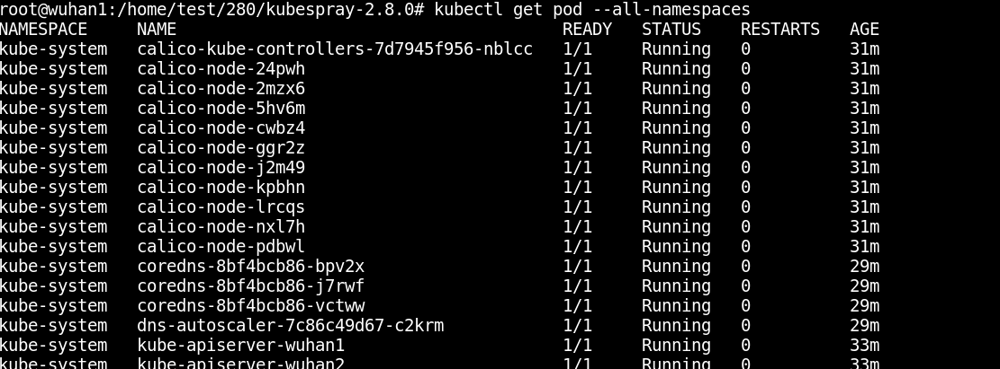
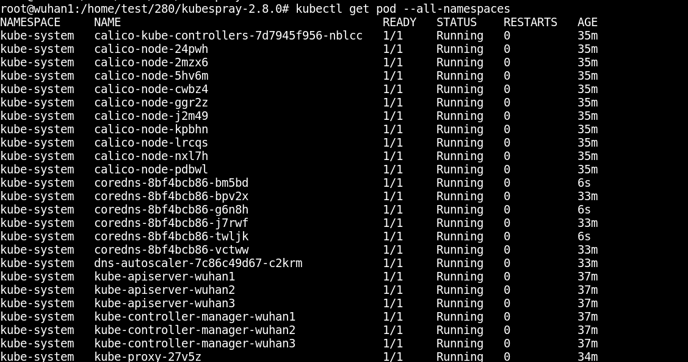

参考网址： https://kubernetes.io/docs/tasks/administer-cluster/dns-horizontal-autoscaling/

###kubespray部署coredns默认配置
kubespray部署```coredns```时，会同时部署一个名为```dns-autoscaler```的服务，给服务负责控制```coredns```的```pod```实例数。在```dns-autoscaler```实例数由三个参数控制。
1、```dns_min_replicas```：决定至少启动多少个```coredns```实例。
2、```dns_nodes_per_replica```与```dns_cores_per_replica```：根据以下公式配置当前应部署多少个```coredns```实例。
```
replicas = max( ceil( cores * 1/coresPerReplica ) , ceil( nodes * 1/nodesPerReplica ) )
```
注：```cores```代表整个```kubernetes```集群的```cpu core```数（包括```master```，```node```），```nodes```代表整个```kubernetes```集群的节点数（包括```master```，```node```）。

在```kubespray```中，文件```roles/kubernetes-apps/ansible/defaults/main.yml```中这些参数的默认配置为
```
dns_min_replicas: 2
dns_nodes_per_replica: 10
dns_cores_per_replica: 20
```
###测试
部署一个拥有```10```节点的集群```cpu```核心数如下
节点IP| cpu cores| 角色
-----|----------|-----
192.168.124.81| 8 |master etcd
192.168.124.82| 8 |master etcd
192.168.124.83| 8 |master etcd
192.168.124.84| 4 |node
192.168.124.85| 4 |node
192.168.124.86| 4 |node
192.168.124.87| 4 |node
192.168.124.88| 4 |node
192.168.124.89| 4 |node
192.168.124.90| 4 |node

根据公式
```
replicas = max( ceil( 52 * 1/20) , ceil( 10 * 1/10) ) = 3（取整数，向上取整，例如2.1,为3）
```
测试，确实生成了3个```coredns```实例

修改服务```dns-autoscaler```的```configmap```中参数的值，把```dns_cores_per_replica```修改为```10```.

根据以下公式，会生成```6```个```coredns```实例。
```
replicas = max( ceil( 52 * 1/10) , ceil( 10 * 1/10) ) = 6（取整数，向上取整，例如2.1,为3）
```
测试结果显示，确实新增了```3```个```coredns```实例。（注，修改服务```dns-autoscaler```的```configmap```中参数后不需要重启服务```dns-autoscaler```）
