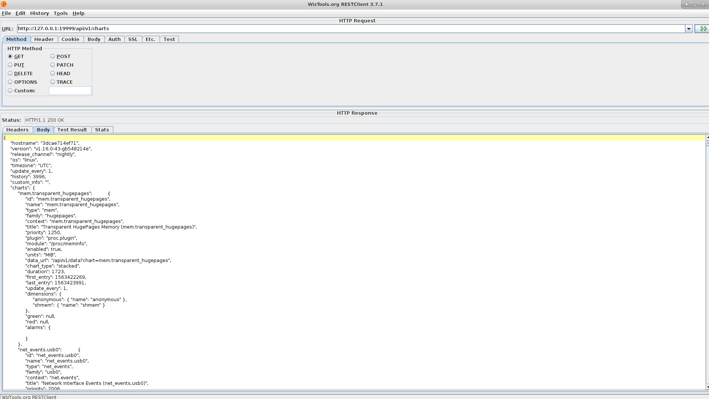

###netdata的api调用
组件的```api```是```restful```格式，使用```swagger```查看地址为```https://registry.my-netdata.io/swagger/#/default/get_data```和```https://editor.swagger.io/?url=https://raw.githubusercontent.com/netdata/netdata/master/web/api/netdata-swagger.yaml```。

组件```netdata```的```api endpoint```为```http://netdataIP:netdataPort/v1/api```。

###ui工具查看api
使用工具```restclient-ui-fat-3.7.1.jar（https://github.com/wiztools/rest-client.git）```来查看```netdata```的```api```。



###go语言调用api demo

###java语言调用api demo