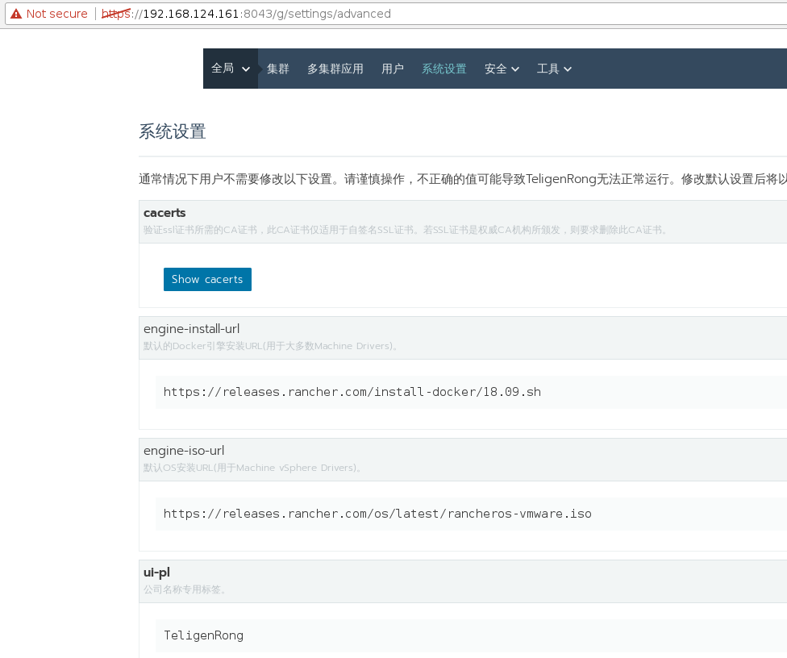
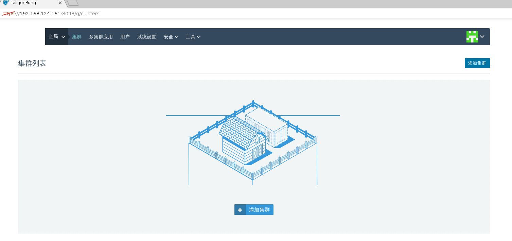
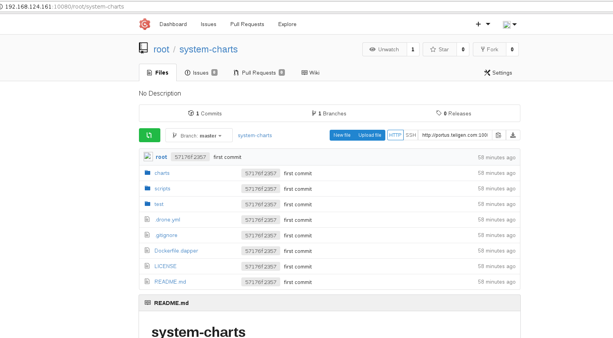
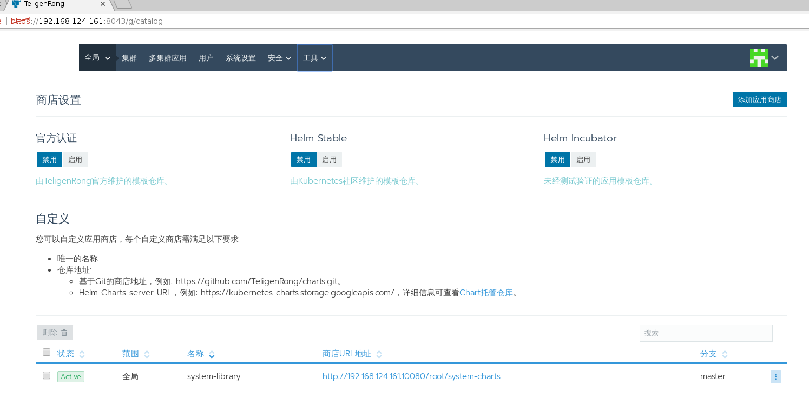

###rancher配置私有公司名
有以下两种方法：
1、在启动```rancher-server```容器时，配置环境变量```CATTLE_UI_PL=TeligenRong```则配置了界面上以```TeligenRong```替换```Rancher```作为私有公司名。
2、启动```rancher-server```容器后，在系统设置面板进行配置。


###rancher去除cattle logo（牛 标志）
在```rancher/rancher:v2.2.4```镜像的```/usr/share/rancher/ui/assets/images/logos```目录保存```logo```图片。用户可以删除或者替换为自己的图片。
使用```-v```把自己的图片目录替换。
```-v /path/to/your/logos:/usr/share/cattle/war/assets/images/logos```

删除或者替换以下图片。

| File                        | Usage                                                     |
|:--------------------------- |:----------------------------------------------------------|
| dark.svg                    | On the Login screen when access control is enabled        |
| fail-*.svg                  | On the branded error screen (for ui.pl="rancher" only)    |
| favicon.ico                 | Browser tab favicon                                       |
| graphic.svg                 | The parachuting cow part of the image on the About screen |
| login-bg.jpg                | Background for the login screen box                       |
| main.svg                    | Top-left corner of the main header                        |
| main-loading.svg            | On the branded loading screen (for ui.pl="rancher" only)  |
| main-k8s.svg                | Top-left corner of the main header, for k8s env           |
| main-mesos.svg              | Top-left corner of the main header, for mesos env         |
| main-swarm.svg              | Top-left corner of the main header, for swarm env         |
| provider-custom.svg         | Custom "Add Host" provider                                |
| provider-local.svg          | Local "Access Control" provider                           |
| provider-orchestration.svg  | "Cattle" environment orchestration provider               |
| text.svg                    | The text part of the image on the About screen            |

去除上述关于```cattle```的图片后，页面除了标题都不在出现```cattle```标志。


###rancher使用轻量级git服务器gogs管理系统chart仓库
首先，以容器方式运行```gogs```。
```
docker run -it -d --name=gogs -p 10022:22 -p 10080:3000 -v /home/xww/rancher/gogs-data:/data gogs/gogs
```
创建与上传```system-charts```仓库。
把卷目录压缩成```gogs-data.tar.gz```，以后运行```gogs```时，直接使用该解压后目录挂载到```/data```下，运行```gogs```时则已包含```system-charts```仓库。

在启动后的```rancher-server```容器界面上配置```system-charts```。
