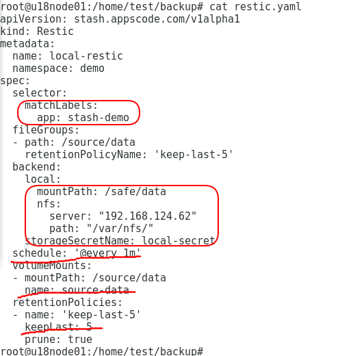
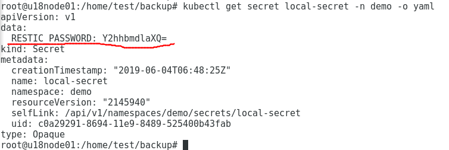
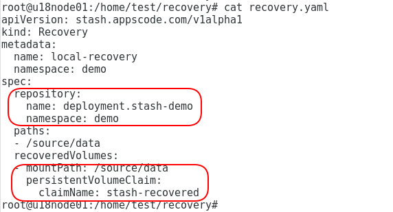
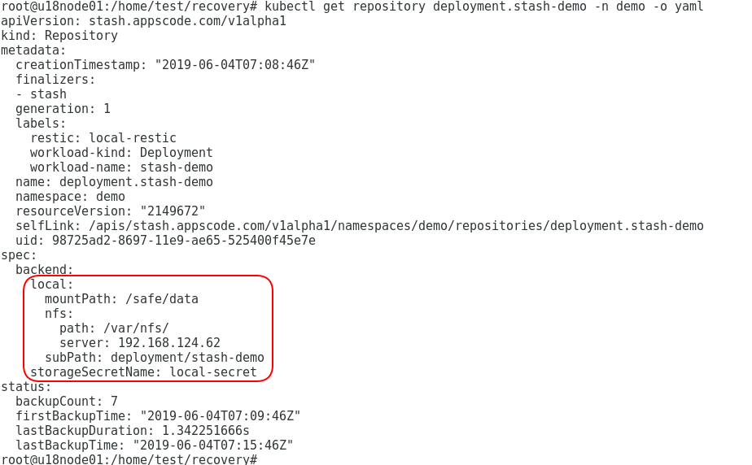

###stash安装


###stash备份和恢复k8s集群持久化存储卷

组件```stash```定义了以下```crd```用于备份和恢复持久化卷。
1、```Restic```：描述备份操作的对象，定义了备份目标，备份存储目的地，备份调度周期，备份快照保留策略。
2、```Repository```：描述了备份存放后端的对象，用户通过该对象可以更容易的查看备份存储后端信息。
3、```Snapshot```：描述备份的一份快照的对象，用户通过该对象可以列出，删除备份的快照，在恢复备份过程中，可以通过该对象指定特定快照进行恢复。
4、```Recovery```：描述恢复操作的对象，定义了恢复操作将作用的备份后端存储和快照信息，恢复的目的卷。

前提： ```kubernetes```集群、存储后端，例如```NFS```

###stash备份k8s集群持久化存储卷
参考网址： https://appscode.com/products/stash/0.8.3/guides/backup/
备份操作有两种模式：在线模式和离线模式
（1）、在线模式
步骤：
1、创建```secret```对象，用于加密备份的数据和保存访问存储后端的证书。
2、创建```Restic```对象，定义备份操作。
3、```stash```会```watch```到```Restic```对象的变化。
4、```stash```在```Restic```对象定义的备份目标上创建```sidecar```容器，该容器会挂载备份目标目录和目的地存储后端目录。
5、```sidecar```容器负责周期性的执行备份操作，执行过程中，会创建```Repository```和```Snapshot```对象描述已完成的备份后端存储目录和快照。
过程图如下


参考网址：https://appscode.com/products/stash/0.8.3/guides/offline_backup/
（2）、离线模式
步骤：
1、创建```secret```对象，用于加密备份的数据和保存访问存储后端的证书。
2、创建```Restic```对象，定义备份操作。
3、```stash```会```watch```到```Restic```对象的变化。
4、```stash```会注入```init-container```容器到备份目标上，该容器会挂载备份目标目录和目的地存储后端目录。
5、```stash```会创建```cronjob```。
6、```cronjob```周期调度执行重启备份目标。
7、备份目标重启时，注入的```init-container```容器执行备份操作，执行过程中，会创建```Repository```和```Snapshot```对象描述已完成的备份后端存储目录和快照。

周期重启```cronjob```对不同的备份目标重启过程如下：
备份目标为```statefulset```或```daemonset```时，重启时将删除所有的```pod```，在重建```pod```，每一个```pod```的```init-container```都会执行备份操作。
备份目标为```deployment```、```replicaset```、```replicationcontroller```时，它会把```pod```的数量缩到```0```。然后创建一个```pod```执行备份操作，再把```pod```伸缩到原始数量，拉伸过程中```pod```不会执行备份操作。

过程图如下：


备份例子：
文件```restic.yaml```定义的```restic```对象如下。

对象```restic```定义的备份目标为带有标签```app: stash-demo```的```deployment```、```replicaset```、```replicationcontroller```、```statefulset```、```daemonset```。需要备份的目录为这些目标管理的```pod```中文件目录```/source/data```，这个目录以卷名为```source-data```挂在到```sidecar/initcontainer```上的目录```/source/data```。
对象```restic```定义的备份存储目的地为```nfs```存储后端```192.168.124.62：/var/nfs```，备份数据加密密码存放在名为```local-secret```的```secret```对象中。

对象```restic```定义的备份调度周期为每分钟调度一次。
对象```restic```定义的备份快照保留策略为保留最近的```5```份快照。

###stash恢复k8s集群持久化存储卷
参考网址： https://appscode.com/products/stash/0.8.3/guides/restore/

步骤：
1、创建```Recovery```对象，定义恢复操作。
2、```stash```会```watch```到```Recovery```对象的变化，获得```Recovery```对象中定义的存储后端目录和快照信息，以及恢复目标卷信息。
3、```stash```创建```job```来执行恢复操作。
4、```job```会读取存储后端目录信息```Repository```和后端证书```secret```，从而访问到待操作的数据。
5、```job```执行恢复操作，把数据从存储后端目录恢复到指定卷。
6、最后，用户创建新的```deploument/statefulset/rc```挂载目的卷。
过程图如下


恢复例子：
文件```recovery.yaml```定义的```recovery```对象如下。

对象```recovery```定义的恢复备份数据到名为```stash-recovered```的```pvc```对象的```/source/data```目录。
对象```recovery```定义的恢复备份数据来源于名为```deployment.stash-demo```的```repository```对象。

对象```repository```定义的备份数据来源为```nfs```服务器```192.168.124.62：/var/nfs/deployment/stash-demo```。加密密码存放在名为```local-secret```的```secret```对象中。