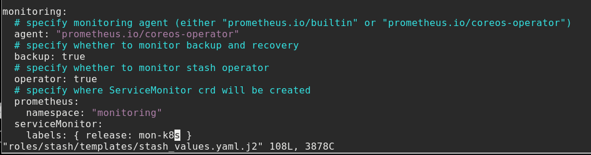
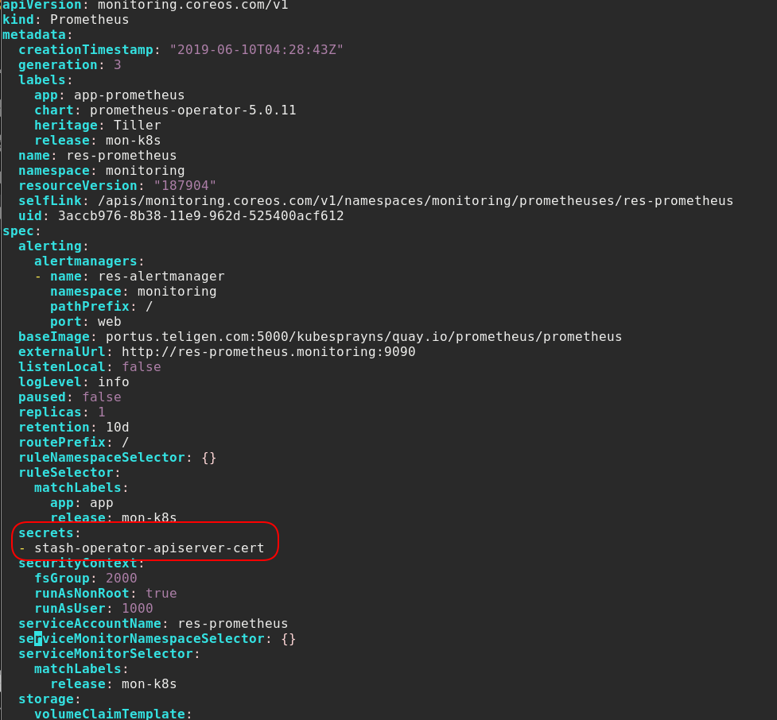
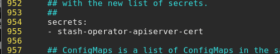
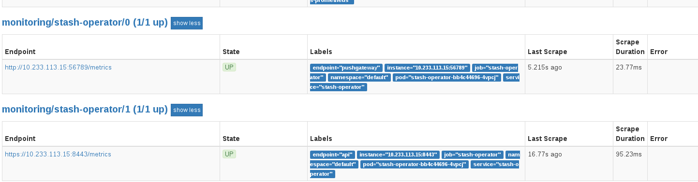
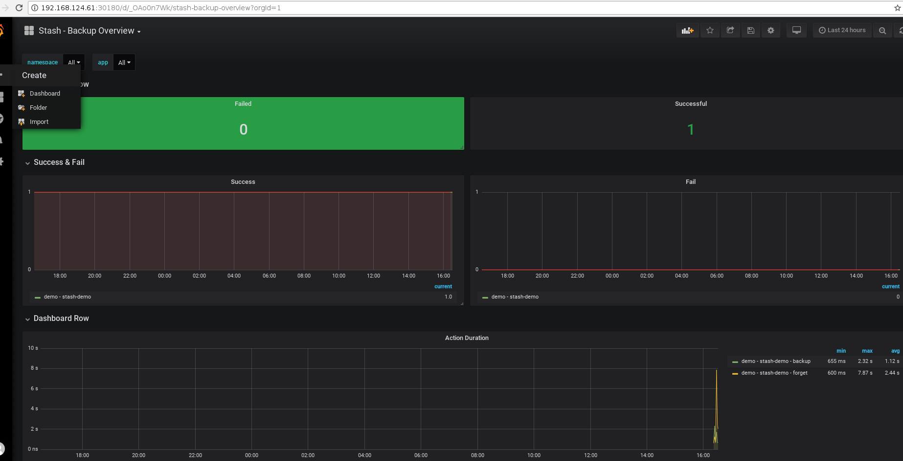

###stash开启监控
1、使用```helm```部署```stash```时，配置安装包中文件```./roles/stash/templates/stash_values.yaml.j2```以下变量开启监控


2、如果云平台套件已经配置默认的监控模块，则需执行以下命令，修改```prometheus```的配置导入```stash-operator```的证书以监控```stash```。
```
kubectl edit prometheus res-prometheus -n monitoring
```


如果云平台套件还未部署监控模块，需修改云平台套件安装包监控模块配置文件```./3rdParty/roles/monitor/templates/values.j2```加入证书的配置以监控```stash```。


至此，可以在```prometheus```的```web```界面查看到对```stash```目标的监控


3、在至少执行一个备份卷和恢复卷，```prometheus```才能获得数据，```grafana```才能得到数据的显示。```grafana```的```dashboard```获取网址为```https://grafana.com/dashboards/4198```。


界面上主要能监控每次备份和恢复操作的失败和成功次数、备份和恢复操作耗时。对于具有大量备份和恢复卷操作的集群通过监控界面查看比通过命令行查找查看要方便的多。