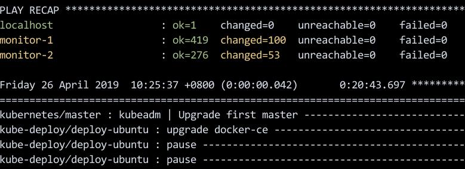
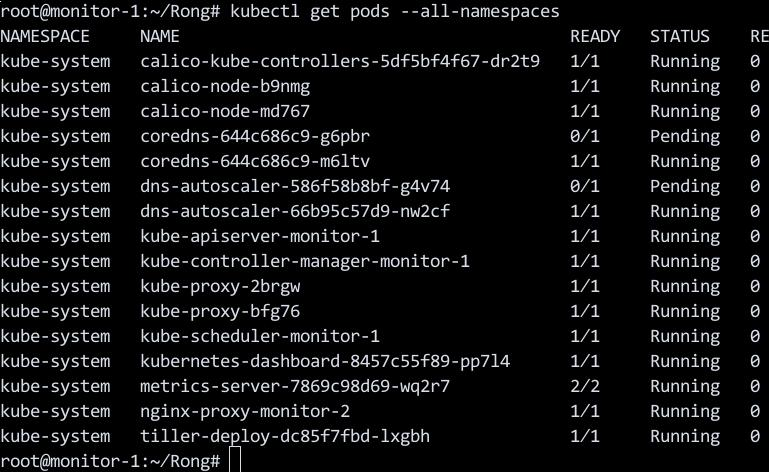

# Rong集群升级
Rong集群升级功能是Rongv1904中新引入的功能，使用该功能将以前部署的Rongv1901集群无缝离线升级至Rongv1904版本。   
注：   
1. 集群升级功能不支持单节点集群升级（生产环境中不会有这种类型的集群）。
2. 集群升级功能仅提供命令行升级功能。
3. 集群升级不能跨版本升级，只能Rongv1901集群升级至Rongv1904版本，Rongv1904集群升级至Rongv1907版本

### 先决条件
如果有保存原有集群部署时的`inventory/rong/hosts.ini`信息，则可忽略下面的操作，直接进入到`集群升级`一步。   

登录原有集群的kube-master节点，获取集群节点角色信息：    

```
# kubectl get nodes
NAME        STATUS   ROLES         AGE     VERSION
monitor-1   Ready    master,node   4m6s    v1.12.5
monitor-2   Ready    node          3m20s   v1.12.5
```
依次登录各节点，获取etcd实例信息, 下面显示该2节点集群中只存在一个etcd实例：    

```
monitor-1
# docker ps | grep etcd
ab4794436b90        quay.io/coreos/etcd:v3.2.24                 "/usr/local/bin/etcd"    6 minutes ago        Up 6 minutes                                                                                    etcd1
monitor-2
# docker ps | grep etcd
```
确定kube-deploy节点信息(goharbor只存在于kube-deploy节点上) :    

```
# 
# docker ps |grep goharbor
f50d357bc5f8        goharbor/nginx-photon:v1.6.2                "nginx -g 'daemon of…"   11 minutes ago      Up 11 minutes (healthy)   0.0.0.0:4443->4443/tcp, 0.0.0.0:5000->80/tcp, 0.0.0.0:5080->443/tcp   nginx
....
```
依据上面得到的信息，调整`inventory/rong/hosts.ini`文件。

```
monitor-1 ansible_host=10.247.129.101 ansible_port=22 ansible_user='root' ansible_ssh_private_key_file='./deploy.key' ip=10.247.129.101
monitor-2 ansible_host=10.247.129.102 ansible_port=22 ansible_user='root' ansible_ssh_private_key_file='./deploy.key' ip=10.247.129.102 

[kube-deploy]
monitor-[1:1]

[etcd]
monitor-[1:1]

[kube-master]
monitor-[1:1]

[kube-node]
monitor-[1:2]

[k8s-cluster:children]
kube-master
kube-node
```

### 集群升级
将Rongv1904的Rong.tar.gz上传到集群中的任一节点，执行以下操作:    

```
$ tar xzvf Rong.tar.gz
$ cd Rong
$ cp YOUR_INVENTORY/hosts.init inventory/rong/hosts.ini
$ sudo bash
# ./bootstrap.sh && ansible-playbook -i inventory/rong/hosts.ini upgrade-cluster.yml
```
脚本将一直执行直到结束:    




### 升级后验证
登录kube-master节点，验证集群升级是否成功:    

```
root@monitor-1:~/Rong# kubectl get nodes
NAME        STATUS     ROLES         AGE   VERSION
monitor-1   Ready      master,node   34m   v1.13.5
monitor-2   NotReady   node          33m   v1.13.5
```
可通过`kubectl get pods
--all-namespaces`查看pods实例是否都处于running状态，如果存在异常Pod，则需要手动调整解决升级中异常问题。



# 附录

集群节点监控功能在Rongv1907版本引入，Rongv1907以前版本集群升级时不会自动引入集群节点监控功能，需要用户执行以下命令安装集群节点监控功能模块。

```
ansible-playbook -i inventory/rong/hosts.ini cluster.yml --tags npg
```
集群状态备份与恢复功能在Rongv1907版本引入，Rongv1907以前版本集群升级时不会自动引入集群状态备份与恢复功能，需要用户执行以下命令安装集群状态备份与恢复功能模块。
```
ansible-playbook -i inventory/rong/hosts.ini cluster.yml --tags nfs,minio,velero
```