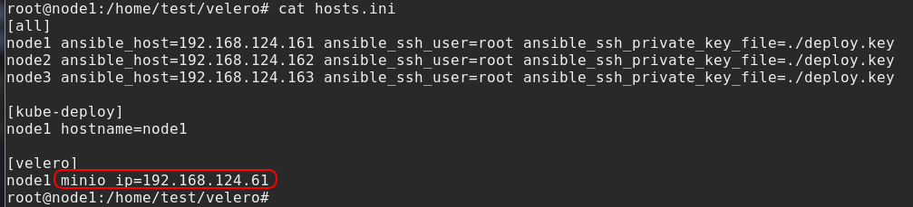
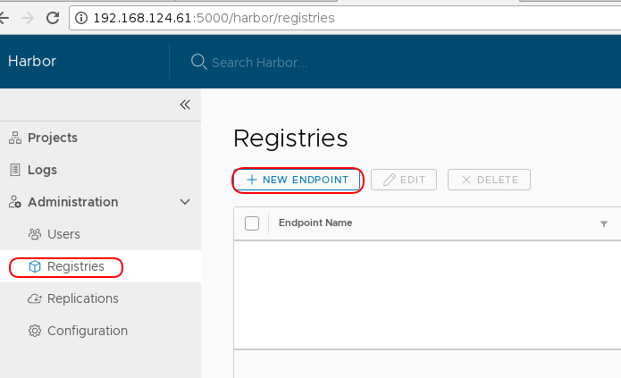
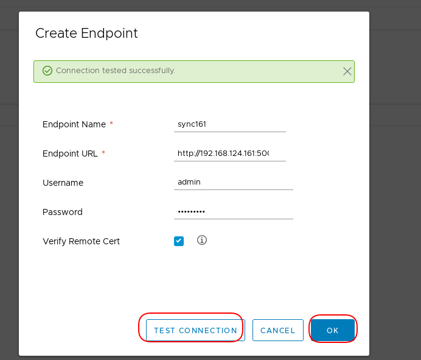
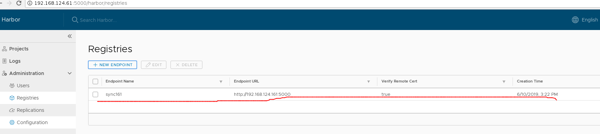
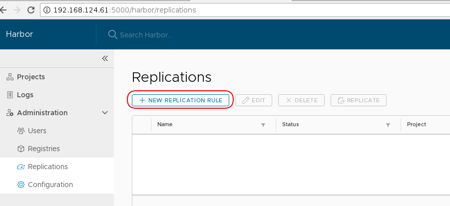
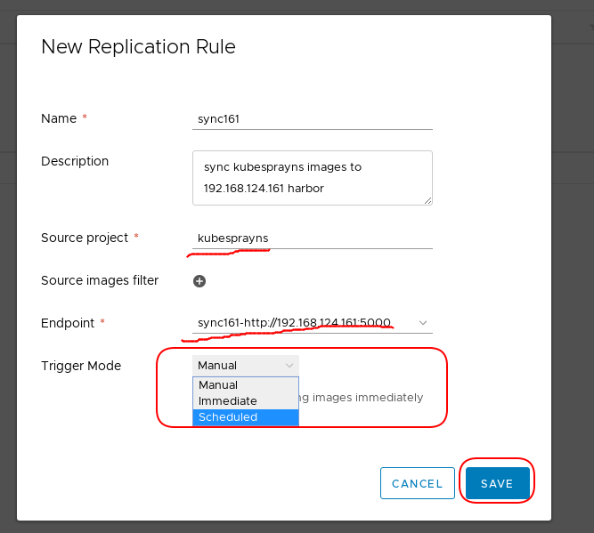
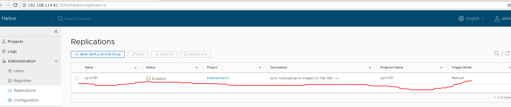
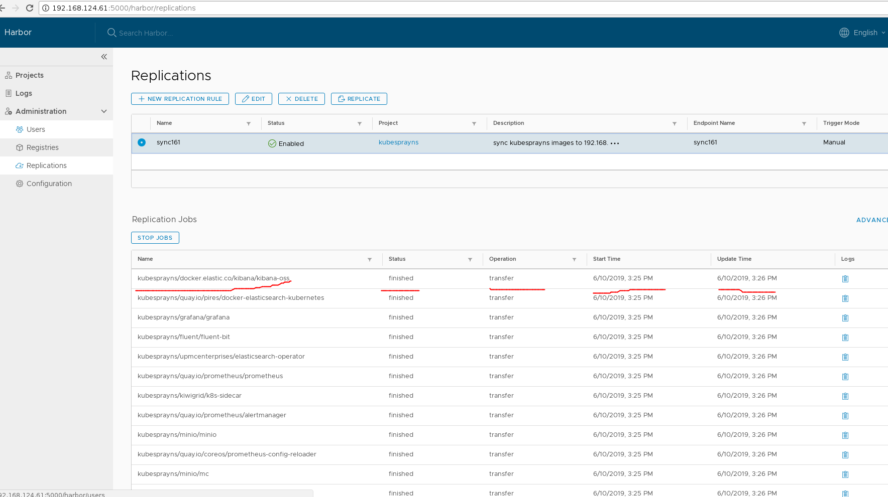

###velero作用
1、备份与恢复k8s集群状态，防止数据丢失。
2、从一个集群迁移资源到另一个集群。
3、复制生产环境集群环境到开发测试环境，进行问题定位与修复。

组成：
1、服务端运行在k8s集群中。
2、命令行工具客户端。

###velero安装
安装包```velero.tar.gz```通过```ansible```自动化安装。
安装前提条件：云平台套件```rong```已经部署
1、配置使用哪个```k8s```集群的```minio```存储


2、运行```ansible```命令执行安装
```
tar -zxvf velero.tar.gz
cd velero
ansible-playbook -i hosts.ini velero.yaml
```
###velero卸载
执行以下命令卸载```velero```
```
kubectl delete namespace/velero clusterrolebinding/velero
kubectl delete crds -l component=velero
```

###velero备份与恢复集群状态
1、```velero```备份```k8s```集群
创建```k8s```集群单次备份。
```
velero backup create k8s-backup --exclude-namespaces velero
```
注：```--exclude-namespaces velero```表示不备份名为```velero```的```namespace```下资源。
创建```k8s```集群周期性为1天的备份。
```
velero schedule create k8s-daily --schedule="0 1 * * *"  --exclude-namespaces velero
```
注：```--exclude-namespaces velero```表示不备份名为```velero```的```namespace```下资源。
2、```velero```恢复```k8s```集群至某一备份
首先，使用命令查看已有的```k8s```集群备份
```
velero get backup 或 velero backup get
```
恢复```k8s```集群备份
```
velero restore create --from-backup k8s-backup
```
查看恢复操作的执行过程
```
velero restore get
velero restore describe <RESTORE_NAME>
```

###k8s集群资源迁移
前提：
1、k8s集群之间同时支持或者不支持共享持久化存储；
2、k8s集群之间使用的镜像仓库保持镜像同步；
3、k8s集群中都安装了velero，并且可以访问同一velero备份存储后端（在安装```velero```时配置）。

云平台套件中使用的用户镜像仓库是```harbor```，```harbor```镜像仓库提供了不同仓库进行镜像同步的功能，配置```harbor```仓库镜像同步功能如下。
1、使用管理员用户登录到镜像同步的源仓库```harbor```，点击左侧的```Administration->Registries```，把镜像同步的目标仓库```harbor```地址添加。



新建```endpoint```

创建后如下


2、在镜像同步的源镜像仓库创建复制规则



这里选择创建一有镜像更新便自动同步的策略```Manual```。

3、创建完成后，可以查看同步的结果


镜像同步后，在原始集群中创建备份，在目标集群可以查看的新建的备份，使用新建的备份恢复目标集群，便实现了集群状态的迁移。
步骤：
1、源集群创建备份
```
velero backup create <BACKUP-NAME> --exclude-namespaces velero
```
注：```--exclude-namespaces velero```表示不备份名为```velero```的```namespace```下资源。
2、目标集群查看备份，确认备份过程已完成
```
velero backup describe <BACKUP-NAME>
```
3、使用新建的备份恢复目标集群
```
velero restore create --from-backup <BACKUP-NAME>
```
最后，在目标集群中运行查看恢复过程命令确认恢复过程是否成功
```
velero restore get
velero restore describe <RESTORE-NAME-FROM-GET-COMMAND>
```
###velero跨k8s集群版本迁移
按照上节所述的步骤进行备份，恢复操作。
工具```velero```恢复不是直接覆盖，而是会恢复当前集群中不存在的```resource```，已有的```resource```不会升级或回滚到之前的版本，如需要升级或回滚，需在```restore```之前提前删除现有的```resource```。
因此，在恢复不同版本```k8s```集群，在```kube-system```的名字空间会存在两个不同版本的```core-dns，dashboard，tiller，metrics```等容器，可以恢复后删除新生成的那一个。（注，```tiller```是```helm```的服务端，包含已经运行的```chart```的```release```信息，因此需要保留恢复后新生成的那一个）。

###备份持久化数据
备份命令如下。
```
velero backup create <BACKUP-NAME> --snapshot-volumes --exclude-namespaces velero
```
注：```--exclude-namespaces velero```表示不备份名为```velero```的```namespace```下资源。
可以选择只备份某一名字空间下的资源
```
velero backup create <BACKUP-NAME> --snapshot-volumes --include-namespaces nginx-example
```
恢复命令如下：
```
velero  restore create --from-backup <BACKUP-NAME> --restore-volumes
```

注： 在测试环境（使用```nfs```作为持久化存储，测试过两个```k8s```集群使用不同的```nfs```存储场景和使用相同的```nfs```存储场景）迁移操作中，对持久化存储数据备份恢复会失败，持久化存储数据无法跨k8s集群迁移。只支持同一个```k8s```集群中备份与恢复持久化数据。

对指定持久化卷进行备份
例如，```pod```文件定义如下
```
apiVersion: v1
kind: Pod
metadata:
  name: sample
  namespace: foo
spec:
  containers:
  - image: k8s.gcr.io/test-webserver
    name: test-webserver
    volumeMounts:
    - name: pvc-volume
      mountPath: /volume-1
    - name: emptydir-volume
      mountPath: /volume-2
  volumes:
  - name: pvc-volume
    persistentVolumeClaim:
      claimName: test-volume-claim
  - name: emptydir-volume
    emptyDir: {}
```
运行以下命令对指定卷```pvc-volume,emptydir-volume```进行标记备份。
```
kubectl -n foo annotate pod/sample backup.velero.io/backup-volumes=pvc-volume,emptydir-volume
```
当运行备份命令时，会产生```podvolumebackups```对象。
可以运行以下命令查看
```
kubectl -n velero get podvolumebackups -l velero.io/backup-name=YOUR_BACKUP_NAME -o yaml
```
当运行恢复命令时，会产生```podvolumerestores```对象。
可以运行以下命令查看
```
kubectl -n velero get podvolumerestores -l velero.io/restore-name=YOUR_RESTORE_NAME -o yaml
```

