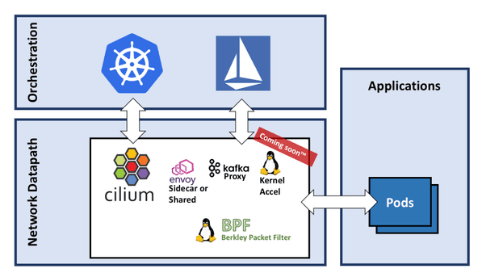

目前istio与cilium的结合如下图所示

cilium目前对istio做了修改后结合，但是istio本身在不断的迭代更新，没有稳定版本的出现。因此这种使用方式有很大风险。
未来的cilium与istio结合应如下图所示

cilium不对istio做修改，而是使用对方的功能，并持续跟进istio的迭代更新。
目前kubernetes使用istio的sidecar模式，pod与pod之间的网络速率有15%到20%的损失，损失值过大。在网络时延上面相差不大。cilium在网络时延非常快速，比envoy代理模式快。网络速率暂时没有测试数据。

如果cilium与istio能实现不做修改结合，有机会需要测试一下网络性能数据，cilium应该会给我们惊喜。