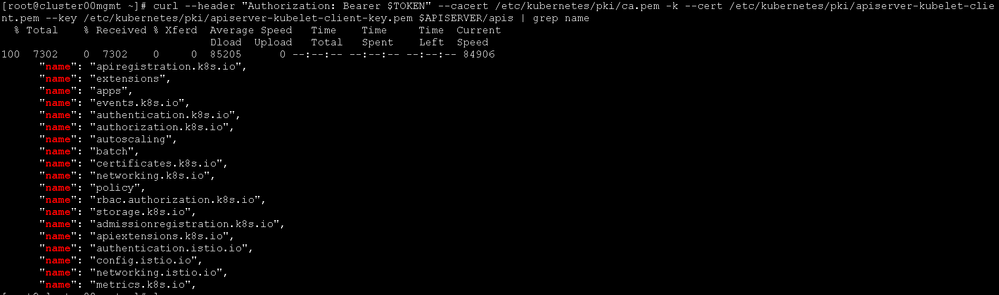

###restful访问kubernetes的api

```
$ APISERVER=$(kubectl config view | grep server | cut -f 2- -d ":" | tr -d " ")
$ TOKEN=$(kubectl describe secret $(kubectl get secrets | grep default | cut -f1 -d ' ') | grep -E '^token' | cut -f2 -d':' | tr -d '\t')
$ curl $APISERVER/api --header "Authorization: Bearer $TOKEN" --insecure
{
  "kind": "APIVersions",
  "versions": [
    "v1"
  ],
  "serverAddressByClientCIDRs": [
    {
      "clientCIDR": "0.0.0.0/0",
      "serverAddress": "10.0.1.149:443"
    }
  ]
}
```
列出可以访问的api类别
```
curl $APISERVER/apis --header "Authorization: Bearer $TOKEN" --insecure
```

使用kubelet-client的证书访问apiserver中所有的deployments
```
curl --cacert /etc/kubernetes/pki/ca.pem -k --cert /etckubernetes/pki/apiserver-kubelet-client.pem --key /etckubernetes/pki/apiserver-kubelet-client-key.pem --header "Authorization: Bearer $TOKEN" $APISERVER/apis/apps/v1/deplyments
```
使用kubelet-client的证书访问apiserver中namespace为istio-system的deployments
```
curl --cacert /etc/kubernetes/pki/ca.pem -k --cert /etckubernetes/pki/apiserver-kubelet-client.pem --key /etckubernetes/pki/apiserver-kubelet-client-key.pem --header "Authorization: Bearer $TOKEN" $APISERVER/apis/apps/v1/namespaces/istio-system/deplyments
```
获得名为nginx-ingress的ingress信息
```
curl --cacert /etc/kubernetes/pki/ca.pem -k --cert /etckubernetes/pki/apiserver-kubelet-client.pem --key /etckubernetes/pki/apiserver-kubelet-client-key.pem --header "Authorization: Bearer $TOKEN" $APISERVER/apis/extensions/v1beta1/namespaces/default/ingresses/nginx-ingress
```

###restful访问istio的api
在kubernetes的apigroup中有以下个与istio有关，分别是
```
authentication.istio.io, config.istio.io, networking.istio.io
```
其中config.istio.io为最主要的，istio流量控制相关的
```
routerule, egressrule, destinationpolicie
```
策略执行相关的
```
memquota，quota，rule，QuotaSpec，QuotaSpecBinding
```
监控与日志配置相关的
```
metric, logentrie
```
http调用相关的
```
httpapispecbinding, tracespan, httpapispec
```
等等都可以通过该apigroup访问。
该apigroup的访问与上述kubernetes api访问一样。
此外，还可以访问mixer的api来检测istio的行为，获取istio的行为报告，管理istio的配额限制(mixer中的api是通过rpc访问)。
###curl 调用api示例
####curl修改kubernetes的ingress
1, 删除name为nginx-ingress的Ingress.
```
curl -X DELETE --cacert /etc/kubernetes/pki/ca.pem -k --cert /etckubernetes/pki/apiserver-kubelet-client.pem --key /etckubernetes/pki/apiserver-kubelet-client-key.pem --header "Authorization: Bearer $TOKEN" $APISERVER/apis/extensions/v1beta1/namespaces/default/ingresses/nginx-ingress
```
2, 根据nginx-ingress.json的内容创建name为nginx-ingress的Ingress，可以在nginx-ingress.json文件中作出内容的修改。
注：在传入kubernetes apiserver的POST方法，只支持json格式(使用yaml会报错)
```
curl -X POST -H "Content-Type:application/json" --cacert /etc/kubernetes/pki/ca.pem -k --cert /etckubernetes/pki/apiserver-kubelet-client.pem --key /etckubernetes/pki/apiserver-kubelet-client-key.pem --header "Authorization: Bearer $TOKEN" $APISERVER/apis/extensions/v1beta1/namespaces/default/ingresses -d@nginx-ingress.json
```
####curl修改istio的rule
1, 删除name为quota的rule
```
curl -X DELETE --cacert /etc/kubernetes/pki/ca.pem -k --cert /etckubernetes/pki/apiserver-kubelet-client.pem --key /etckubernetes/pki/apiserver-kubelet-client-key.pem --header "Authorization: Bearer $TOKEN" $APISERVER/apis/config.istio.io/v1alpha2/namespaces/istio-system/rules/quota
```
2，根据nginx-rule-test.json的内容创建name为quota的rule,可以在nginx-rule-test.json文件中作出内容修改。
注：在传入kubernetes apiserver的POST方法，只支持json格式
```
curl -X POST -H "Content-Type:application/json" --cacert /etc/kubernetes/pki/ca.pem -k --cert /etckubernetes/pki/apiserver-kubelet-client.pem --key /etckubernetes/pki/apiserver-kubelet-client-key.pem --header "Authorization: Bearer $TOKEN" $APISERVER/apis/config.istio.io/v1alpha2/namespaces/istio-system/rules -d@nginx-rule-test.json
```
