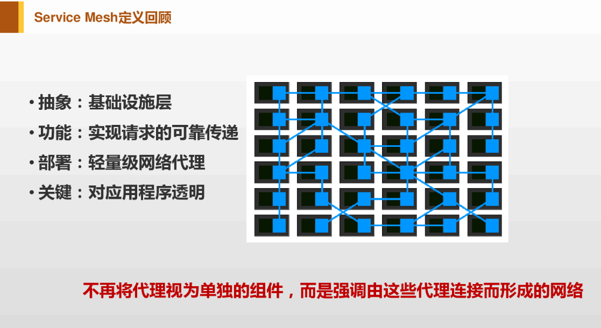

###serviceMesh（服务网格）
Willian Morgan（Linker 的CEO）给出的Service Mesh定义：
服务网格是一个用于处理服务间通信的基础设施层，它负责为构建复杂的云原生应用传递可靠的网络请求。在实践中，服务网格通常实现为一组和应用程序部署在一起的轻量级的网络代理，但对应用程序来说是透明的。
理解服务网格。

1. 对于单个服务调用，服务网格表现为sidecar（类似kubernetes中pod的Sidecar容器）。

2. 有多个服务调用，服务网格表现为服务间通讯专用基础设施层。在这种情况下，服务不再负责传递请求的具体逻辑，只负责完成业务处理。服务间通讯的环节就从应用里面剥离出来，呈现出一个抽象层。

3. 有大量服务，服务网格表现为服务网格形状，Sidecar之间的连接形成网格。首先第一个，服务网格是抽象的，实际上是抽象出了一个基础设施层，在应用之外。其次，功能是实现请求的可靠传递。部署上体现为轻量级的网络代理。最后一个关键词是，对应用程序透明。

定义关键点

* 抽象：基础设施层
* 功能：实现请求的可靠传递
* 部署：轻量级网络代理
* 关键：对应用程序透明
* Service Mesh定义当中一个非常重要的关键点，和Sidecar不相同的地方：不再将代理视为单独的组件，而是强调由这些代理连接而形成的网络。在Service Mesh里面非常强调代理连接组成的网络，而不像Sidecar那样看待个体。

###servicemesh开源工具
####istio
Istio是由Google、IBM和Lyft开源的微服务管理、保护和监控框架。
使用istio可以很简单的创建具有负载均衡、服务间认证、监控等功能的服务网络，而不需要对服务的代码进行任何修改。只需要在部署环境中，例如Kubernetes的pod里注入一个特别的sidecar proxy来增加对istio的支持，用来截获微服务之间的网络流量。
####linkerd
linkerd由Buoyant开源，也是业界第一个Service Mesh项目。
Linkerd 是一个提供弹性云端原生应用服务网格的开源项目。其核心是一个透明代理，可以用它来实现一个专用的基础设施层以提供服务间的通信，进而为软件应用提供服务发现、路由、错误处理以及服务可见性等功能，而无需侵入应用内部本身的实现。
####conduit
Buoyant在Linkerd不敌Istio的恶劣情况下，绝地反击，推出全新设计的 Conduit 作为对抗 Istio 的武器。
Conduit是一款针对Kubernetes的超轻量级的service mesh。可以透明得管理服务运行时之间的通信，使得在Kubernetes上运行服务更加安全和可靠；还具有不用修改任何应用程序代码即可改进应用程序的可观测性、可靠性及安全性等方面的特性。

serviceMesh开源工具对比

Feature|Istio|Linkerd|Conduit
-------|-----|-------|-------
功能支持| 负载均衡，服务TLS认证，服务调用监控，熔断，动态请求路由，服务发现，服务间流量管理，服务间访问策略管理|负载均衡，服务TLS认证，服务调用监控，熔断，动态请求路由，服务发现|官方文档暂未列出，发展还不完善
第三方插件集成|分布式调用链跟踪Zipkin、监控套件Prometheus与Grafana、日志套件EFK、服务图展示ServiceGraph|分布式调用链跟踪Zipkin、监控套件Prometheus,InfluxDB,StatsD|监控套件Prometheus
部署架构|Envoy/Sidecar|DaemonSets|sidecar
易用性|复杂|简单|适中
支持平台|kuberentes|kubernetes/mesos/Istio/local|kuberentes
当前版本|0.7|1.3.7|0.3
是否已有生产部署|否|是|否
评分|★★★★☆|★★☆☆☆|★★☆☆☆
       